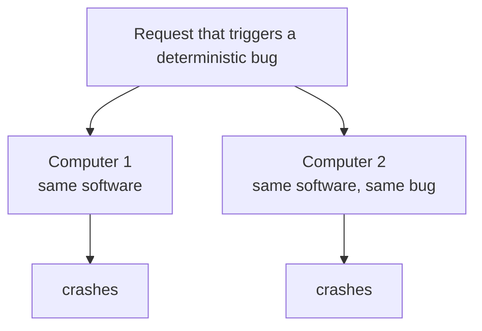

# 1. The problem

## A machine that is not allowed to stop

Start with the thing on the other end of the wire. In the 1980s and 1990s, when Armstrong and his colleagues at the Ericsson Computer Science Laboratory were doing this work, that thing was a telephone exchange. Tens of thousands of people are connected to it at once. Each of them expects a dial tone now, not in a moment. The exchange is expected to run for years without stopping, and "years" is not a slogan. The reference point Armstrong cites for a telephone exchange is less than two hours of downtime in forty years. Call it five nines, give or take. Treat that as an industry aspiration rather than a measured guarantee: it already assumes redundant hardware and planned maintenance that does not count against the total, and what a user actually feels is how the outages are distributed, not a lump sum spread evenly across four decades. As a statement of intent, though, it sets the bar plainly. The exchange is supposed to be, for all practical purposes, always on.

Now make it worse, the way reality does. The software is several million lines long. The Ericsson AXE10 and the AT&T 5ESS switches of that era were in that range. It was written by a rotating cast of engineers over a decade or more. New features arrive constantly, and they have to be installed into the running system, because you are not allowed to take it down to upgrade it. So the code is large, it is always changing, and it is never restarted.

A system like that has a property that is uncomfortable to say out loud: at any given moment, some of the code is wrong, and you do not know which part.

Bjarne Däcker, who ran the Ericsson Computer Science Laboratory where Armstrong worked, had written down what telephony software actually demands, and Armstrong reproduces that list early in the thesis. Paraphrased, the system must handle huge numbers of concurrent activities, hit real-time deadlines, run distributed across many machines, drive hardware, span millions of lines, do something complicated, run continuously for years, accept upgrades without stopping, meet stringent reliability targets, and tolerate both hardware faults and software bugs. Read that list again with a modern eye. Strip the word "telephony" off it and it is a description of a serious internet service. Armstrong noticed this too, and says so directly in the thesis: these requirements came from telecom, but a web server's list would look strikingly similar.

## Why the obvious answers fail

The obvious answer to "some of the code is wrong" is: test more. Find the bugs before they ship. This is necessary and it is not sufficient, and Armstrong is blunt about why. In a system of millions of lines, exercised by tens of thousands of concurrent, real-time, distributed interactions, the number of reachable states is not something you can enumerate. Testing reduces the bug count. It does not drive it to zero, and it cannot prove it has. The thesis treats residual bugs in shipped code as a given, a permanent operating condition, not a temporary failure of diligence.

The second obvious answer is hardware redundancy. Telecom already knew this trick: run two computers, and if one dies, the other carries the load. Hardware redundancy assumes failures are independent. Lightning hits one machine, not both. Software faults break that independence, but not uniformly, and the way they break it is worth slowing down on, because the distinction holds up the rest of the thesis.

Jim Gray, whose results Armstrong leans on directly, split production software faults into two kinds. Most are transient: a race, a rare timing window, a momentary resource exhaustion, a one-in-a-million interleaving. Gray's observation, which Armstrong quotes, is that the majority of production faults are like this, and that if you reinitialize the state and retry, the operation usually succeeds the second time. For these, redundancy and restart genuinely work. The standby, or a freshly restarted process, meets a slightly different timing and never reproduces the fault. This is not a footnote. It is the reason the entire "let it crash" strategy of chapter 3 works at all.

The other kind is deterministic: a logic error that fires every time the same input meets the same code. Here redundancy is helpless, and the diagram shows why.

The input that triggers the bug on the primary triggers it on the standby a moment later, because the standby faithfully runs the same code on the same input. The more identical your replicas, the more perfectly they fail together on this class of fault. The recognized defense is design diversity, sometimes called N-version programming: independently built implementations unlikely to share a bug. It works, and it is so expensive that almost nobody pays for it.

So redundancy is not useless against software faults. It absorbs the transient majority and is defeated by the deterministic remainder, and that remainder is exactly what testing also tends to leave behind. That split, transient versus deterministic, is the seam this whole architecture is built along: restart for the common case, and a structure that contains and escalates the faults restart cannot cure.

## Armstrong's move: stop trying to prevent failure

The reframe is the whole thesis in one sentence. Instead of asking "how do I keep this software from failing," ask "given that it will fail, how do I keep the system providing service anyway."

That sounds like resignation. It is the opposite. It is a design constraint, and a demanding one. If you accept that any component can be wrong at any time, then correctness can no longer live inside the component. It has to live in the structure around the component: in how failures are contained so one broken part does not corrupt the rest, in how failure is detected, in how something else takes over, in how the system degrades to a smaller but still-correct version of itself instead of collapsing.

Armstrong frames the target as a hierarchy of tasks ordered by complexity. When everything works, the system delivers full service. When it cannot, it should fall back to a simpler level of service that it can still deliver correctly, rather than failing outright. A phone system that cannot offer call-waiting but can still connect calls is degraded. A phone system that returns garbage, or wedges, has failed. The difference between those two is not better code. It is architecture that was designed, from the start, around the assumption of failure.

## The shape of the rest of the thesis

Everything that follows is the engineering of that one decision. If failure is normal, you need somewhere to put it. So you need strong isolation, so a fault has a boundary it cannot cross (chapter 2). You need a disciplined way to fail, instead of heroic in-place error handling that just spreads the damage (chapter 3). You need something outside the failed unit whose job is to notice and restart it (chapter 4). And you need failure itself to become a piece of information that another process can receive and act on (chapter 5). Read in order, the thesis is not a tour of Erlang features. It is the derivation of an architecture from a single honest premise.

> **Principle:** You cannot make failure rare enough to ignore. Design so the system survives the failures you did not prevent.
