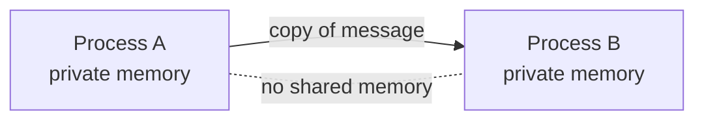

# 2. Concurrency-oriented programming

## The problem with sharing

Chapter 1 ended with a requirement: if any component can be wrong at any time, a fault needs a boundary it cannot cross. This chapter is about building that boundary.

Start with why the usual concurrency tools do not give you one. The default model, the one most languages still ship, is threads over shared memory. Threads are cheap to reason about until you remember that they can see each other's data. Now picture the failure case Armstrong cares about. One thread has a bug. It writes a half-updated structure, or frees something twice, or scribbles past an array. A second thread, with no bug at all, reads that corrupted state and does the wrong thing. The fault has crossed from the broken component into a healthy one, silently, through memory they both touch. Worse, a lock held by a thread that then crashes can wedge every thread waiting on it. Shared mutable state means a fault has no natural boundary. It propagates along every reference.

You cannot build a fault container out of components that share memory. The sharing is the leak.

## Armstrong's move: make the process the unit of the world

So take sharing away. Armstrong's model, which he names Concurrency Oriented Programming (his spelling, unhyphenated), is built from processes that share nothing at all. A process is a small self-contained world. It has its own memory. No other process can read it or write it. The only thing a process can do to another process is send it a message, and a message is copied, not shared. The receiver gets its own copy and the sender keeps its own, so there is nothing for a fault to travel along. (The guarantee is what counts here, not the mechanism: because Erlang data is immutable, the runtime may share some large values under the hood, but no process can ever observe another mutating shared state, because there is no mutable state to share.)

That dotted line is the idea. Two processes are meant to be as independent as if they were running on two different machines on two different continents. If that is the mental model, then a lot follows automatically, and Armstrong walks through the consequences. Since nothing is shared, messages are the only way to move data. Since nothing is shared, a message has to be a copy. Since the receiver might be slow or broken, sending has to be asynchronous, because if sending blocked until the receiver was ready, a bug in the receiver could freeze the sender and the isolation would be gone. And since the two could really be on different machines, the model refuses to assume a message ever arrives. In practice a local send reliably reaches the mailbox, and only a cross-node send can truly be lost, but Erlang treats every send as best-effort so that one machine and many obey the same rule. If you need to know a message got there, you wait for a reply.

That isolation is real, but Armstrong is careful to call it true only to a first approximation, and the caveat matters in production. Two processes share nothing in memory, so neither can corrupt the other's state, and that is the boundary that defends you against software faults. But they still sit on one node: one CPU, one memory pool, one scheduler. A process that spins forever starves its neighbors of CPU. A process that lets its message queue grow without bound can exhaust the node's memory and take every "isolated" process down with it. Isolation is a boundary against corruption, not against resource exhaustion. For resource faults the real fault boundary is the node, not the process, which is why serious Erlang systems still need bounded mailboxes, backpressure, and per-process memory limits, and why the multi-node structure in [chapter 4](04-supervision-trees.md) carries real weight.

This is a strong claim, so it is worth being precise about what "process" means here. An Erlang process is not an operating-system process and not an OS thread. It is a far lighter thing, scheduled by the language runtime, with its own heap and its own garbage collection. You are meant to create them by the hundreds of thousands. That cheapness is not a performance footnote, it is what makes the model usable: if isolation were expensive, you would ration it, and then you would start sharing again to save money. Because a process costs almost nothing, you can afford to give every concurrent activity its own.

## The six properties, read as a specification

Armstrong lists six properties that define a concurrency-oriented language. They are easy to skim past as a feature list. Read them instead as the minimum spec for "a fault has a boundary."

1. **Processes exist, and a process is like a self-contained virtual machine.** The unit of concurrency is also the unit of isolation. One concept, not two.
2. **Processes on the same machine are strongly isolated.** A fault in one must not affect another unless you explicitly wired them together. Same-machine processes behave like remote ones.
3. **Each process has a unique, unforgeable identifier (a Pid).** You cannot reach a process you were not given a handle to.
4. **No shared state. Processes interact only by messages.** If you have a process's Pid, you can send it a message. That is the entire interface for normal interaction, with one addition covered in [chapter 5](05-links-and-monitors.md): a process can also be notified when another one dies, which is a second channel that exists precisely for failure.
5. **Message passing is unreliable, with no delivery guarantee.** The model bakes in the assumption that the network, and the receiver, can fail.
6. **A process can detect that another process has failed, and learn the reason.** Failure is observable from the outside.

Properties 2 and 4 give you the boundary. Property 3's unforgeability is more an aspiration of the model than a guarantee of the runtime (in real Erlang you can reconstruct a Pid if you set out to), but the design intent is unambiguous: no shared state, and no addressing a process you were never introduced to. Property 6 is the one that turns the boundary into something useful, and it is where the next two chapters live. There is no point isolating a failure if nothing is allowed to notice it. Armstrong adds an honest caveat to property 6 that most retellings drop: the reported reason for a failure can be wrong. In a distributed system, a process that is alive but unreachable behind a broken network looks exactly like a process that has died. You will be told it is dead. You cannot, even in principle, always tell the difference. Hold onto that. It is the same impossibility that runs through every asynchronous distributed system: you cannot build a perfect failure detector, because a slow process and a dead one are indistinguishable from the outside (the Two Generals problem, and the theory of unreliable failure detectors, make this precise; the FLP result is the related proof that it makes consensus impossible in the asynchronous case). Armstrong meets it here, in passing, while specifying a programming language. The later seminars in this series are largely about what you can still build despite it.

## Why this is easier, not harder

The natural objection is that this sounds like more work. Most concurrency tooling exists to let threads share safely: locks, semaphores, condition variables, careful memory ordering. Armstrong is throwing all of that out and asking you to copy data and tolerate lost messages instead. Surely that is a step back.

His claim is the reverse, and it is the practical payoff of the model. Because processes share nothing, adding more of them cannot corrupt the ones already running. Because you were forced from the start to assume messages can be lost, you are pushed to design for loss rather than discover it in production. That is not the same as getting loss-tolerance for free: you still write the timeouts, the retries, and the idempotency yourself. The model just makes you do it instead of letting you forget. And because a same-machine process and a remote process obey the same source-level rules, the program you wrote for one machine compiles and runs across many. The reasoning, though, does not travel quite so transparently. The model already assumes delivery can fail, so nothing has to be retrofitted, but going distributed makes that assumption bite: real latency, partition as a live failure mode, and genuine message loss, none of which a single node forced you to confront. (Pairwise message ordering does survive across nodes, so what distribution adds is loss and partition, not reordering.) The source ports with little change. The correctness argument has to be re-examined. Still, the discipline that looked like a tax at design time is what lets the system scale and survive at all, and you paid most of that cost up front instead of during an outage.

## Modern echo, stated precisely

It is tempting to wave at all of modern infrastructure and say it looks like this. Be exact instead, because the differences are where the lesson is.

A goroutine in Go is cheap, and you can have a million of them. That satisfies the cheap-concurrency requirement, the one Armstrong later codifies as R1, beautifully. But goroutines share one heap by default and coordinate through channels by convention, so two of them can still corrupt shared state, and an unrecovered panic can take the whole process down. Go gives you cheap concurrency without enforced isolation: the concurrency Armstrong wanted, missing the isolation that was the whole point.

A Linux container, or a Kubernetes pod, goes the other way. It gives you strong isolation, a real boundary a fault struggles to cross, but it is heavy. You provision them in the dozens or hundreds, not the hundreds of thousands, and you would never wrap a single short-lived request handler in its own pod. You get the isolation without the cheapness.

Erlang's bet was that you need both at once: isolation as strong as a separate machine, and processes as cheap as a function call. The systems that came closest to inheriting the full idea, rather than half of it, are the actor runtimes (Akka, Orleans) and Erlang's own descendant, Elixir. They are the subject of [chapter 7](07-modern-echoes.md). The closest formal counterpart, Carl Hewitt's actor model, was arrived at independently. Armstrong's team built Erlang's processes without it; the thesis never cites Hewitt, and the Erlang designers have said plainly that they were not working from the actor model. So the resemblance is convergence, not descent, which is exactly what makes it worth the next seminar in this series.

> **Principle:** Isolation is not a property you add to concurrency. It is the reason to have processes at all.
