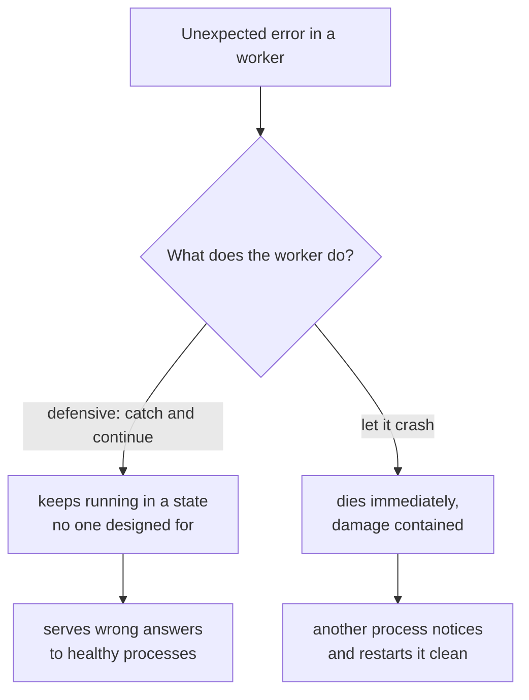

# 3. Let it crash

## The reflex, and why it backfires

Every programmer is trained to handle errors where they happen. A call might fail, so you wrap it. An input might be malformed, so you check it. A pointer might be null, so you guard it. Do this everywhere and you get defensive programming: code that, at every step, tries to anticipate what could go wrong and keep going anyway. It feels responsible. Armstrong argues it is one of the main things making reliable systems harder to build, and the argument is worth following because it is not the one you expect.

The first problem is volume. Defensive code is code. In a system where you already concede that some fraction of the code is wrong (chapter 1), every extra branch you write to handle a hypothetical error is more surface area to be wrong in. The error-handling paths are also the least-tested paths, because they fire rarely, so they are precisely where latent bugs hide. You are adding your buggiest code in the name of safety.

The second problem is worse, and it is the heart of the chapter. Defensive code's goal is to keep going. But keep going as what? When a process hits a situation its author did not anticipate, "handle it and continue" means continue in a state nobody designed for. It limps forward holding data that may be half-updated, an invariant that may be broken, an assumption that is now false. And it keeps serving. Other processes, which have no bug at all, ask it for things and believe its answers.

This is the distinction the whole chapter turns on. A process that has crashed is dead, and a dead process is safe: it has stopped, it tells no lies, nothing downstream mistakes it for healthy. A process that has been patched past an error it did not understand is corrupted, and a corrupted process is dangerous, because it is still talking. Given the choice, you want the dead one. The instinct to "recover and continue" optimizes for the outcome you should be most afraid of. Safe does not mean free, though. The request the dead process was serving is simply lost, and whoever was waiting on it has to notice the silence (a timeout) and retry, ideally in a way that is safe to repeat. Crashing trades a wrong answer for a dropped one and pushes the cost onto the caller. That is usually a good trade. It is still a trade.

## Armstrong's move: die well, recover elsewhere

So Armstrong inverts the reflex. The Erlang error philosophy, in his own slogans, is four lines:

- Let some other process do the error recovery.
- If you can't do what you want to do, die.
- Let it crash.
- Do not program defensively.

Read "let it crash" carefully, because it is the most misquoted phrase in the thesis. It does not mean "ignore errors" or "never use a try/catch." It means: write each process for the case you actually expect, state your assumptions as code that will fail loudly if violated, and when something happens that you did not plan for, do not improvise. Stop immediately, while the damage is still contained to this one process, and let something else decide what to do about it. Crashing early is how you prevent a corrupted state from ever being observed. The process dies at the first sign that its model of the world is wrong, before it can act on that wrongness.

That "let something else decide" is the other half, and Armstrong gives it equal weight: handle the error somewhere other than where it occurred. This sounds backwards until you see where it comes from. To survive a whole computer dying, you already need a second computer watching the first. So the recovery logic was always going to live in a different place from the failure. Armstrong takes that fact, forced on him by hardware, and makes it the uniform rule for software too. A process does not recover itself. A different process, watching it, notices the death and recovers.

There is a quiet elegance to why this unifies things. When a remote machine dies, the runtime delivers its death to the watcher as a message that looks just like a local crash. The watcher does not need two error strategies, one for "my process threw" and one for "the machine across the network vanished." It has one. Armstrong calls this conceptual integrity, and it is why the same recovery code runs on one node or fifty, with a single caveat the asterisk section below returns to: a death reported across a network might be a lie. The mechanism that makes a crash into a message is [chapter 5](05-links-and-monitors.md); the watcher that acts on it is [chapter 4](04-supervision-trees.md).

## The error kernel: where correctness still has to live

"Let it crash" cannot be the rule everywhere, and Armstrong knows it. If every process may freely die and be restarted, something has to do the restarting, and that something must not crash, or at least must be small and simple enough to trust. This is the idea of an error kernel: a small core of the system that has to be correct, surrounded by a large periphery that is allowed to fail.

The payoff is that it tells you where to spend your defensive effort. Instead of scattering paranoia evenly across a million lines, you concentrate it in the kernel, the supervisors, the code that holds critical state, the part whose failure cannot be recovered by restarting. The rest, the bulk of the system, gets to be written for the expected case and allowed to crash. You are not abandoning rigor. You are aiming it at the small surface where it actually buys reliability, and relaxing it everywhere restart already covers.

Be honest about what this concentration is, though. The error kernel is a single point of failure by design. A bug in it is the one bug the system cannot recover from on its own, because there is nothing above it to do the recovering. You have not removed the risk, you have gathered it into a small, heavily scrutinized place. That is the entire bet: a little code you can actually get right, holding up a lot of code you cannot. It only pays off if the kernel really is small, really is simple, and is reused rather than rewritten, which is exactly why a battle-tested framework like OTP, rather than a hand-rolled supervisor, is where you want this code to live.

## Where the slogan needs an asterisk

The reliability engineer reading this should already be uneasy, and correctly. "Let it crash" only works under conditions the slogan hides.

It works only if restart returns to a good state, and whether it does depends on which kind of fault killed you. Recall the split from chapter 1. For a transient fault, the soft-fault majority, restart works exactly as advertised: the fresh process meets a slightly different interleaving and the problem is simply gone. For a deterministic fault, restart is a trap. A poison message, or a corrupt row in stable storage, kills the new process the same way it killed the last, and you get a tight crash loop doing no work. The stable-storage case is the sharpest, because it is the one restart can never fix by construction: restarting reloads the same bad state, and if that state is ever written back or replicated, the corruption becomes permanent. Curing a deterministic crash needs the cause removed, not another restart: quarantine the poison message or dead-letter it, validate state on load and roll back to a known-good snapshot. Armstrong's supervisors do add restart-intensity limits, a cap on restarts per time window, but be precise about what that buys. It stops the flapping by giving up and escalating. It does not make the deterministic fault go away. Escalation contains the damage and hands it upward; it is not recovery. The mechanism, and why it is non-negotiable, is in the next chapter. The lesson here is the one a careless reader misses: "let it crash" cures transient faults and merely contains deterministic ones, and treating those two as the same is how you ship a system that crash-loops in production.

It also works only because chapter 2 came first, and only as far as chapter 2's boundary reaches. Crashing a process is safe precisely because the process shares nothing in memory: its death cannot leave a half-released lock or a torn data structure in the heap, because there was nothing shared in the heap to tear. But that safety stops at the VM's edge. A process that crashes midway through writing a file, sending on a socket, driving a piece of hardware, or updating stable storage (Erlang's dets and mnesia, the R6 of [chapter 6](06-armstrongs-rules.md)) can absolutely leave torn state behind. Armstrong does not get that for free from isolation. He handles it separately, with processes that release resources when a linked process dies and with transactional storage for the state that has to stay consistent. Crash-safety across durable, external, shared state is engineered, not automatic. Try "let it crash" in a shared-memory system, by contrast, and you get a corrupted heap and a deadlocked pool with no engineering available to save you. The slogan is not portable on its own. It is the visible tip of the isolation model underneath it, and it ends where that model ends.

One last limit, and it is the one [chapter 5](05-links-and-monitors.md) takes up in full. "Let it crash" assumes a process either works or stops cleanly, what distributed-systems people call fail-stop. Two things violate that assumption. A process can fail silently, corrupted but still answering, never tripping the assertion that would have killed it, so "let it crash" never fires because nothing crashed. And a process can look dead when it is only unreachable, so a supervisor restarts it while the original is still alive behind a network partition, and now two instances each believe they are the one true worker. Restart-on-suspected-death is safe only when death is real and final. When it might instead be a partition, you need fencing or a quorum to keep recovery from creating a duplicate, which is precisely where this thread is picked up later.

## Modern echo

The pattern is now mainstream, usually under different names. Kubernetes does not debug a misbehaving pod; a failed liveness probe kills it and the controller starts a fresh one, which is "let it crash" with the supervisor living in the control plane. The "cattle, not pets" maxim is the same stance toward processes: do not nurse a sick one back to health, replace it. "Crash-only software," argued by Candea and Fox in the same year as this thesis (and cited in it), reached the same conclusion from the operating-systems side: if the only way to stop is to crash, and the only way to start is to recover, you exercise your recovery path constantly and it actually works. And Kubernetes learned the asterisks too. A pod that keeps dying lands in CrashLoopBackOff, an exponential backoff that is restart-intensity limiting under another name, and a pod stuck there is simply down, which is the same admission Armstrong's escalation makes: past some point, restarting is not the answer. That is the part worth noticing. Telecom, operating systems, and cloud orchestration converged not just on the idea but on its limits, and convergence on the limits is much stronger evidence that the idea is real than convergence on the slogan alone.

> **Principle:** A process that dies cannot lie. When your model of the world breaks, stop, and let something that still has its bearings recover you.
