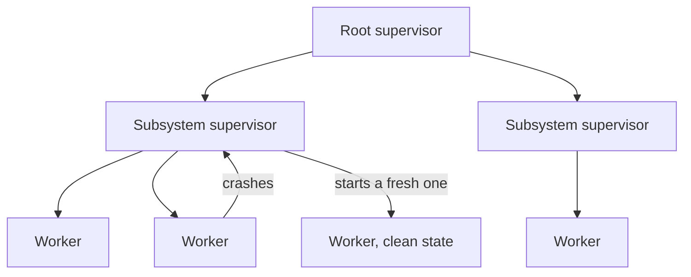
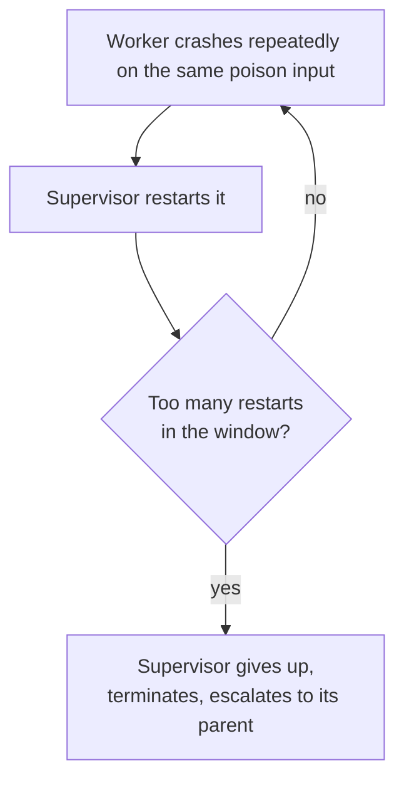

# 4. Supervision trees

## The gap the last chapter left open

Chapter 3 ended with a deliberate hole. A process that hits trouble should die and let "something else" recover it. Fine. What is that something else, where does it sit, and how do you organize thousands of them so the whole system has a recovery story and not just a slogan? That structure is the supervision tree, and it is the part of Armstrong's design that traveled furthest, because it is the part that turns "let it crash" from a local trick into a system-wide architecture.

Begin with the division of labour. Some processes do work: they parse a request, hold a connection, run a state machine. Others do nothing but watch. A supervisor's entire job is to start its children, notice when one dies, and start a replacement. It contains no business logic. That emptiness is the point: a process with no real work to do has almost nothing to be wrong about, so it can be the thing you trust to recover the processes that do.

Supervisors can supervise supervisors. A supervisor's child can itself be a supervisor with its own children. Stack that up and you get a tree: workers at the leaves, supervisors at every internal node, one root supervisor at the top. The thesis is explicit that this shape is not arbitrary. The supervision hierarchy is meant to mirror the task hierarchy from chapter 1, the one Armstrong orders by complexity: the top task is the most complex, and when every goal beneath it is met the system delivers full service, while lower tasks are simpler and deliver a reduced but still acceptable level of service. The tree is that degraded-service plan made executable. Lose a leaf and you lose one small capability. Lose a subtree and you fall back to a simpler level of service. The structure of the tree is the structure of how the system falls back.

## Restart is only safe because state was kept elsewhere

The supervisor's move is to throw the broken process away and start a new one from its initial state. This is the same instinct as "cattle, not pets," and it only works under one condition: the new process must start from a known-good state. If the worker held the only copy of something important, restarting it from scratch loses that thing, and the restart is not a recovery, it is a second failure.

So the tree forces a discipline about where state lives, and it pays to be exact about how durable each option really is. Transient, reconstructable state can sit in the worker, because losing it on restart is fine. State that must survive a worker crash can move to a process higher up the tree whose job is to hold it. But be careful what that buys: a parent process outlives a child restart, and nothing more. It does not survive a node crash, an out-of-memory kill, or a power loss, because it lives in the same VM on the same machine. State that has to survive the machine needs real stable storage (Erlang's answer there is dets and mnesia, which chapter 6 returns to) or has to be rebuilt from a source of truth on restart. A higher process is a wider blast shield, not durable storage. The architecture pushes you, gently and then firmly, toward keeping your fragile workers stateless and your durable state in a small number of carefully guarded places. That is the error kernel from chapter 3 showing up again as a layout rule: the closer a process is to the root, the more it is trusted with state and the more correct it has to be.

## Restart strategies: the failure unit is a design decision

When a child dies, restarting just that child is not always right, because children are often not independent. Three workers might cooperate so tightly that one dying leaves the other two holding a dead process's identity and talking to nobody. OTP, the framework the Ericsson team built on top of the language, gives the supervisor a small menu of strategies for exactly this question of blast radius (the real atoms are in parentheses):

- **one-for-one** (`one_for_one`): restart only the child that died. Use it when the children are genuinely independent.
- **one-for-all** (`one_for_all`): restart every child in the group when any one dies. Use it when they only make sense together, so a partial survivor is worse than a clean slate.
- **rest-for-one** (`rest_for_one`): restart the dead child and everything started after it, when there is a startup ordering and the later children depend on the earlier ones.

The thesis already carries the first two ideas as AND/OR supervision (`one_for_one` even appears verbatim in its supervisor code); `rest_for_one` is a later OTP refinement with no direct counterpart in the thesis. Either way the lesson is the same and it is more general than Erlang: choosing your restart strategy is choosing your unit of failure. You are deciding, per group, how much to tear down to get back to something you trust. That is an architectural decision, and the framework makes you make it on purpose rather than discovering it during an incident.

## The detail that makes "let it crash" safe: restart limits

Chapter 3 left an asterisk: restart a process that crashes on a poison input and you get a tight loop, restarting and recrashing forever, doing no work and burning a core. The supervision tree is where that asterisk gets resolved, and it is the detail that keeps "let it crash" honest.

Every supervisor carries a restart-intensity limit: a maximum number of restarts within a time window. The thesis spells out a concrete one, `{one_for_one, 5, 1000}`, which says give up if you have to restart more than five times in a thousand seconds. Stay under the limit and restarts are treated as routine. Exceed it, and the supervisor concludes that restarting is not working, gives up on its own children, terminates itself, and dies up to its parent. Now its parent's strategy takes over, and a larger subtree gets restarted, or the failure escalates further still. A persistent fault therefore does not flap at the leaves. It climbs.

This is the mechanism that makes the philosophy honest. "Let it crash" does not mean "restart forever and hope." It means "restart within a budget, and if the budget blows, admit that local recovery has failed and hand the problem to someone with a wider view." Escalation converts a stuck retry into a real decision. A transient fault is absorbed near the leaf; a deterministic fault is forced upward until it reaches a level that can do something different, restart a larger component, fail over a whole node, or, at the very top, conclude that the system cannot provide this service right now and degrade.

Be clear-eyed about the cost, though, because escalation is also the largest blast-radius amplifier in the system. The same climb that rescues you from a stuck leaf will, when a fault is common to many children (a poison input they all process, a deterministic bug, a shared dependency that is down), blow every child's budget, then every subtree's, and march the failure straight to the root. That is not graceful degradation, that is a whole-node crash. This is not a theoretical worry, it is Armstrong's own finding. The AXD301 case study in the thesis is blunt: "Cascading restarts do not work." Ulf Wiger, the AXD301's chief architect, found that restarting a failed process usually worked, but that when it did not, restarting the level above generally did not help either, so the production supervision trees were kept deliberately flat rather than deep. Escalation is a release valve of last resort, not a routine recovery move. This is why "let it crash" in production comes with tuning: conservative restart intensities, shallow trees, and a healthy fear of `one_for_all` over large groups, where one child's death takes all its siblings down with it. There is also a fault the budget quietly misses. A slow-burn problem, a memory leak that kills the worker every few minutes against a five-in-a-thousand-seconds limit, never trips the window, so it restarts forever without ever escalating. The budget catches fast flapping, not slow bleeding, and slow bleeding needs its own detection (leak and error-rate alerting), not just a restart counter. The tree is a powerful recovery structure and a built-in circuit breaker, but it is a circuit breaker you still have to size.

## The recovery shape, and where you have seen it

Strip away the Erlang and a supervisor and a Kubernetes controller are trying to do the same job: hold a desired set of things alive, and recreate whatever is missing. But the way they learn that something is missing is the sharp difference, and it is worth getting right, because the two mechanisms work in opposite ways.

A supervisor is edge-triggered. It does not run a loop polling its children, asking each one whether it is still alive. It is pushed a message the instant a child dies, the exit signal of chapter 5, and it reacts to that event. This is the same point chapter 5 makes about why polling is the wrong model: failure arrives as a notification, not as something you go looking for. A Kubernetes controller is the level-triggered version. It watches the observed state of the cluster, compares it against the desired state stored in etcd, and reconciles the difference on a loop. It re-derives "a pod is missing" by observation; the supervisor is told "a child died" by signal.

That edge-versus-level distinction is the interesting part, and chapter 7 spends real time on it. The other gap is scale. A supervisor reacts in microseconds, inside one VM, over processes that cost almost nothing. A Kubernetes controller reconciles in seconds, across machines, over containers and an etcd-backed desired state. Microseconds against seconds is about six orders of magnitude in latency, and a similar gap in the size of the thing being recovered. Armstrong's bet was that pushing this shape all the way down, to individual lightweight processes reacting to pushed events, is what lets a system recover from small faults before they ever become incidents.

> **Principle:** Put recovery above the thing that fails, give it a budget, and let a fault it cannot fix climb until it reaches someone who can.
