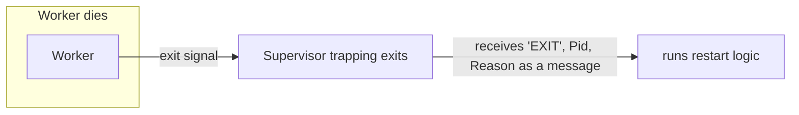

# 5. Links and monitors

## How does one isolated process learn that another died?

The supervision tree in chapter 4 rests on a capability we have not yet explained. A supervisor restarts a child when the child dies. But the whole model from chapter 2 says processes share nothing. The supervisor cannot read the child's memory, cannot see its stack, cannot poll a flag inside it. So how does it find out the child is gone?

Polling is the wrong answer, and it is worth seeing why before reaching the right one. If the supervisor had to ask "are you alive?" on a timer, you would be trading detection latency against overhead, and a process wedged in an infinite loop would answer "yes" right up until it didn't. Detection has to be a property of the runtime, not a courtesy the dying process performs. The death of a process has to turn, by itself, into something another process can receive. Failure has to become a message.

This is Armstrong's sixth COPL property cashed out: a process must be able to detect that another has failed, and learn why. Erlang gives you two primitives for it, and the difference between them is a clean lesson in coupling.

## Links: shared fate

A link is a bidirectional bond between two processes. The deal is symmetric: if either one dies abnormally, the other is told. By default, "told" means "also dies." That sounds destructive until you see what it is for. Some processes only make sense as a group: a connection handler and the parser feeding it, a pair that jointly own one task. If one half dies, the other half is now meaningless, a process holding the identity of a partner that no longer exists. Links let that whole group collapse together, cleanly, so you never have orphaned halves limping along. Failure propagates along links the way a fault would propagate along shared memory, except here it is the controlled version: it kills cleanly instead of corrupting silently.

That default is not what a supervisor wants, though. A supervisor must outlive its children, not die with them. So it sets a flag called trapping exits, and that flag changes everything. A process that traps exits does not die when a linked process fails. Instead, the death arrives as an ordinary message in its mailbox, of the form `{'EXIT', Pid, Reason}`. The supervisor reads that message like any other and runs its restart logic. This is the hinge of the entire architecture: trapping exits is the act that converts a crash into data. A crash is a violent thing in most systems, an exception unwinding a stack. Here it is a message, handled by the same receive loop that handles everything else. There is no separate exception machinery threading up through the program, because failure travels the same channel as normal communication.

A couple of edges keep this honest, and the runtime engineers among the readers will want them stated. An ordinary, expected shutdown is a `normal` exit, and that does not take down linked peers, so finishing your work cleanly is not treated as a failure. And there is one deliberately untrappable kill signal, so that a supervisor always retains the power to forcibly terminate a child that refuses to die gracefully. The mechanism has an override, on purpose.

## Monitors: observation without entanglement

Links are bidirectional and about shared fate, which is exactly wrong when you only want to watch. If process A needs to know whether B is alive, but A's survival should not depend on B and A must not accidentally kill B, a link is too strong a bond. That is what monitors are for.

A monitor is unidirectional and passive. A sets up a monitor on B. B is not affected at all, does not know or care, and is not linked back. If B dies, A receives a message, `{'DOWN', Ref, process, Pid, Reason}`, and does whatever it likes with that information. If A dies, nothing happens to B. This is the right tool when a client wants to notice a server vanishing, when one component watches another it does not own. The `Ref` is a unique handle, so A can monitor many processes and tell the notifications apart.

The contrast is the lesson, and it generalizes well past Erlang. Links express "we live and die together." Monitors express "I want to know about you, but my fate is my own." Picking between them is picking a coupling, and most distributed-systems failures come from getting that choice wrong: tying your fate to a dependency you should merely have observed, or merely observing one whose death should have taken you down too.

## The unification, and the limit underneath it

Chapter 3 claimed something that can now be made concrete. The same mechanism handles a software crash and a dead machine. When the node running B disappears, the runtime on A's node synthesizes the notification for A. A monitor fires with reason `noconnection`; a link delivers an exit signal carrying that same `noconnection` reason. The delivery channel is identical to a local death, so A's failure handling is the same receive clause whether B crashed next door or a whole machine vanished. That is the uniformity Armstrong calls conceptual integrity, and it is why supervision logic written for one node runs unchanged across a cluster. Note what is and is not unified, though. The channel is the same; the reason is not. A local crash arrives with B's actual exit reason, a remote loss arrives as `noconnection`, and that difference is not noise, it is the most important bit in the message.

But that very unification exposes the hard limit, the one chapter 2 flagged and the one that connects this whole seminar to Lamport and Liskov later in the series. The synthesized death message can be wrong. `noconnection` does not mean "B is dead." It means "A's node can no longer reach B's node." B may be perfectly alive on the far side of a network partition, still doing work, still holding resources, while A is told it is gone and a supervisor somewhere starts a replacement. Now two instances believe they are the one true B.

This is not a bug in Erlang. It is the impossibility at the center of distributed systems, surfacing in Armstrong's failure detector exactly as it surfaces in everyone's. You cannot, from the outside, reliably distinguish a crashed process from a slow or unreachable one. Armstrong's design does not pretend to solve this. What it does is make failure a first-class, uniform message, which means the place where you confront the ambiguity is one well-defined message handler, not a hundred scattered timeouts. The honesty of the model is that it hands you the ambiguity cleanly instead of hiding it. What you do about a possibly-false death, fencing, leases, quorums, is the subject the later seminars in this series take up.

> **Principle:** Make failure a message, and you can reason about it. But a message that says "dead" can only ever mean "unreachable," and a careful system never forgets the difference.
