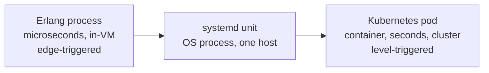

# 7. Modern echoes

## The temptation, and the discipline

It is easy, and lazy, to say that Kubernetes is basically Erlang, or that microservices are just the actor model with extra steps. The structural overlap is real, but the value is in being precise about it, because the places where these systems diverge from Armstrong's model are exactly where their operators get surprised. This chapter does the comparison carefully. For each system: what recovery or isolation shape did it inherit, and where does it structurally differ?

One pattern recurs, so pin it down once. A supervisor keeps a desired set of things alive and recreates whatever goes missing. Two mechanisms can drive that. A supervisor is edge-triggered: it is pushed an exit signal the moment a child dies and reacts to the event. A Kubernetes controller is level-triggered: it observes the actual state, compares it to the desired state, and reconciles the gap on a loop. Same goal, opposite trigger, and the difference matters more than the similarity. Armstrong runs the edge-triggered version over individual lightweight processes inside one VM, in microseconds. The modern systems below run one or the other at much larger grain.

The same supervise-and-restart shape, growing coarser and slower from left to right. Two other systems in this chapter, Temporal and microservices, are not points on this line at all; they answer different questions, and saying so is half the lesson.

## systemd and Kubernetes: the supervisor moved out of the VM

A Linux init system like systemd is a process supervisor. It starts services, watches them, and restarts them on failure under a policy (`Restart=on-failure`), with a cap on how fast it will retry before giving up (`StartLimitBurst` over `StartLimitIntervalSec`). Those two settings are restart-intensity limiting from chapter 4, rebuilt for OS processes. systemd is not as flat as it first looks: it has slices and a cgroup hierarchy, target grouping, and failure propagation through `BindsTo=` and `PartOf=`. What it does not have is restart escalation up a supervision tree. A unit that blows its start limit just fails in place; there is no parent whose strategy then takes over. And the unit is heavy: an OS process, tens or hundreds per host, not the hundreds of thousands Armstrong built around.

Kubernetes is the same idea lifted to a cluster, and getting its mechanics right matters, because there are two control loops here, not one, and they are easy to blur.

The first is node-local. On each machine, the kubelet runs liveness probes and, when a container fails one or exits, restarts that container in place, applying CrashLoopBackOff (an exponential backoff) if it keeps dying. This loop is fast, stays on the node, and never touches the cluster database. This is the part that actually maps to "a supervisor restarts its child": the kubelet is the local supervisor, the container is the worker.

The second loop is the control plane. A ReplicaSet or Deployment controller compares the desired number of Pods, stored in etcd, against the Pods actually running, and creates or reschedules Pods to close the gap, including moving a Pod to a healthy node when one dies. This loop is level-triggered, spans machines, and runs in seconds. It is closer to a supervisor's parent reacting to a whole subtree going down.

Two precise differences fall out, and both are the kind a careful reader should hold onto. First, scale: the kubelet and controller work in seconds over containers and an etcd-backed desired state; a supervisor reacts in microseconds over in-memory processes. That is about six orders of magnitude in latency, and a similar gap in the size of the unit being recovered. Second, escalation: CrashLoopBackOff backs off and retries the same container forever, capped at around five minutes. It bounds the retry rate, which is the "give up locally" half of Armstrong's restart limit, but it has no parent to hand the fault to, so it drops the "escalate to someone with a wider view" half that chapter 4 called the single most important detail. In Kubernetes, escalation is something outside the loop: a controller, an operator, or a human. A pod can sit in CrashLoopBackOff indefinitely, which is to say, simply down.

The isolation story is the one most people get backwards, so be careful here. It is tempting to say pods are less isolated than Erlang processes. The opposite is closer to true. A container uses kernel namespaces and cgroups, so a pod gets enforced memory and resource limits that two Erlang processes, sharing one VM and one out-of-memory fate, do not have between them. On the resource axis, containers isolate harder. What Kubernetes cannot do is what Armstrong did: couple that isolation with a unit cheap enough to give every concurrent activity its own. A pod is far too heavy for that, so supervision happens at the granularity of whole application instances, not individual tasks. And co-located pods still share a kernel and a node, so a kernel panic or a node failure is shared-fate across every pod on the box. The real gap is not "pods lack isolation." It is "Erlang couples enforced isolation with near-free granularity, and nothing in the container world does."

## Akka, Orleans, Elixir: the actual inheritors

The systems that took the model entire, not just the recovery shape, are the actor runtimes. Akka, on the JVM, is the most direct: it has supervisor strategies, actors with mailboxes, and "let it crash" as stated doctrine. Its strategy names deliberately echo OTP's, though not exactly: Akka's `OneForOneStrategy` matches OTP's `one_for_one`, while its `AllForOneStrategy` is OTP's `one_for_all` with the words reversed, and Akka has no `rest_for_one` at all. Orleans, on .NET, took a different cut with virtual actors (grains) that the runtime activates on demand and silently reactivates elsewhere after a failure, so reliability comes from automatic re-instantiation rather than an explicit supervision tree. Elixir is not an echo at all; it runs on the BEAM, Erlang's own VM, and inherits OTP wholesale. Phoenix and its supervision trees are Armstrong's design with nicer syntax.

Here is the difference that matters. Akka and Orleans live on runtimes (JVM, CLR) with a shared heap and shared garbage collection, so actor isolation is a discipline the framework asks you to keep, not a property the runtime enforces. Nothing at the VM level stops one actor from handing another a reference to mutable state, and one actor's runaway allocation can trigger an out-of-memory error that kills every actor in the process. Modern low-pause collectors (ZGC, Shenandoah, G1, .NET's background GC) have largely defused the old "one actor's GC pause freezes them all" problem, so the pause is not the durable objection. The durable objection is the shared heap and the shared out-of-memory fate. The BEAM gives each process its own heap and collects them independently, so a process crash stays local. That is not total isolation even on the BEAM (ETS tables, the atom table, and the process registry are shared, and a node-wide OOM takes everyone down), but a crashing process tearing its own heap cannot reach into another's. On the JVM, "let it crash" is sound advice the platform cannot fully guarantee. On the BEAM it is enforced. That gap is the difference between adopting a model and faithfully implementing it.

## Temporal: a different answer to the same question

Durable-execution engines like Temporal answer one of Armstrong's questions a genuinely different way, which is why they are not a point on the granularity line above. Recall the tension from chapters 3 and 4: restart is only safe if the restarted process comes back to a good state, which forces you to keep durable state outside the fragile worker. Armstrong's answer is a supervisor that restarts the worker from its initial state, with important state held in stable storage.

Temporal makes the execution itself durable. Every result a workflow produces, every completed activity, is written to an event history. When a worker crashes, Temporal does not checkpoint-and-resume from an instruction pointer; it re-runs the workflow code from the top on a new worker and replays that history, feeding back the recorded results of already-completed steps instead of re-executing their side effects. The workflow fast-forwards through everything it already did and continues from where it left off. This only works because the workflow code must be deterministic: same history in, same decisions out. That determinism requirement is a real operational footgun (a stray `now()` or random number breaks replay), and it is the price of the approach. So Armstrong throws the process away and rebuilds from a known-good start; Temporal preserves the position by replaying a durable log. Both keep the system making progress across crashes. Seeing them together sharpens what Armstrong actually chose: cheap restart plus carefully placed durable state, rather than persisting every step, because in 1990s telecom persisting every step was unaffordable and most faults were transient anyway. Different era, different constraints, same question.

## Microservices: the isolation, and the bill that comes with it

Cut a system into services that each run in their own process or container and talk only by messages over the network, and you have rebuilt concurrency-oriented programming at the granularity of the deployment. Share-nothing, message-passing, independent failure: Armstrong's model with the network as the bus. The isolation is real and, on one axis, stronger than his, because separate hosts genuinely cannot touch each other's memory.

But you pay a bill Armstrong mostly avoided. His model already assumes unreliable delivery everywhere, which is why local Erlang code and distributed Erlang code read the same. The honest contrast is not "local is reliable, remote is not"; it is that the network makes the assumed unreliability bite. Inside one BEAM, a send is cheap and, between a given pair of processes, ordered. Across a network of generic services, every call is slow, can be lost, can be reordered, and can be answered by a service that has since died, that last hazard being the dead-versus-unreachable ambiguity of chapter 5, now present at every hop. The patterns the industry invented to cope are rediscoveries of the same instincts. Bulkheads are process isolation drawn at the service boundary. A circuit breaker is not restart-intensity limiting (that lives in the supervisor); it protects the caller from a failing dependency by failing fast and probing for recovery, which puts it in the timeout-and-bulkhead family. Nygard's *Release It!* is the catalog, and the service mesh (Envoy and its outlier detection, retries, and timeouts) now implements much of it out of process in a sidecar. We rebuilt Armstrong's ideas at a granularity that made them far more expensive, in exchange for the operational independence of separate deployables. Sometimes that is the right trade. It is worth knowing it is a trade.

## What actually survived

| System | Recovery shape it inherited | Where it structurally diverges |
|--------|----------------------------|--------------------------------|
| systemd | Supervised restart with intensity limits | Heavy OS processes; no restart escalation up a tree |
| Kubernetes | Restart in place (kubelet) plus reconcile (controller) | Six orders coarser and slower; backoff but no escalation; supervises whole instances, not tasks |
| Akka / Orleans | Supervisor strategies, mailboxes, let it crash | Shared-heap runtime; isolation by convention, not enforced |
| Elixir / OTP | The whole model | None; it is the BEAM |
| Temporal | Survive worker crashes | Replays a durable log instead of restarting clean; needs deterministic code |
| Microservices | Share-nothing, message-passing isolation | Full network failure model on every call |

Read down the right-hand column and one thing stands out. Almost everyone took the recovery shape, isolate, supervise, restart, escalate, because it is correct and hard to improve on. Almost no one took the part that was actually difficult: enforced isolation at the granularity of a process cheap enough to spend by the million. That specific combination is still rare, and it is why Armstrong's design, not just his architecture, still teaches something. The shape was easy to copy. The foundation under it was not.

> **Principle:** The recovery shape travels easily and turns up everywhere. The enforced, cheap isolation that makes it safe does not, so most systems inherit the architecture and rebuild the hard part by hand, if at all.
