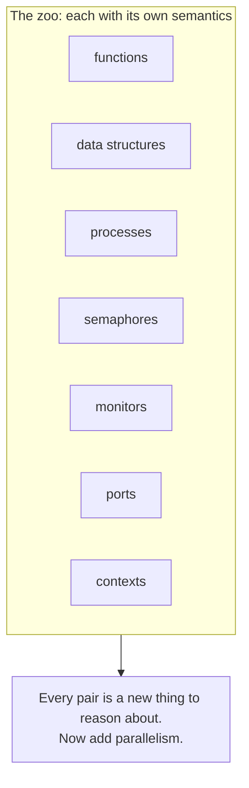

# 1. Knowledge, not reliability

## The problem was intelligence

If you learned the actor model from Erlang or Akka, you learned it as an answer to a concurrency problem. Hewitt was not asking a concurrency question. In 1973 he was at the MIT Artificial Intelligence Laboratory, running the PLANNER project (the paper reports the work as sponsored by the AI Lab and Project MAC under an Office of Naval Research contract), and the thing he wanted was a machine that could hold knowledge and reason with it.

That is the frame the paper announces in its first breath. The title is *A Universal Modular ACTOR Formalism for Artificial Intelligence*, and the opening sentence proposes "a modular ACTOR architecture and definitional method for artificial intelligence." The goal Hewitt kept returning to was what his group called the procedural embedding of knowledge: representing what a program knows not as a pile of declarative facts sitting in a database, but as procedures, active things that carry the knowledge and know how to use it. An AI program in this tradition does not just store "a bird can fly." It stores a procedure that, when asked, does something intelligent about birds and flying.

Push on that goal and it gets demanding fast. If knowledge is procedural, and you want a program that can add knowledge, revise it, reason about it, and even reason about itself, then you need every kind of thing in your system to be inspectable and combinable in the same way. A number, a list, a function, a database, a running process: if each of these is a different sort of beast with its own rules, then a program that wants to reason across all of them has to learn a different language for each. Hewitt wanted one language.

## Why the obvious fix fails: the zoo

The obvious way to build a powerful AI system in 1973 was to keep adding mechanisms. The field had plenty. PLANNER itself had pattern-directed invocation and automatic backtracking. CONNIVER, built by McDermott and Sussman as a reaction to PLANNER, contributed the possibility list and borrowed a context mechanism from QA4, which had introduced it. Underneath all of it sat the ordinary machinery of programming: functions and the call stack, mutable data structures, coroutines, and for anything concurrent, the operating-system toolkit of interrupts and semaphores. Balzer, Krutar, and Mitchell had ports for connecting programs. Each mechanism solved a real problem. Together they were a zoo.

A zoo is expensive in a specific way. Every mechanism has its own semantics, so every combination of mechanisms is a new thing to reason about. What does a semaphore mean when the process holding it backtracks? What happens to a coroutine when an interrupt fires? The constructs Hewitt singled out as the worst offenders were `goto`, the interrupt, and the semaphore, and his objection was not aesthetic. A `goto` sends control somewhere without carrying any data to where it lands. An interrupt, in his words, "wrenches control away from whatever instruction is running when the interrupt strikes." These constructs tear control flow away from data flow, and once the two are separated, reasoning about the program, which was the entire point, becomes a special case analysis with no bottom.

And the parallelism was coming. Hewitt saw that hardware was about to make it "economically attractive to run many physical processors in parallel," which he called a "swarm of bees" style of programming. Layering true parallelism on top of the zoo, with its interrupts and semaphores and shared global state, was a recipe for a formalism nobody could reason about at all.

## Hewitt's move: one concept, on purpose

Hewitt's answer was radical compression. Throw out the zoo. Replace all of it with a single kind of object, the actor, whose single ability is to send messages to other actors. He was explicit that this was a deliberate reach for the fewest possible entities, and he reached for Occam to say so: the paper quotes "It is vain to multiply Entities beyond need" and then, with a straight face, adds the line "Monotheism is the Answer."

The claim is that the entire zoo collapses into special cases of one thing. In Hewitt's own list, "data structures, functions, semaphores, monitors, ports, descriptions, Quillian nets, logical formulae, numbers, identifiers, demons, processes, contexts, and data bases can all be shown to be special cases of actors." All of them are just objects with useful modes of behavior, and every mode of behavior is defined in terms of the one behavior every actor shares: receiving a message and sending messages in turn. "An actor is always invoked uniformly in exactly the same way regardless of whether it behaves as a recursive function, data structure, or process."

That uniformity is the payoff Hewitt was chasing back at the AI problem. If a function and a database and a process are all just actors, then a program that reasons about one can reason about all of them, because there is only one interface to understand. Knowledge embedded in procedures becomes tractable to inspect and extend because the procedures, and the data, and the processes running them, are made of the same stuff.

## The modern echo, kept honest

The picture Hewitt drew of his own model is startlingly current. He described it, borrowing Seymour Papert's image, as "a cooperating society of little men each of whom can address others with whom it is acquainted and politely request that some task be performed." Read that in 2026 and it sounds like a description of a multi-agent system: a swarm of independent agents, each with local knowledge, coordinating by sending each other requests to get a larger task done.

The resonance is real, and it is worth being precise about where it holds and where it breaks. It holds on shape: independent entities, local knowledge, coordination by message rather than by shared control. It breaks on isolation. The agents in a modern LLM framework usually share a great deal, a common context window, a shared tool registry, a scratchpad of intermediate state, and they are coordinated by an orchestrator that sees everything. Hewitt's actors share nothing but the messages they choose to send. His society is stricter than most of the "agent" systems that invoke the word today, and that strictness is not a limitation he stumbled into. It is the whole design. The rest of this seminar is about what he bought with it.

> **Principle:** Do not add a mechanism for every behavior you need. Find the single mechanism that every behavior is a special case of, and pay the cost of making everything fit.
