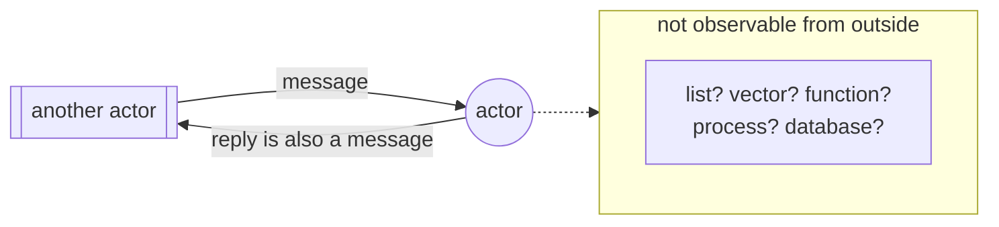

# 2. One kind of object

## The problem: what is the single thing?

Chapter 1 ended with a commitment: throw out the zoo, keep one kind of object. That commitment is easy to state and hard to honor, because it forces a question most language designers get to dodge. What is the one thing? If a number and a function and a database and a running process are all going to be the same kind of object, that object has to be defined in a way that does not secretly assume it is any one of them.

This is harder than it sounds. Pick the wrong foundation and the unification leaks.

## Why the obvious fixes fail

Two candidates were sitting right there in 1973, and Hewitt rejected both.

The first was the function, in the sense of the lambda calculus. Church and McCarthy had shown you could build a great deal out of pure functions, and Hewitt knew the tradition cold. But a function is a poor universal object for his purposes. It is timeless and stateless by nature, which makes a mutable data structure or a long-lived process an awkward fit. You can encode state in a pure functional world, but you encode it, you do not represent it directly, and Hewitt wanted processes and databases to be first-class citizens, not encodings. He kept the lambda calculus close (his message-receiving construct is, in his words, "reminiscent of the actor LAMBDA in the lambda calculus") but he did not make the function the foundation.

The second candidate was the passive data structure, defined from the outside by writing down axioms for the operations you can perform on it. A stack is whatever satisfies the laws for push and pop. (The rigorous algebraic version of this idea was itself only taking shape in these same years, so Hewitt is reacting to the instinct more than to a finished theory.) He rejected it too, and his reason is the intellectual core of the chapter. Borrowing a distinction he credits to Alan Kay, he calls this axiomatic style extrinsic: you define an object by stating properties of the operations that act on it, from the outside. His alternative he calls intrinsic. As the paper puts it, "objects are defined by their actors rather than by axiomatizing the properties of the operations that can be performed on them."

The difference is not academic. An extrinsic definition talks about an object. An intrinsic definition is the object. When you want a program that can reason about its own building blocks, and can extend itself by creating new building blocks, the intrinsic style wins, because there is no separate layer of axioms to keep in sync with the thing. The behavior is the definition.

## Hewitt's move: define by behavior, hide the representation

So the single object is the actor, and an actor is defined entirely by how it behaves when it is sent a message. Nothing else about it is visible, and Hewitt makes the consequence loud. It becomes, in his words, "impossible to determine whether a given object is 'really' represented as a list, a vector, a hash table, a function, or a process."

That sentence is the idea. From the outside, you send a message and observe what comes back. Whether the thing you are talking to stores its answer in an array or computes it on the fly or fetches it from a database is not merely hidden, it is undefined at the level of the model. The paper drives it home with a joke that is also a specification: "If it waddles like a duck, quacks like a duck, and otherwise behaves like a duck; then you can't tell that it isn't a duck."

The diagram is deliberately boring on the left and vague on the right, because that is the point. The interface is a message in and messages out. The representation is a cloud you are not allowed to look into. Two actors that answer every message the same way are, as far as the model is concerned, the same actor, no matter what is inside. Chapter 5 turns that intuition into Hewitt's actual definition of equivalence. For now, hold the shape: behavior is public, representation is private, and there is exactly one way to interact, which is to send a message.

## The modern echo, stated precisely

If this sounds like object-oriented programming, that is not a coincidence, and the honest history runs in both directions. Hewitt built on Alan Kay's work directly. The paper thanks Kay, whose "FLEX and SMALL TALK machines have influenced our work," and says outright that it "explores the consequences of generalizing the message mechanism of SMALL TALK and SIMULA-67 ... to a universal communications mechanism." Actors and Smalltalk grew up in the same conversation about message passing, in the same few years, influencing each other.

Now the break, because it is where the lesson lives. Mainstream object-oriented programming kept the encapsulation and the message-passing vocabulary, we still say a caller "sends a message" to a method, and then quietly reintroduced almost everything Hewitt was trying to escape. A Java object's method call is a synchronous, stack-based procedure call, not an asynchronous message. Objects share references to mutable state, so two of them can corrupt a third. The encapsulation is a convention the compiler helps you keep, not a boundary the model enforces. What survived into ordinary OOP is the interface idea, program to what an object does, not to how it is built, which is real and valuable and shows up every time you define an interface or lean on duck typing in Python. What did not survive is the strict version: no shared state, no synchronous call, message passing as the only move. That strict version went a different way, into the concurrency runtimes, and it is the subject of the chapters ahead.

The intrinsic-versus-extrinsic distinction also survived, under other names. Every time you argue about whether to specify a component by an algebraic contract or by a reference implementation, whether an interface should be a list of laws or a working mock, you are having Hewitt and Kay's argument. Hewitt bet everything on the intrinsic side: the thing is its behavior.

> **Principle:** Define an object by the messages it answers, not by the operations you can perform on its insides. If no observer can see the representation, the representation is free to be anything.
