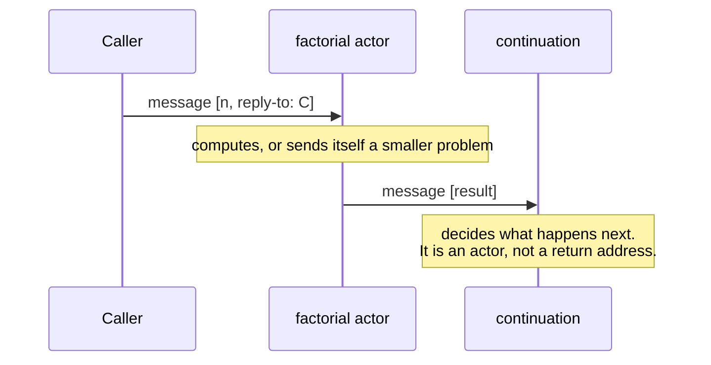

# 3. The message is the only move

## The problem: where did the control structures go?

If every object is an actor and the only thing an actor does is send messages, a hard question lands immediately. Programs are not just objects. They branch, they loop, they call and return, they run coroutines, they wait on each other. All of that is control flow, and control flow was exactly the part of the zoo Hewitt threw out. He kept no `goto`, no call stack primitive, no interrupt, no semaphore. So how does anything actually happen?

The chapter's job is to show that one primitive, sending a message, is enough to rebuild all of it, and that rebuilding it this way fixes something the original constructs got wrong.

## Why the obvious fix fails: control flow that drops the data

The conventional toolkit gives each control pattern its own mechanism. A jump for branching. A stack for call and return. An interrupt for asynchronous events. A semaphore for synchronization. Hewitt's complaint, stated in chapter 1 and sharpened here, is that several of these sever control flow from data flow, and once severed, the two cannot be reasoned about together.

The `goto` is the clean example. When you jump to a label, control moves but no data goes with it. The destination has to reach back into shared state to find out why it was invoked and what to do. Hewitt states the principle he is enforcing, "Control flow and data flow are inseparable," and then convicts `goto` on it: the construct "does not allow a message to be passed to the place where control is going. Thus it violates the inseparability of control and data flow." The interrupt is worse, because it seizes control from code that never agreed to yield. These are not stylistic sins. They are the reason a program built from them cannot be read locally, one piece at a time, which is the property Hewitt needs for reasoning and for parallelism.

## Hewitt's move: calling is sending, and returning is sending back

Replace the toolkit with one act. To invoke an actor, you send it a message. That is the universal control primitive, and Hewitt means universal literally. He put it most sharply a few years after the 1973 paper, in "Viewing Control Structures as Patterns of Passing Messages" (1977): "Sending messages between actors is a universal control primitive in the sense that control operations such as function calls, iteration, coroutine invocations, resource seizures, scheduling, synchronization ... are special cases." The 1973 paper is already reaching for this; the crisp formulation is the follow-up.

The move that makes this work, and the one most worth slowing down on, is what happens to the return. In an ordinary language, return is built into the call: a function call pushes a frame, the function runs, and control falls back to the caller through the stack. Hewitt unbundles this. When you send a message, you also hand along a continuation, which is simply another actor: the one to send the answer to. Returning a value is not a special operation at all. It is sending a message to the continuation.

He is emphatic that a continuation is a real actor, not a bookmark. "A continuation is a full blown actor with all the rights and privileges; it is not a program counter. There are no instructions in the sense of present day machines in our model." A function does not return to "the next instruction." It sends its result to an object it was told to send it to, and that object decides what happens next. The paper draws the formal event as a quadruple, and the continuation `C` is right there in it alongside the target `T` and the message `M`. We will use that quadruple in the next chapter.

Once return is just a message, the rest of the zoo really does fall out. A loop is an actor that sends itself the next iteration, carrying the running state in the message. A coroutine is two actors sending each other messages with no presumption about who is "the caller." Hewitt notes that the send is unidirectional and carries no promise of a reply: "Sending a message to an actor makes no presupposition that the actor sent the message will ever send back a message to the continuation. The unidirectional nature of sending messages enables us to define iteration, monitors, coroutines, etc. straightforwardly." There is no built-in round trip to constrain the patterns you can build. If you want a reply, you send a continuation and let the other side use it. If you do not, you do not.

## The modern echo, stated precisely

An engineer who has written asynchronous code will feel a jolt of recognition here, because this is continuation-passing style, and it is how the async world actually works. When you call an API with a callback, you are handing the callee a continuation: here is the function to invoke with the result. A JavaScript Promise is a first-class continuation you can pass around, store, and hand to `.then`. `async`/`await` is the same machinery with the continuation captured for you by the compiler so the code reads sequentially. The event loop underneath is a scheduler passing messages and results between callbacks. The shape Hewitt drew, invoke by sending, return by sending to a continuation you were given, is the shape of every non-blocking runtime built since.

The overlap is not an accident of convergence in this case, or not entirely: continuations were an active research idea in exactly these years. The paper thanks "Peter Landin, Arthur Evans, and John Reynolds for emphasizing the importance of continuations," and Sussman and Steele's Scheme grew up in the same MIT hallways and would go on to make continuations first-class objects a programmer could capture, pass around, and invoke. This is a genuine shared lineage, not a coincidence.

Now the break. Modern async runtimes make the continuation first-class but keep a scheduler and, underneath, a call stack and a heap the callbacks share. A JavaScript callback can close over and mutate variables another callback also sees. Hewitt's model has no shared state to close over: the only thing a continuation gets is the message sent to it. And where a real runtime distinguishes "call this function now on this stack" from "schedule this callback for later," Hewitt collapses the distinction. There is one operation. The runtime that took this idea and made it enforce isolation, rather than merely offer it, was not JavaScript. It was Erlang, and getting to why is the rest of the seminar.

> **Principle:** Return is not a language feature. It is a message to whoever asked. Once you believe that, every control structure is a pattern of messages, not a primitive of its own.
