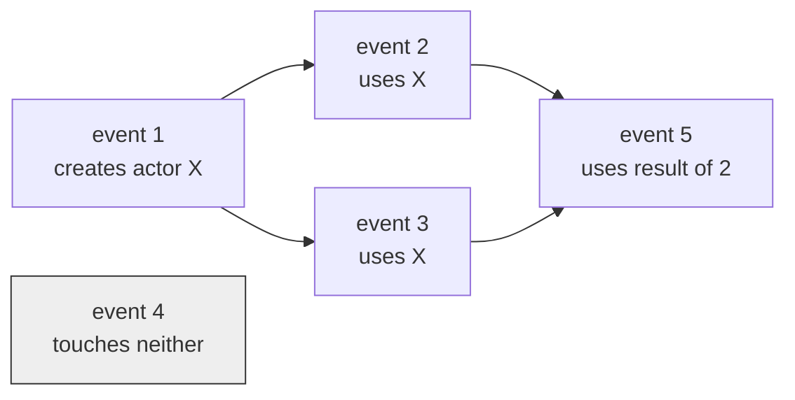

# 4. No clock, only order

## The problem: when did anything happen?

Chapter 3 rebuilt control flow out of messages. That buys a new problem. If a computation is a swarm of independent actors firing messages at each other, possibly on many processors at once, then what does it even mean to say one thing happened before another? A single sequential program has an obvious answer: instructions run in order, and "before" is just their position in that order. Hewitt threw that out when he threw out the instruction pointer. So he owes an account of time, and he cannot borrow the easy one.

This is not a side issue for him. To define what a program means, to say when two programs are equivalent, or to prove an actor correct, you need a notion of the order events occur in. Hewitt needs that notion to survive parallelism, and the parallelism he is imagining is aggressive: many physical processors, the swarm of bees.

## Why the obvious fix fails: there is no global now

The standard way to give a language its meaning in 1973 was to define it over a global computational state. The Vienna Definition Language did this: the meaning of a program is a sequence of transformations on one big global state, one step at a time. Hewitt rejects this directly, and he rejects it in a phrase he clearly enjoyed: under a header reading "Global state considered harmful," he argues that defining semantics in terms of the global state forces you to "pay formal penalties such as the frame problem and the definition of simultaneity even if the definition only effectively modifies local parts of the state."

Two costs, both fatal for his goals. The first is the frame problem, the AI headache of having to say, every time anything changes, everything that did not change. A global-state semantics makes you account for the whole state at every step. The second is simultaneity. To order events against one global state, you need to know what "at the same time" means across the system, and once you have many processors running freely, that global instant does not exist in any useful sense. Insisting on it would serialize the swarm you were trying to set loose. As Hewitt puts it, local definition is what "allows the maximum possible degree of parallelism."

## Hewitt's move: causality as a partial order

Instead of a timeline, Hewitt gives an order built only from what actually depends on what. He starts by naming the atom of activity. An event is a message send, written as a quadruple. As the paper defines it, "an EVENT is a quadruple of the form `[C T M N]` where `C` is the continuation of the caller, `T` the target, and `M` the message, thereby creating a new actor `N`." Every event names the four actors involved: who to reply to, who received the message, what the message was, and the new actor conceptually born from the send.

Then he defines order between events by dependence, not by clock. One event precedes another when something the first event created is used by the second. In the paper's notation, event one precedes event two if the actor `N` created by the first turns up among the `C`, `T`, or `M` of the second: the created actor is used in the later event. He calls the resulting relation the "arrow of time" and requires it to be a strict partial order. And then the crucial sentence, the one that makes this a distributed-systems paper in disguise: "Notice that we do not require a definition of global simultaneity; i.e. we do not require that two arbitrary events be related."

That last clause is the whole idea. Two events that never touch, neither one using anything the other created, are simply unordered. There is no fact about which came first, and the model does not invent one. Time is not a line. It is a partial order, and concurrency is just the absence of an edge.

Events 2 and 3 both depend on event 1, so both come after it, but they do not depend on each other, so they are concurrent: no arrow, no ordering, no contradiction. Event 4 floats free of all of them. Event 5 is the one place order reappears, because it needs results from both 2 and 3. This graph, not a clock, is what "when" means in the actor model. Hewitt then builds correctness on top of it: the observable behavior of a system is the sub-order of events visible to a given audience, which chapter 5 picks up.

## The modern echo, stated precisely

If you have done any distributed systems, that partial order is familiar, because it is Lamport's. Leslie Lamport's "Time, Clocks, and the Ordering of Events in a Distributed System" appeared in 1978, five years after this paper, and its central move is the same one: define a happens-before relation as a partial order over events, where an event happens-before another only if there is a causal chain linking them, and events off each other's chains are concurrent and simply unordered. Lamport was solving a different problem, keeping physically separated machines coherent without a shared clock, and by all accounts arrived at the structure independently (his paper does not cite Hewitt). That independence is the interesting part. Two people chasing unrelated goals, AI knowledge representation on one side and distributed clocks on the other, reached for the identical abstraction, which is a strong signal that the abstraction is forced by the territory rather than invented for taste.

The comparison rewards precision, because the two orders are built from different atoms. Lamport's happens-before is generated by two rules: events within one process are ordered by that process's local sequence, and a message send happens-before its receive. Hewitt's arrow is generated by actor creation and use: an event precedes another when the later event uses an actor the earlier one made. Different generators, same kind of object, a causal partial order with no global instant. And both carry the same hard consequence, the one the later seminars in this series spend their time on: if there is no global now, then a group of machines cannot simply read the current state and agree on it. Ordering has to be constructed, and constructing it under failure is the consensus problem. Hewitt did not go there. He needed the partial order to define his language and stopped once he had it. Irene Greif, his student, took the event-and-history picture and turned it into a full formal semantics for actors in her 1975 thesis, and the line from there runs straight into how we reason about distributed executions today.

The break worth naming: Hewitt's partial order is a semantic device, a way to say what a program means. Lamport's is an operational tool you actually implement, with logical clocks and later vector clocks that let a running system stamp events and test causality at runtime. The idea is shared. The engineering of turning it into timestamps a live system can compute is Lamport's, and it is the subject of his seminar later in this series.

> **Principle:** In a system with no shared clock, "when" is a partial order, not a number. Two events that never touch are not simultaneous and not sequential. They are simply unrelated, and a model that forces them into a line is lying to you.
