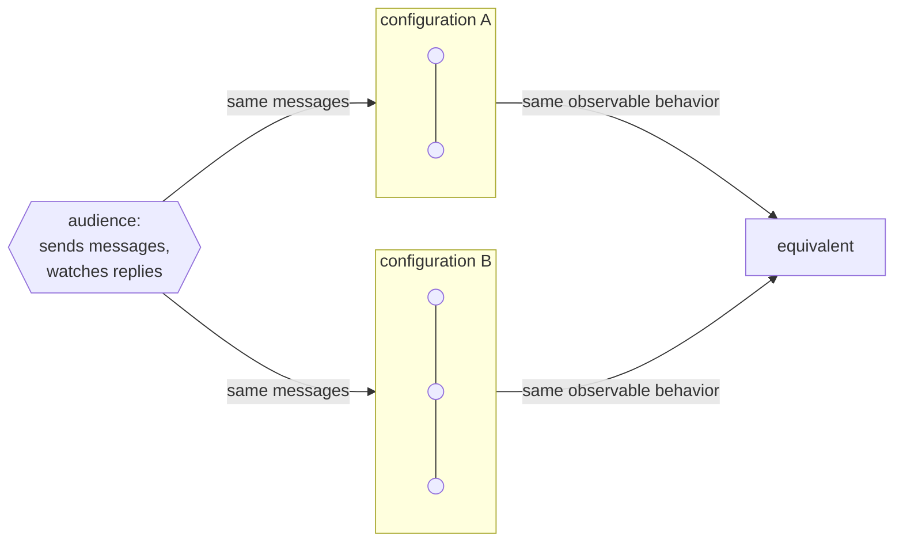

# 5. Behavior, not state

## The problem: when are two actors the same?

Chapter 2 said an actor is defined by its behavior, and that you cannot see its representation. Chapter 4 said events form a partial order visible to observers. Put those together and a sharp question falls out: when are two actors, or two whole configurations of actors, the same? You cannot answer "when they have the same internal state," because internal state is exactly what the model forbids you to look at. You need a definition of sameness that only mentions what an observer can see. And you need it to hold up under parallelism, where "observe the state" is not even well defined.

This is also the chapter where the 1973 actor turns out to be a stranger animal than its descendants, so it is worth reading closely before the next chapter cashes it out.

## Why the obvious fix fails: structural equality leaks the representation

The default notion of "same" is structural. Two data structures are equal if they hold the same values; two programs are equal if they are the same code. Both are useless to Hewitt, because both talk about the representation he spent chapter 2 hiding. If a list and a function can be the same actor as long as they answer messages identically, then equality cannot mention lists or functions. It can only mention messages and replies. Structural equality asks the one question the model refuses to answer.

## Hewitt's move: define sameness by what an audience can observe

Hewitt builds equality out of observation, in three steps, all in the paper's own terms.

First, behavior relative to an audience. He fixes a set of actors `E`, calls it an audience, and defines the behavior of a history "with respect to an audience `E`" as the sub-order of events, those quadruples `[C T M N]`, in which the continuation or target is a member of `E`. In plain terms: pick the observers you care about, and the behavior is just the events they can see, in their causal order. Everything the audience cannot touch drops out.

Second, the repertoire. "The repertoire of a configuration of actors is the set of all behaviors of the configuration." It is everything the system could be observed to do, across all the ways an audience might interact with it.

Third, equivalence. "Two configurations of actors will be said to be equivalent if they have the same repertoire." Two systems are the same when no audience, interacting with them by messages, could ever tell them apart. That is the definition, and it mentions representation nowhere. It is purely about observable behavior.

Different insides, different number of actors, and still equivalent, because the audience gets the same behavior out of both. This is a strikingly modern idea, and Hewitt knew he was near deep water. He credits Robin Milner directly: "Robin's puzzlement over the meaning of 'equality' for processes led to our definition of behavior." He even reaches for the fixed-point machinery, defining behavioral equivalence in terms of a "minimal behavioral fixed point," and citing "the least fixed point of Park and Scott."

## Intentions: a contract on every actor

Behavioral equality tells you when two actors are the same. It does not tell you when one is correct. For that Hewitt attaches to every actor an intention. "Every actor has an intention which checks that the prerequisites and the context of the actor being sent the message are satisfied. The intention is the contract that the actor has with the outside world. How an actor fulfills its contract is its own business." He then defines a bug against it: "By a simple bug we mean an actor which does not satisfy its intention." A bug is not a crash or a wrong answer in the abstract. It is a broken contract.

Because the contract is decoupled from the code that satisfies it, Hewitt can state a proof principle over the system. He calls it actor induction: if every actor satisfies its own intention whenever the actors it messages satisfy theirs, then the intentions of everything an audience sets in motion are satisfied too. He notes that "computational induction, structural induction, and Peano induction are all special cases of actor induction." It is a way to reason about a concurrent system compositionally, one contract at a time, without ever assembling a global state to check.

## The part that got replaced: state was the exception, not the rule

Here is the fact that surprises everyone who arrives from Erlang or Akka, and it is the hinge of this seminar. The message-sending mechanism in this paper is side-effect-free. Hewitt says it plainly: "The basic mechanism of sending a message preserves all relevant information and is entirely free of side effects." And he draws a consequence that a modern actor programmer will find almost unreadable: "Many actors who are executing in parallel can share the same continuation," and an actor "can be thought of as a kind of virtual processor that is never 'busy' in the sense that it cannot be sent a message." Being free of side effects, he adds, is what lets an actor be "engaged in several conversations at the same time without becoming confused."

Sit with that. In today's actor systems, the mental model is a stateful object with a mailbox that processes one message at a time, and that serialization is precisely what protects its internal state from races. The 1973 actor points the other way. Because the send mechanism carries no side effects, an actor need not hold any mutable state of its own, so it never needs to be busy, so any number of messages can be in flight to it at once and several parallel activities can share a single continuation and all send their answers to the same place. By default this actor is far closer to a pure function or a node in a dataflow graph than to the little stateful servers we now call actors.

None of this means state is impossible, only that it is the exception you request by name. Hewitt introduces the cell as "one of the simplest kinds of actors": you create it with contents, you can ask it for its contents, and you can ask it to change them. Mutation is quarantined into an explicit object you have to go out of your way to use. The default world is functional, and a cell is how you opt into state. So the honest claim is not that the 1973 actor cannot hold state, it is that statelessness is the default and mutation is a named special case, which is the reverse of every actor runtime you have used.

## The modern echo, stated precisely

Two of Hewitt's three moves here became mainstream, and one went a direction he did not take.

Behavioral equivalence became the standard way to compare concurrent systems. Milner, whose puzzlement Hewitt thanked, and David Park, whom Hewitt cited, went on to define bisimulation, the now-canonical notion that two processes are equivalent when each can match the other's observable moves step for step. When you assert that a mock and a real service are interchangeable because no caller can distinguish them, you are using Hewitt's definition of sameness, later sharpened by Milner and Park into a tool with real proof power.

Intentions became design by contract. Bertrand Meyer's Eiffel put preconditions, postconditions, and invariants into a language over a decade later, and the same instinct runs through modern type contracts, assertion checks, and property-based testing, where you state the law an operation must satisfy and let the framework attack it. Hewitt's "a bug is a violated intention" is the ancestor of "a bug is a falsified property."

The side-effect-free actor is the move that did not survive intact, and naming that honestly is the point of the next chapter. The actor that conquered industry is stateful and serialized, one message at a time, state guarded by that serialization. That is a genuinely good design, but it is not this one. It arrives later, through Gul Agha's reformulation and through Erlang's independent invention, and it trades Hewitt's shareable, side-effect-free, never-busy actor for a private, stateful, one-at-a-time one. The word stayed the same. The thing underneath changed.

> **Principle:** Identity is behavioral. Two systems are the same when no observer can tell them apart, and whether either one holds state is its own private business, not part of what it is.
