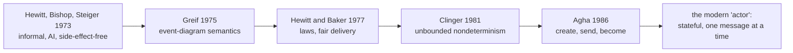

# 6. What survived, what got replaced

## The word won. The 1973 semantics did not, entirely.

"Actor" is one of the most successful pieces of vocabulary computer science has produced. It names a programming model taught in every concurrency course and shipped in Erlang, Elixir, Akka, Orleans, and a dozen smaller runtimes. But the thing the word names today is not identical to the thing Hewitt, Bishop, and Steiger described in 1973. Between the paper and the runtimes there is a chain of reformulations, and each link changed the model. This chapter traces the chain, then checks the survivors, so you can say precisely which parts are Hewitt's and which parts are somebody else's later good idea wearing his name.

## The chain from 1973 to the textbook definition

Start with the paper you just read. It is informal, aimed at artificial intelligence, and its actor is side-effect-free with shareable continuations, as chapter 5 showed. Then Irene Greif's 1975 MIT thesis turned the loose event-and-history sketch of chapter 4 into a real operational semantics built on event diagrams and causal order. Hewitt and Baker's 1977 "Laws for Communicating Parallel Processes" added the laws that made actors a usable concurrency model, including the guarantee that a sent message is eventually delivered, a fairness property the 1973 paper does not lean on. Will Clinger's 1981 thesis gave the model a rigorous denotational footing and made its defining feature explicit: unbounded nondeterminism, the ability to guarantee a message arrives eventually without bounding how long it takes.

Then comes the link that produced the definition most engineers actually carry. Gul Agha's 1986 book recast the model around three primitives: an actor, on receiving a message, can create new actors, send messages to actors it knows, and designate the behavior it will use for the next message. That third primitive, usually called become, is where mutable state enters cleanly. An actor updates itself by choosing a new behavior for its next message, which means it now processes messages one at a time, in order, its state changing between them. This is the actor of the textbooks, and it is worth being blunt about the attribution: the crisp "create, send, become" trio is Agha's 1986 formulation, not Hewitt's 1973 paper. If you have ever seen the actor model summarized as those three verbs and attributed to Hewitt, that is folklore compressing thirteen years of work into one citation.

The change is not cosmetic. Agha's become gives the actor a private, evolving state and forces it to handle messages sequentially, which is exactly what makes an actor feel safe to program: no other activity is inside your actor while you handle a message, so there are no data races on its state. Hewitt's 1973 actor was side-effect-free by default, with mutable state quarantined in cells, so it had little of its own to race on and could share a continuation with a crowd. The modern actor bought intuitive safety by trading that side-effect-free default for private, evolving state. Good trade. Different model.

## Erlang: the convergence, verified

The cleanest illustration that the surviving idea is bigger than one lineage is Erlang, because Erlang reached the same shape without touching Hewitt's paper at all.

This is easy to assert and needs checking, since it is the kind of tidy story that turns out false. It holds up. Erlang's designers have said so directly. On the Erlang mailing list, Robert Virding, one of the language's creators, wrote that they were solving a concrete telecom problem and "definitely took ideas from other inputs but not from the Actor model," adding that he, at least, had never heard of it at the time. Their inputs were Prolog, Smalltalk, an in-house concurrent Pascal, and the reliability demands of telephone switching, as the Armstrong seminar in this series lays out. Joe Armstrong's thesis does not cite Hewitt. They arrived independently at share-nothing entities that communicate only by copied messages, which is why the resemblance is convergence, not descent. Two teams, one chasing AI knowledge representation and one chasing five-nines telecom uptime, built the same structure. That is the strongest possible evidence that the structure is real.

Hewitt himself did not consider Erlang a faithful implementation of his model, and his objections are a precise map of where the two diverge. He disliked Erlang's external per-process mailbox, arguing that buffering and ordering should happen inside an actor rather than in a queue bolted to its front. And he objected to Erlang's silent process failure, where a process just dies and something else notices, versus his own preference for explicit handling. Erlang, for its part, added machinery Hewitt's actors never had: selective receive, where a process can pattern-match and pull a specific message out of its mailbox rather than handle them in arrival order, and links and monitors and supervision trees, the failure-handling architecture that is Armstrong's real contribution and owes nothing to the 1973 paper. Supervision is not in Hewitt. It is convergent evolution's answer to a problem Hewitt was not solving.

## Akka and Orleans: adopting the model, keeping the asterisks

Akka, on the JVM, is the most direct descendant of the textbook actor model, and it wears the lineage openly: mailboxes, `become` for state, and a supervision scheme borrowed from Erlang's OTP. It is Agha's model plus Armstrong's supervision, running on a shared-memory runtime. That last part is the asterisk. Because the JVM has one heap shared across all actors, actor isolation in Akka is a discipline the framework asks you to keep, not a boundary the runtime enforces. Nothing at the VM level stops one actor from handing another a reference to a mutable object, and a single actor's runaway allocation can trigger an out-of-memory error that kills every actor in the process. Hewitt's model forbids shared mutable state by construction. Akka forbids it by convention and code review.

Microsoft's Orleans took a different cut with virtual actors, called grains. A grain always conceptually exists; the runtime activates it on demand when a message arrives and can deactivate it when idle, and it guarantees that at most one activation of a given grain runs at a time, processing its messages one at a time. This is the serialized, stateful actor pushed into a distributed cluster with the lifecycle automated. It also runs straight into a problem Hewitt's semantics never had to face: enforcing single activation across a network where nodes fail and partitions happen is a hard distributed-systems guarantee, exactly the territory of no-global-clock from chapter 4. Hewitt gave the causal order; Orleans has to implement agreement on top of it, which is why its single-activation guarantee comes with careful caveats under partition.

## The ledger

| Idea | Origin | Status today |
|------|--------|--------------|
| Everything communicates only by message | Hewitt 1973 | Survived, core of every actor system |
| Address as capability, no shared state | Hewitt 1973 | Survived as the model's ideal; enforced on BEAM, by convention on JVM/CLR |
| Causality as a partial order, no global clock | Hewitt 1973 (formalized Greif 1975) | Survived, and became the backbone of distributed systems |
| Behavioral equivalence, intentions as contracts | Hewitt 1973 | Survived as bisimulation and design by contract |
| Side-effect-free actor, shareable continuation | Hewitt 1973 | Replaced by stateful, serialized actors |
| Guaranteed fair message delivery | Hewitt and Baker 1977 | Survived in the formal model; runtimes vary |
| State via `become`, one message at a time | Agha 1986 | The definition most engineers now mean |
| Supervision, links, restart | Armstrong / Erlang (convergent) | Survived, but never Hewitt's |

Read the middle of that table and the pattern is clear. The abstract commitments survived almost untouched: message-only communication, no shared state, causal order, behavioral identity. The concrete semantics of a single actor got rewritten twice, first by Agha to add state, then by the runtimes to enforce isolation and add supervision. The idea was robust. The details were replaceable, and got replaced.

> **Principle:** A powerful idea survives by being rewritten. The parts that endure are the constraints (communicate only by message, share no state, order by cause), not the mechanism. Check the citation before you put a modern actor's habits in a 1973 author's mouth.
