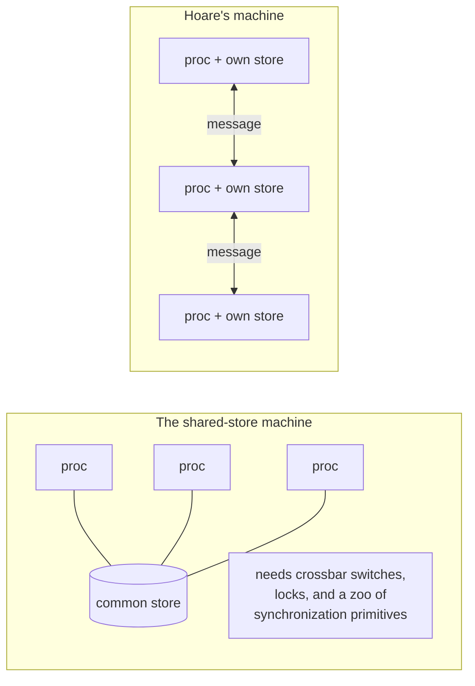

# 1. Input, output, and a machine of processors

## The problem: the machine was about to change

Hoare opens the 1978 paper with a complaint that sounds minor and turns out to be the whole argument. Assignment, he says, is well understood: any change to a machine's internal state is just an assignment to some variable. But input and output, the operations that touch the world outside the machine, "are often added to a programming language only as an afterthought." He wanted to promote them. His claim, stated in the abstract, is that "input and output are basic primitives of programming and that parallel composition of communicating sequential processes is a fundamental program structuring method."

Why did this matter in 1978? Because the hardware was about to change shape, and Hoare could see it coming. The stored-program computer had been built for "deterministic execution of a single sequential program," and wherever parallelism had crept in, designers had worked to "disguise this fact from the programmer." Hoare bet the disguise was ending. He argued that "a multiprocessor machine, constructed from a number of similar self-contained processors (each with its own store), may become more powerful, capacious, reliable, and economical than a machine which is disguised as a monoprocessor." Many processors, each with its own private memory, is not a footnote to that sentence. It is the assumption everything else rests on.

Once you accept that machine, the question writes itself. If the processors each have their own store and no shared memory, how do they communicate and synchronize to work on one task together?

## Why the obvious fix fails: the shared store and its zoo

The obvious answer in 1978 was the one most systems used: put the data in a common store and let the processors read and write it. Hoare rejected it on two grounds, one about correctness and one about hardware.

The correctness problem was already well known. Communication "by inspection and updating of a common store," he notes, "can create severe problems in the construction of correct programs." And to manage those problems, the field had produced a zoo of synchronization mechanisms. Hoare lists them: "semaphores, events, conditional critical regions, monitors and queues, and path expressions." His verdict on the pile is the sentence that motivates the paper: "Most of these are demonstrably adequate for their purpose, but there is no widely recognized criterion for choosing between them." A zoo with no principle for picking an animal is a sign that nobody has found the underlying idea.

The hardware problem was sharper and more forward-looking. A shared store across many independent processors is not free. Hoare points to the "expense (e.g. crossbar switches)" of wiring every processor to common memory, and the "unreliability (e.g. glitches)" of doing so. On a machine of self-contained processors, shared memory is the thing you have to build at great cost, not the thing you get for free. Message passing between processors that already have their own stores is the natural primitive. Shared memory is the expensive illusion.

## Hoare's move: one solution, built from three ideas

Faced with the zoo, Hoare does not add another animal. He makes "an ambitious attempt to find a single simple solution to all these problems." The solution has three moving parts, and the paper names them in order.

First, control and choice come from Dijkstra's guarded commands, "adopted (with a slight change of notation) as sequential control structures, and as the sole means of introducing and controlling nondeterminism." Chapter 4 is about what that buys. Second, a parallel command "specifies concurrent execution of its constituent sequential commands (processes)," which "all start simultaneously" and finish together, and which "may not communicate with each other by updating global variables." No shared state, by rule. Third, "simple forms of input and output command are introduced" as the only way those processes talk.

The most consequential detail is how the communication works, and it is worth quoting because the rest of the seminar turns on it. Communication happens "when one process names another as destination for output and the second process names the first as source for input," and then, crucially, "there is no automatic buffering: in general, an input or output command is delayed until the other process is ready with the corresponding output or input." Send and receive are a synchronized event. Neither side proceeds until both are present.

Hoare is candid that he is buying simplicity with severity. The language is "a rather static language: the text of a program determines a fixed upper bound on the number of processes operating concurrently; there is no recursion and no facility for process-valued variables." And he is unusually honest about the limits, in a passage worth imitating: the paper "fails to suggest any proof method," and the notations "should not be regarded as suitable for use as a programming language." He is proposing primitives, not shipping a compiler.

## The modern echo, and the contrast that runs through this seminar

Hoare's hardware bet came in. The machine of many self-contained processors, each with its own store, is now the normal machine: multicore chips, clusters, and the entire distributed world, where shared memory across nodes is exactly the expensive illusion he described. And the synchronization zoo is still the zoo. A working engineer in 2026 still argues about mutexes versus channels versus actors, still has "no widely recognized criterion for choosing between them," and still discovers that shared mutable state across independent workers is where the correctness bugs live. Hoare's diagnosis aged better than most 1978 predictions.

There is a second, closer comparison, and it is the spine of this seminar. The previous seminar read Carl Hewitt, who started from a different problem, artificial intelligence, and reached a strikingly similar first move: independent entities, no shared memory, communication only by message. Hoare and Hewitt agree completely that shared memory is the enemy and messages are the cure. Then they split. Hewitt's actor sends a message and moves on, never waiting, addressing a recipient by identity. Hoare's process cannot send until a receiver is there to catch it, and it names that receiver directly in the code. Same diagnosis, opposite prescription. The next chapter is about that fork, and it is the most important disagreement in the concurrency literature.

> **Principle:** When a field has many adequate mechanisms and no principle for choosing among them, the mechanisms are not the idea. Look for the primitive they are all special cases of.
