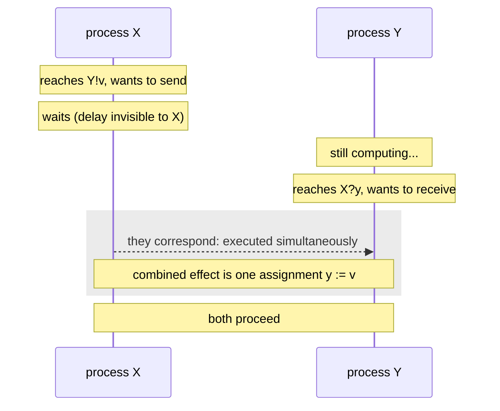

# 2. Communication is a handshake

## The problem: what happens when the receiver is not ready?

Two processes want to exchange a value. One is ready to send. The other is busy, or slow, or not yet at the point in its code where it wants to receive. What should happen to the sender?

There are only a few honest answers. The sender can drop the value. It can hold the value in a buffer and keep going. Or it can wait until the receiver is ready and hand the value over directly. Every message-passing system answers this question, and the answer defines the system more than any syntax does. Hoare picked the last option, and picked it deliberately, against the grain of what others were proposing.

## Why the obvious fix fails: buffering hides a decision you need to make

The tempting answer is the buffer. Let the sender deposit its value in a queue and continue; the receiver picks it up whenever it gets around to it. This is convenient, and Hoare knew it was the popular choice. In the discussion section he describes it precisely: "it is often proposed that an outputting process should be allowed to proceed even when the inputting process is not yet ready to accept the output," with the implementation "expected automatically to interpose a chain of buffers to hold output messages that have not yet been input."

He rejected it, and gave two reasons. "It is less realistic to implement in multiple disjoint processors," because a buffer is memory that has to live somewhere, and on a machine of self-contained processors there is no neutral shared place to put it. And, more pointedly: "when buffering is required on a particular channel, it can readily be specified using the given primitives." Buffering, to Hoare, is not a primitive. It is a thing you build out of processes when you actually want it, and paying for it everywhere by default is the wrong trade. He adds, with characteristic symmetry, that the argument runs both ways: "synchronization can be specified when required by using a pair of buffered input and output commands." He is aware he is making a choice, and he defends the choice rather than pretending it is forced.

## Hoare's move: the rendezvous

So communication in CSP is a handshake. The paper's rule is exact: "there is no automatic buffering: in general, an input or output command is delayed until the other process is ready with the corresponding output or input. Such delay is invisible to the delayed process." When both are ready, the two commands "are said to correspond," and "commands which correspond are executed simultaneously, and their combined effect is to assign the value of the expression of the output command to the target variable of the input command."

Read that last clause slowly, because it is doing something subtle. The output command `Y!v` in one process and the input command `X?y` in the other, when they correspond, together behave exactly like a single assignment `y := v`. Two processes, running on two machines, perform one assignment between them, at one instant, with no intermediate state where the value is in flight. That is the rendezvous: not a message in transit, but a moment of agreement.



The canonical example is three lines long and contains the entire idea. A process `X` that copies characters from a process `west` to a process `east`:

```
X :: *[c:character; west?c → east!c]
```

It repeatedly receives a character from `west` and sends it to `east`. Hoare's note on it is the part to keep: "Process X acts as a single-character buffer between west and east. It permits west to work on production of the next character, before east is ready to input the previous one." Even in a world with no buffering, a relay process gives you exactly one slot of buffering. Want ten slots? Chain ten relays, or write the bounded-buffer process Hoare gives in section 5.1. Buffering is not absent from CSP. It is just something you spell out, process by process, rather than something the runtime does behind your back.

## The modern echo, stated precisely

This is where CSP and the actor model separate cleanly, so hold both in view. In the actor model, as the previous seminar described, a send does not wait. The sender fires a message at a recipient and continues immediately; the recipient deals with it later. The mainstream actor runtimes make that concrete with a mailbox, an unbounded queue in front of each actor that holds messages until it processes them. Asynchronous, buffered, non-blocking. Hoare's process is the mirror image: synchronous, unbuffered, blocking until the partner arrives.

The difference is not academic, and the clearest place to see it is failure under load. An actor mailbox that fills faster than the actor drains it grows without bound, and the previous series entry on Armstrong noted this is a real production failure mode: an unbounded queue is an out-of-memory error waiting for traffic. CSP does not have this failure, and the reason is structural. Because a sender blocks until the receiver is ready, a slow receiver automatically slows its senders. The synchronization is backpressure, built into the communication primitive rather than added later as a library. You cannot outrun a CSP consumer, because the producer is not allowed to run ahead of it.

Go inherited this exactly, and lets you choose. An unbuffered Go channel, `make(chan int)`, is a CSP rendezvous: a send blocks until a receiver is ready, and the handoff is synchronized. A buffered channel, `make(chan int, 10)`, is the automatic buffering Hoare declined, bounded to ten slots, so the sender runs ahead until the buffer fills and then blocks. Go, in other words, offers both the answer Hoare chose and the one he rejected, as a one-argument decision at channel creation. That is a genuinely good piece of language design, and it is also a quiet acknowledgment that Hoare's rejection of buffering was a stance, not a law. Sometimes you want the buffer. Go makes you say how big, which is the part that keeps the actor's unbounded-queue failure off the table.

> **Principle:** How a system behaves when the receiver is not ready is not a detail, it is the system. Synchronous handoff makes communication a moment of agreement, and gives you backpressure for free.
