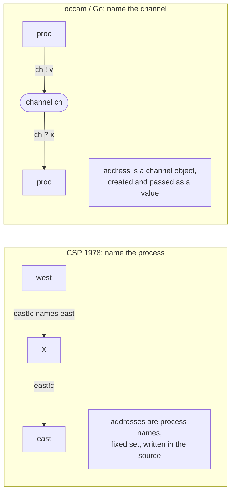

# 3. Name the process, not the channel

## The problem: how does a process say who it is talking to?

Communication needs an address. When a process wants to send a value, it has to indicate where the value goes; when it wants to receive, it has to indicate where the value comes from. The choice of what kind of thing an address is turns out to shape everything downstream: whether the communication structure is fixed or can grow, whether processes can be written as reusable libraries, and whether the wiring of the system is visible in the source or assembled at runtime. This is the second place CSP and the actor model diverge, and it is more subtle than the synchronous-versus-asynchronous split of the previous chapter.

## Why the obvious fixes pull in different directions

Two addressing schemes were available, and they lead to different worlds.

You can name a shared conduit, a channel or a mailbox, that exists independently of the processes plugged into it. Then a process says "send on this channel" without knowing or caring who is on the other end. This decouples the endpoints: you can rewire, reconnect, or swap the process at the far end without touching the code that sends. But now the channel is a thing you have to create, name, and pass around.

Or you can name the process itself. A process says "send to `X`," meaning the actual process labeled `X` in this program. This is direct and needs no separate conduit object, but it couples the two processes by name: the sender's code contains the receiver's identity, so you cannot reuse the sender without renaming, and the set of participants has to be known.

Hoare chose to name the process. His descendants, mostly, chose to name the channel. Understanding why is understanding what CSP is.

## Hoare's move: direct process naming

In the 1978 paper, an input command names a source and an output command names a destination, and both of those are process names. The grammar is blunt about it:

```
<input command>  ::= <source> ? <target variable>
<output command> ::= <destination> ! <expression>
<source>         ::= <process name>
<destination>    ::= <process name>
```

So `west?c` means "receive from the process named `west`," and `east!c` means "send to the process named `east`." There is no channel object anywhere. Communication "occurs between two processes of a parallel command" when one names the other as source and the other names the first as destination, and their commands correspond. The wiring of the system is nothing but the process names written into the input and output commands.

This choice commits Hoare to a static world, and he says so. The language is "rather static": the program text "determines a fixed upper bound on the number of processes," there is "no recursion and no facility for process-valued variables," and processes in a parallel command must be "disjoint," meaning none touches a variable that is a target in another. The set of processes is fixed at compile time, they share no memory, and they refer to each other by name. You can write an array of processes, `X(i:1..n)`, and name element `X(3)`, but the bound `n` is fixed before the program runs. There is no way to spawn a process into a variable and pass it around, because a process is not a value.



Hoare did not miss the alternative. He examines it in the discussion and sets it aside on purpose. Under the heading "Port Names," he describes naming "a port through which communication is to take place," with ports "local to the processes" and "the manner in which pairs of ports are to be connected by channels declared in the head of a parallel command." He calls it "an attractive alternative which could be designed to introduce a useful degree of syntactically checkable redundancy." But he judges it "semantically equivalent to the present proposal, provided that each port is connected to exactly one other port," and chooses the simpler, more direct notation for the paper. The channel is right there in the 1978 text, named and admired, and deliberately not taken. That matters, because when people say "CSP channels," they are describing a road Hoare pointed at but did not walk until later.

## The weakness Hoare admits

Direct naming has a cost, and Hoare is the one who names it. Under "Explicit Naming" he writes that his "design insists that every input or output command must name its source or destination explicitly," and that "this makes it inconvenient to write a library of processes which can be included in subsequent programs, independent of the process names used in that program." A library process cannot know in advance the names of the processes it will talk to, so hard-coding those names into its input and output commands defeats reuse. He offers only "a partial solution": let one process have an empty label and be addressed as the anonymous main process. This is not presented as a solved problem. It is presented as a real limitation of the choice he made.

There is a second asymmetry he flags. Input commands may appear in guards, so a process can wait to receive from several sources and take whichever is ready, the subject of the next chapter. Output commands may not. Hoare notes in the discussion that "since input commands may appear in guards, it seems more symmetric to permit output commands as well," and shows a small program that would need output guards to model cleanly. He left them out of the base proposal anyway, and output guards remain one of the awkward corners of CSP. The 1978 design is not clean and symmetric. Its author says so, twice.

## The modern echo, stated precisely

Here the family tree splits in a way that is easy to get wrong, so be exact. The actor model addresses a recipient by identity: an actor holds another actor's address, a process holds a pid, and it can send to that identity without any shared conduit. That identity is a value, so it can be stored, passed in a message, and handed around, which is what makes actor topologies dynamic. CSP 1978 names a process too, but the name is a static label in the source, not a value you can pass. So on the addressing axis, the actor and CSP 1978 are cousins, both name a counterparty rather than a conduit, but the actor made the name a first-class value and CSP did not.

Go went the other way entirely, and its designer said so plainly. Rob Pike, describing Go's lineage, drew the exact contrast: communicating "to a process by name," as in Erlang, versus over a channel, as in Go, and offered the analogy of "writing to a file by name versus writing to a file descriptor." Go names the channel. A Go channel is a first-class value: you create it with `make`, store it in a variable, pass it to a function, put it in a struct, and even send a channel over a channel. That is precisely the port-and-channel alternative Hoare sketched in section 7.3 and declined, later made central by occam and by the Bell Labs languages that led to Go. So Go is not built on the 1978 paper's addressing at all. It inherits the channel line that came afterward. The paper it descends from named processes. The language named channels. Chapter 6 follows that line in full.

> **Principle:** Choosing what an address is, a process, a pid, or a channel, decides whether your communication structure is fixed or fluid, and whether a component can be reused without knowing its neighbors. It is a language-defining choice disguised as a syntax detail.
