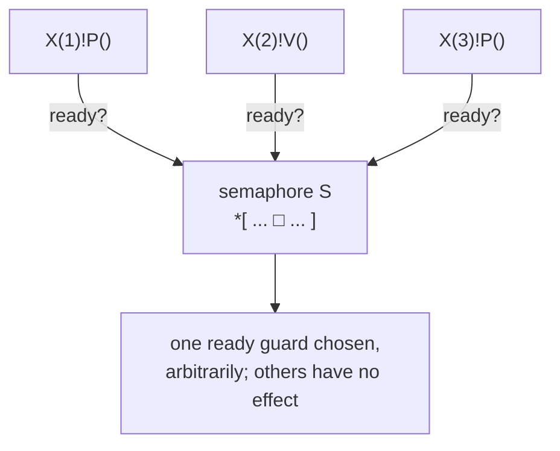

# 4. Choice and nondeterminism

## The problem: a process that waits on more than one thing

A rendezvous between two named processes is a clean idea, but a process worth writing rarely talks to just one partner at a time. A buffer serves a producer and a consumer. A semaphore serves a hundred clients. A server waits for whichever request arrives first. Each of these needs a process that is willing to communicate with several others and proceeds with whichever one is ready. Pure point-to-point rendezvous does not give you that. You need a way to offer a choice among communications and let the environment decide which one happens.

The catch is that this choice is not the programmer's to make in advance. Which client calls first depends on the relative speeds of processes running independently, which the language explicitly refuses to pin down. So the construct has to be built around nondeterminism from the start, not have it bolted on.

## Why the obvious fix fails: deterministic control cannot express "whichever is ready"

Ordinary control flow is deterministic by design. An `if` tests conditions in order and takes the first that holds. A `switch` dispatches on a value you already have. Neither can express "wait until any one of these several communications becomes possible, then take that one," because the deciding event has not happened yet when control reaches the construct. Worse, if two of the communications are ready at once, deterministic control forces a fixed priority: it will always pick the first. That is exactly wrong for a fair server, where always preferring the first client starves the rest.

What is needed is a construct whose selection is legitimately nondeterministic, where "any ready one may be chosen" is part of the meaning rather than an implementation accident.

## Hoare's move: build on Dijkstra's guarded commands

Hoare did not invent this construct. He borrowed it, and he is scrupulous about the attribution: the first of the paper's proposals is that "Dijkstra's guarded commands are adopted (with a slight change of notation) as sequential control structures, and as the sole means of introducing and controlling nondeterminism." The guarded command is Dijkstra's, from his 1975 paper on nondeterminacy and the formal derivation of programs. Hoare's contribution is what he does with it in a concurrent setting.

A guarded command is a guard, a condition, followed by a command to run if the guard succeeds, written `guard → command`. Dijkstra packaged these two ways. The alternative command, in brackets, offers a set of guarded commands and runs exactly one whose guard holds:

```
[ x ≥ y → m := x  □  y ≥ x → m := y ]
```

This assigns the larger of `x` and `y` to `m`. Note the overlap: when `x` and `y` are equal, both guards hold, and Hoare says plainly "either assignment can be executed." The nondeterminism is in the semantics, not hidden. The repetitive command, marked with a leading `*`, runs the alternative over and over until every guard fails, at which point it terminates.

Hoare's move, the one that turns this local control structure into a concurrency mechanism, is a single sentence in the grammar: a guard may end in an input command. That is the input guard. A guarded command with an input guard "is selected for execution only if and when the source named in the input command is ready to execute the corresponding output command." Now a process can offer several possible communications at once and let readiness decide. When several are ready, "only one is selected and the others have no effect; but the choice between them is arbitrary." That arbitrariness is the point, not a defect.

The integer semaphore shows the idea in six lines:

```
S :: val:integer; val := 0;
     *[ (i:1..100) X(i)?V() → val := val + 1
      □ (i:1..100) val > 0; X(i)?P() → val := val - 1
      ]
```

The semaphore repeatedly offers two kinds of communication to a hundred client processes: accept a `V()` signal from any client and increment, or, only if `val` is positive, accept a `P()` and decrement. The Boolean guard `val > 0` and the input guard `X(i)?P()` combine, so a `P()` is accepted only when the value is positive. Which client is served, and whether an increment or decrement happens next, is decided by which communication is ready. The classic synchronization primitive, expressed with no special synchronization machinery, just guarded input.



## Two honesty points: deadlock and fairness

Two things this construct raises need stating carefully, because they are where the trap lies for a careless reader.

The first is deadlock. The word is in the 1978 paper, and so is the phenomenon, but not a theory of it. Hoare defines it operationally: a communication command is delayed until its partner is ready, and "it is also possible that the delay will never be ended, for example, if a group of processes are attempting communication but none of their input and output commands correspond with each other. This form of failure is known as a deadlock." That is the whole treatment. There is no model for reasoning about which programs deadlock, no refinement check, no proof technique. Hoare is explicit elsewhere that the paper "fails to suggest any proof method." The machinery for analyzing deadlock is a later development, and the next chapter is about not confusing the two.

The second is fairness. If a process offers a choice and one option is always ready, must the implementation eventually pick it, or may it ignore that option forever? Hoare asks exactly this and answers it. "Should a programming language definition specify that an implementation must be fair? Here, I am fairly sure that the answer is NO." He puts the burden on the programmer: correctness must be provable "without relying on the assumption of fairness in the implementation." An efficient implementation "should try to be reasonably fair," but a program that only terminates if the scheduler is fair is, by his standard, an incorrect program. This is a deliberate and slightly austere position, and it contrasts sharply with the actor tradition, where Hewitt's later work leaned the other way, toward guaranteed eventual delivery.

## The modern echo, stated precisely

If you write Go, you have used this construct, because Go's `select` is the guarded command with input guards, lightly reskinned. A `select` lists several communications, blocks until one can proceed, runs that one, and, when several are ready at once, "chooses pseudo-randomly," which is Hoare's "the choice between them is arbitrary" made concrete. Add a `default` clause and you get the non-blocking poll. Rob Pike traces the lineage directly to "Dijkstra's guarded commands (1975)" by way of Hoare, and the intermediate step is occam's `ALT`, which chapter 6 covers. The mapping is close to exact: `select` is `[...□...]` with the box replaced by the word `case`.

The break is small but real, and it is the same one from the previous chapter. Go's `select` chooses among channels, which are first-class values, so the set of communications a `select` waits on can be built at runtime. Hoare's alternative command chooses among input guards that name processes statically, so the set of possible communications is fixed in the source. Same construct, same nondeterministic selection, but one waits on values you can compute and the other on names you must write down. The shape also recurs, by convergence rather than descent, anywhere a program waits on many sources and proceeds with whichever fires first: the event loop behind `epoll`, the `select` and `kqueue` system calls, the readiness-driven core of every async runtime. Guarded choice over ready communications is one of those structures that keeps getting reinvented because the problem keeps recurring.

> **Principle:** When the deciding event has not happened yet, deterministic control cannot express the choice. Make nondeterministic selection a primitive, and let readiness, not the programmer's fixed priority, pick the branch.
