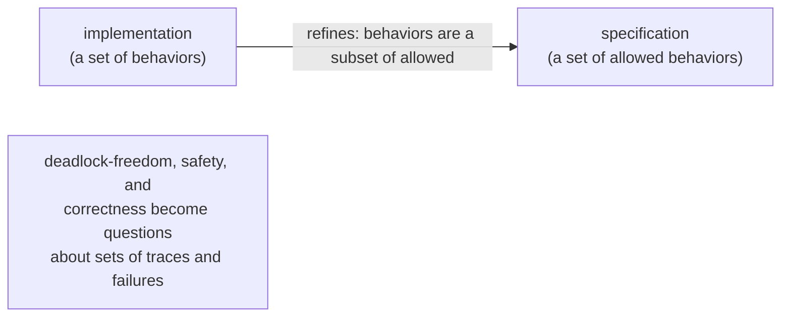

# 5. The algebra came later

## The problem: the 1978 paper cannot prove anything

The CSP most computer scientists carry in their heads is a mathematical theory: processes as algebraic objects, traces, failures, refinement, a whole calculus with laws you can push symbols around in. That theory is real and it is powerful. It is also not in the 1978 paper, and confusing the two is the single most common mistake made about this work. This chapter is about keeping them apart, because the gap between them is itself the lesson.

Start with what the 1978 paper admits about itself. In the introduction, listing the problems it does not solve, Hoare writes: "The most serious is that it fails to suggest any proof method to assist in the development and verification of correct programs." That is not modesty. It is accurate. The paper gives you a notation for writing concurrent programs and a careful operational account of what they do, and it stops there. You can write the dining philosophers in it. You cannot prove, within it, that your solution does not deadlock. Hoare even notes the philosophers' deadlock informally and gives Dijkstra's fix as a hint, but there is no formal apparatus for establishing that the fix works. The word "deadlock" appears; a theory of deadlock does not.

## Why the obvious fix fails: you cannot reason about interleavings by hand

The naive way to verify a concurrent program is to trace its execution: track the global state, consider every order in which the processes might interleave, and check that nothing goes wrong on any path. This fails for two reasons, and both are fatal.

First, there is no global state to track. The whole point of CSP is that processes have private stores and run at arbitrary relative speeds, so "the current state of the system" is not a well-defined object you can write down and step forward. Second, even if you could, the number of interleavings explodes combinatorially with the number of processes and steps. Reasoning that requires you to enumerate interleavings does not scale past toy examples, and it does not compose: proving two processes correct in isolation tells you little about the process you get by running them in parallel. Operational, state-by-state reasoning is exactly the wrong tool.

## The move, in 1984 and 1985: define a process by its behavior

The fix, developed over the years after the paper, was to stop describing a process by how it executes and start describing it by what can be observed of it. This is a reformulation, not a clarification, and it belongs to specific later work: a 1984 paper in the Journal of the ACM by Stephen Brookes, Hoare, and A.W. Roscoe, and then Hoare's 1985 book, also titled *Communicating Sequential Processes*, published by Prentice Hall. It grew up alongside Robin Milner's Calculus of Communicating Systems, and the two influenced each other. None of it is in the 1978 paper.

The central idea is to identify a process with its set of observable behaviors. In the simplest model, a process is the set of its traces: every finite sequence of communication events it could engage in. A richer model records failures: a trace paired with the set of events the process can refuse to do at that point, which is what lets you talk about deadlock, because a process that can refuse everything is stuck. A third model adds divergence, the possibility of spinning forever in internal activity. Once a process is just a set of behaviors, two questions that were intractable become set relations. Two processes are equivalent when they have the same behaviors. And one process refines another, written with the refinement order, when its behaviors are a subset of what the specification allows: the implementation never does anything the spec did not permit.

This deserves a pause, because it echoes something from the previous seminars. Hewitt, in 1973, defined when two actors are the same by exactly this instinct: not by their internal representation, which is hidden, but by whether any observer could tell them apart. Hoare's traces and failures are the same move for CSP, and both were in conversation with Milner's work on the equivalence of processes. Three of the founding figures of concurrency, in overlapping conversations rather than in isolation, landed on the same conclusion: the identity of a communicating thing is its observable behavior, not its guts. When ideas converge like that, they are usually onto something structural.

## Why it mattered: you can now check

The behavioral models turned CSP from a notation into a verification tool, and the payoff was concrete. If both a specification and an implementation are sets of behaviors, a machine can check whether one refines the other. The tool that does this, FDR, is a refinement checker built on the failures-divergences model, and it was used to verify real hardware, including the communication logic of the T9000 transputer that chapter 6 discusses. "Does this system deadlock?" became a question you could answer by asking whether the system refines a deadlock-free specification, and then running a check. The 1978 paper could pose that question. The 1985 theory could answer it.

## The modern echo, stated precisely

The living descendant of this line is refinement checking and, more broadly, the practice of specifying a concurrent system as a formal object and verifying properties against it before or instead of testing. FDR is still used for CSP; the mindset spread well beyond it. When you write a TLA+ specification and check that an implementation refines it, you are working in a different formalism, Lamport's state machines and temporal logic rather than Hoare's traces and failures, but the governing idea is the same one the 1985 book made rigorous: describe the allowed behaviors, then prove the system stays inside them. The kinship is real, and the difference is real too. CSP models a process as sequences of communication events and reasons about deadlock and refusal; TLA+ models a system as a state machine and reasons about invariants and temporal properties. Different lenses on the same ambition.

The honest summary is a timeline. The 1978 paper is a programming-language proposal that openly lacks a proof method. The theory that lets you prove things, traces, failures, divergences, and refinement, arrived in 1984 and 1985 through Brookes, Hoare, and Roscoe, next to Milner's CCS. If you find yourself attributing refinement or the failures model to the 1978 paper, you have collapsed seven years and several people's work into one citation. The paper earned its influence precisely by being incomplete in a way that invited the completion.

> **Principle:** A notation lets you write a system down. A theory lets you prove things about it. They are different achievements, often years apart, and crediting the notation with the theory erases the work that made the idea trustworthy.
