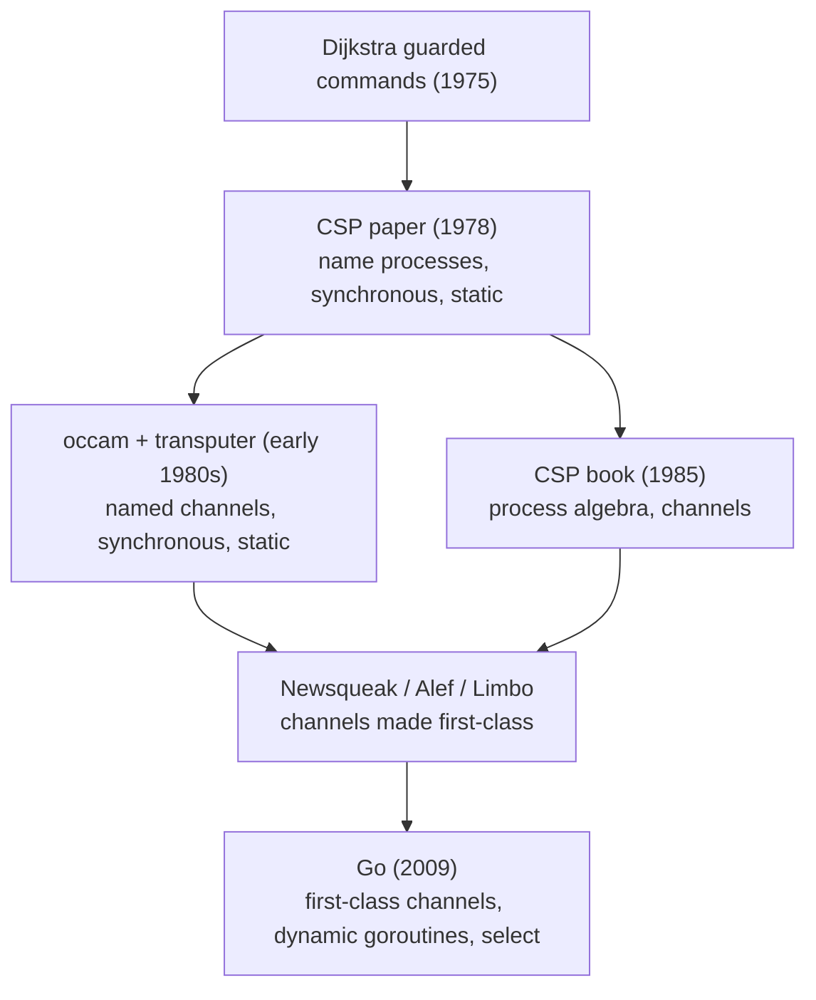

# 6. occam, the transputer, and Go

## From a paper that disclaimed being a language

The 1978 paper insists it is not a programming language. Its notations "should not be regarded as suitable for use as a programming language," and it is "a rather static" set of primitives stripped to the minimum. And yet CSP became the backbone of real languages and even a real chip. This chapter follows that line and sorts the descendants into two kinds: the ones that implemented CSP faithfully, and the one most engineers actually use, which took the ideas and changed them. Getting the difference right is the last of this seminar's traps.

## The faithful line: occam and the transputer

The paper contains a prophecy. Hoare writes that his programs are "intended to be implementable both by a conventional machine with a single main store, and by a fixed network of processors connected by input/output channels." That second machine did not exist in 1978. INMOS built it.

The transputer, designed at INMOS in the early 1980s, was a microprocessor with its own on-chip memory and dedicated hardware links for point-to-point communication with other transputers. You wired transputers into networks and they talked over those links. It was, almost literally, the "fixed network of processors connected by input/output channels" the paper imagined, realized in silicon. And the language built for it, occam, designed by a team under David May at INMOS and released around 1983, is the most faithful CSP descendant there is. occam has processes composed with `PAR` and `SEQ`, communication that is synchronous and unbuffered exactly as the paper specifies, and an `ALT` construct that is Dijkstra's guarded command with input guards, the alternative command under a new keyword. A program was a static network of processes handing values across links in synchronized rendezvous. That is CSP running on hardware designed for it.

occam did make one telling change, and it is the change Hoare had already sanctioned. It communicates over named channels, not by naming processes directly. That is the port-and-channel alternative from section 7.3 of the paper, the one Hoare called "attractive" and "semantically equivalent" and then declined to use in his notation. occam took him up on it. So even the faithful descendant did not use the 1978 paper's direct process naming; it used the channel variant its author had described as equivalent. The synchronous rendezvous, the guarded choice, and the no-shared-memory discipline are pure CSP. The addressing is the road not taken in the paper itself.

## The line most engineers use: Go

Go is the CSP most working programmers meet, and it is CSP-inspired rather than CSP-implemented. Its lineage is well documented by the people who built it. The path runs from occam through a series of Bell Labs languages, Rob Pike's Newsqueak, then Alef, then Limbo, and into Go, and the defining innovation along that path was making channels first-class values. Pike credits the roots openly, "back to Hoare's CSP in 1978 and even Dijkstra's guarded commands (1975)," and Go's own documentation traces the same line.

What Go took from CSP is genuine. Goroutines are cheap independent processes. A `select` statement is the guarded command with input guards: it offers several communications, blocks until one is ready, and chooses arbitrarily among those that are, which is Hoare's "the choice between them is arbitrary" down to the semantics. An unbuffered channel is a synchronous rendezvous, a send blocking until a receiver arrives. If you squint at a Go program built from goroutines and unbuffered channels and `select`, you are looking at CSP.

What Go changed is just as real, and a careful reader should hold all of it at once:

- **Channels, not processes.** Go names channels, which are first-class values you create, store, pass, and even send over other channels. This is the section 7.3 alternative, inherited through occam and the 1985 book, not the 1978 paper's process naming. Dynamic communication topologies follow from it, which the static 1978 language could not express.
- **Buffering is back.** A buffered channel, `make(chan int, n)`, is the automatic buffering Hoare "deliberately rejected." Go offers it as a per-channel choice, bounded, alongside the unbuffered rendezvous. It restored the thing the paper refused, while keeping the bound that stops the actor's unbounded-queue failure mode.
- **Dynamic, not static.** Goroutines are spawned at runtime with no fixed upper bound, unlike the paper's compile-time-bounded process set.
- **Shared memory is still there.** This is the deepest divergence. CSP processes are disjoint by rule: a process "may not communicate with another by updating global variables." Go goroutines share one address space and Go ships mutexes and atomics in the standard library. Go's slogan, "do not communicate by sharing memory; instead, share memory by communicating," is advice, not a constraint the language enforces. CSP made shared state impossible. Go makes it inadvisable. That is a large gap, and it is why Go can have data races and CSP, by construction, cannot.

## Resolving the actor-versus-CSP question

This series has now read both great concurrency traditions, and the descendants let us state the distinction precisely instead of lumping them together. Two axes matter, and they are independent.

The first axis is synchrony. CSP is a synchronous rendezvous: sender and receiver meet, and neither proceeds alone. The actor model is asynchronous: the sender fires and continues. The second axis is addressing. CSP 1978 names the counterparty; the actor model names the counterparty too, by identity, but makes that identity a first-class value. Go, uniquely, names a channel, a conduit rather than a counterparty.

Rob Pike put the addressing point sharply when he observed that Erlang, which communicates "to a process by name," is on that axis closer to the original CSP than Go is, even though Erlang is an asynchronous actor language and Go is the CSP descendant. His analogy was writing to a file by name versus writing to a file descriptor. The lesson is that "actor versus CSP" is not one distinction but two, and the famous descendants scramble them: Erlang is asynchronous like an actor but names processes like CSP, while Go is synchronous-capable like CSP but names channels like nothing in either original.

- **occam and the transputer** took synchronous rendezvous, guarded choice (`ALT`), no shared memory, and a static network. They diverge by naming channels, not processes (the section 7.3 alternative).
- **The CSP 1985 book** took the programs and primitives, and diverges by adding the algebra and reformulating around channels.
- **Go** took `select` as guarded choice and the unbuffered channel as rendezvous. It diverges with first-class channels, optional buffering, dynamic goroutines, and shared memory that is not forbidden.
- **Erlang** (the actor line) took nothing directly and is convergent: asynchronous and buffered, but it names processes the way CSP does.

Read the divergences and the pattern from the earlier seminars repeats. The abstract commitment, structure a concurrent program as sequential processes that communicate rather than share, survived everywhere. The specific 1978 choices, synchronous, unbuffered, statically named processes with no shared memory, survived only in occam. Everyone else kept the shape and renegotiated the terms.

> **Principle:** A model spreads by its shape and mutates in its details. CSP's shape, sequential processes communicating instead of sharing, is everywhere; its exact 1978 terms survive only where the hardware was built to enforce them.
