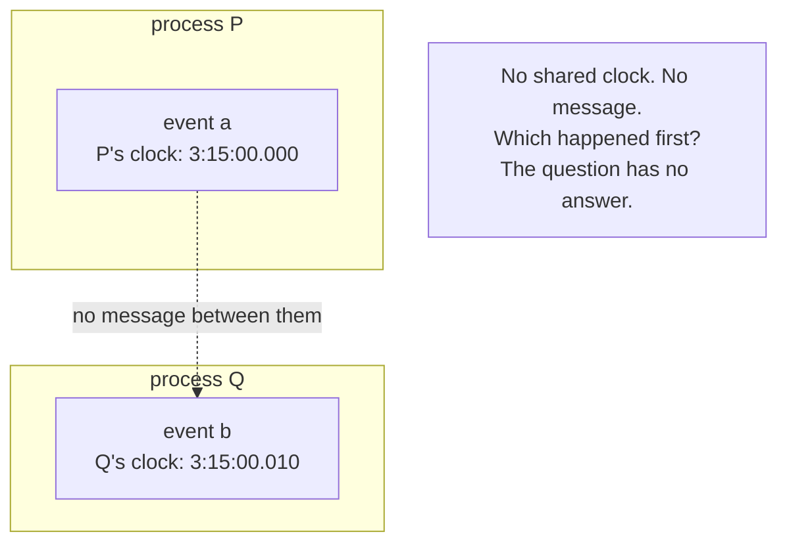

# 1. There is no now

## The problem: we build systems on a clock that does not exist

Lamport opens with something that sounds like philosophy and turns out to be an engineering warning. "The concept of time is fundamental to our way of thinking," he writes, and "it is derived from the more basic concept of the order in which events occur." We say a thing happened at 3:15 because it came after the clock read 3:15 and before 3:16. That habit runs so deep that we build it into specifications without noticing. His example is an airline reservation system: a request for a seat should be granted "if it is made before the flight is filled." Before. The whole correctness condition hangs on an ordering in time.

Then the warning: "this concept must be carefully reexamined when considering events in a distributed system." Because in a distributed system, the word "before" quietly stops meaning what you think it means.

Lamport is precise about what makes a system distributed, and the definition is the root of the problem. "A system is distributed if the message transmission delay is not negligible compared to the time between events in a single process." That is it. If sending a message takes long enough to matter, then two processes cannot check each other's state instantly, and there is no shared instant they can both point at. His examples stretch the idea usefully: the ARPA net is distributed, but so is a single computer whose CPU, memory, and I/O channels are separate processes exchanging signals. Distribution is not about geography. It is about delay.

## Why the obvious fix fails: physical clocks do not save you

The obvious response is to give every machine a clock and timestamp everything. Lamport dismantles this in two moves, and it is worth watching him do it because the reasoning is the paper.

First, the specification problem. "If a system is to meet a specification correctly, then that specification must be given in terms of events observable within the system." If you write the specification in terms of physical time, then the system has to contain real clocks to observe that time. You have not removed the dependence on clocks; you have made it mandatory. Second, even if you accept real clocks, "such clocks are not perfectly accurate and do not keep precise physical time." Two clocks in two machines drift. One reads 3:15:00.000 while the other reads 3:15:00.020, and neither knows which is right, because there is no third clock that is definitionally correct.

So a timestamp comparison between two machines does not reliably tell you which event happened first. If the clocks are off by more than the gap between the events, the comparison can be backwards. And in the case that matters most, two events on two machines with nothing connecting them, there is no fact of the matter at all. As Lamport puts it, "in a distributed system, it is sometimes impossible to say that one of two events occurred first." Not hard. Impossible. There is no observer, inside the system or out, who can order them.

## Lamport's move: derive order from causality, not from time

Here is the inversion the paper turns on. We think order comes from time: b is after a because b's clock reading is larger. Lamport runs it the other way. Order is the primitive; time is the derived, and often fictional, thing on top. So he sets out to "define the 'happened before' relation without using physical clocks," building it only from events the system can actually observe.

What can it observe? Two things. Within a single process, events happen in a definite sequence, so their order is known locally. And a message must be sent before it is received, so a send is always before its matching receive. That is the entire observable raw material: local process order and the send-before-receive of messages. Everything else about "when" has to be derived from those two facts or admitted to be unknowable. The next chapter builds the relation; this chapter's point is the reorientation. Stop asking what time an event happened. Ask what it could have come after.

The consequence lands immediately, and Lamport states it as the thesis of the paper: the "happened before" relation "is therefore only a partial ordering of the events in the system," and "problems often arise because people are not fully aware of this fact and its implications." A partial order, not a line. Some events are ordered. Many are not, and no amount of engineering will order them, because the information to do so does not exist.

## The modern echo, stated precisely

Every distributed system you touch runs on machines whose clocks disagree, and the "global now" is a convenient lie the infrastructure tells. NTP keeps servers within a handful of milliseconds of each other on a good day, and tens of milliseconds on a bad one, which is an eternity next to the microseconds between events in a busy service. The moment you order events across two machines by comparing wall-clock timestamps, you have bet correctness on clock skew, and Lamport's paper is the proof the bet is unsound. The most common form of the mistake is last-write-wins conflict resolution keyed on physical timestamps, where a lagging clock can make a later write lose to an earlier one. Chapter 6 shows exactly that failure in a real database. For now the lesson is the reorientation itself: a timestamp is a number a machine wrote down, not a fact about the order of the universe.

This is also the question the two previous seminars stepped around. Hewitt's actors send messages in a causal sequence; Hoare's processes are sequences of communications. Both assume that when a message goes from one place to another, the before-and-after is clear. It is, for that one message: send precedes receive. What neither asks is how to order two events on two processes that never exchanged anything. Lamport asks, and answers that you usually cannot, and that the discipline of a working distributed-systems engineer begins with accepting it.

> **Principle:** Time is derived from order, not the other way around. In a system with real message delay, there is no global now, and any design that assumes one is a bug that has not fired yet.
