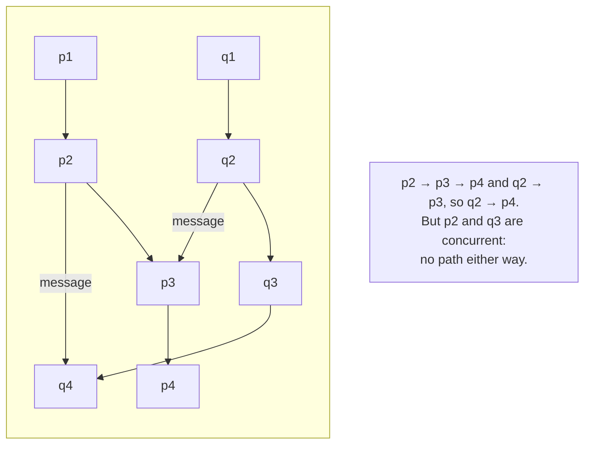

# 2. Happened-before

## The problem: build an ordering from only what the system can see

Chapter 1 reoriented us: order is primitive, time is derived. But that is a stance, not yet a definition. To make it useful, Lamport has to say exactly which pairs of events are ordered and which are not, using nothing but what a process can actually observe. No physical clock is allowed in the definition, because chapter 1 showed a physical clock is either absent or untrustworthy. So the raw material is strictly local: a process knows the order of its own events, and it knows a message it received was sent before it arrived. Everything must be built from those two facts.

## Why the obvious fix fails: there is no observer to ask

You might hope to escape by appointing a referee, a single observer who watches all events and records the true order. This fails for the reason chapter 1 established. A referee is just another process, reachable only by messages that take time, so its record of "which came first" is subject to the same delay and the same skew as everyone else's. Worse, forcing every event through one observer serializes the system and reintroduces the shared bottleneck that distribution was meant to avoid. There is no privileged vantage point. The ordering has to be definable from the local, partial views the processes already have, or it does not exist.

## Lamport's move: three conditions, and concurrency as the gap between them

Lamport defines the relation, written with an arrow, as the smallest relation satisfying three conditions. Here is the paper, with his arrow rendered as the words "happened before":

> (1) If a and b are events in the same process, and a comes before b, then a happened before b. (2) If a is the sending of a message by one process and b is the receipt of the same message by another process, then a happened before b. (3) If a happened before b and b happened before c then a happened before c.

That is the whole definition. Local sequence within a process, send-before-receive across processes, and transitivity to chain them. Nothing about clocks, nothing about physical time. And then the move that makes the relation honest rather than total:

> Two distinct events a and b are said to be concurrent if a did not happen before b and b did not happen before a.

Concurrency is not a claim that two events happened at the same instant. It is the absence of any causal chain between them in either direction. They are incomparable. There is no path from one to the other along process lines and message lines, so the system has no basis to order them, and Lamport refuses to invent one. With the assumption that no event happens before itself, the relation is an irreflexive partial ordering. Partial is the entire point: for many pairs of events, the relation simply says nothing, and that silence is a fact about the world, not a gap to be filled.

Lamport gives the relation its meaning in one sentence: "a happened before b means that it is possible for event a to causally affect event b." The arrow is a channel for influence. If a happened before b, then a could have changed what b does, because there is a chain of process steps and messages carrying information from a to b. If they are concurrent, neither could have touched the other. This is why the partial order is the right object. It records exactly the possible lines of causal influence, and nothing more.

The picture Lamport draws for it, the space-time diagram, is worth reconstructing because it makes the relation obvious. Time runs up, space runs across, each process is a vertical line, each message a diagonal from a send to a receive. Then "a happened before b means that one can go from a to b in the diagram by moving forward in time along process and message lines." Reachability in the diagram is the relation. Events you cannot reach from each other are concurrent.

## Lamport's own analogy: special relativity, used carefully

Lamport reaches for physics, and because it is his own analogy and he is careful with it, this seminar uses it the way he did. "This definition will appear quite natural to the reader familiar with the invariant space-time formulation of special relativity." In relativity, too, there is no universal simultaneity: whether two separated events are "at the same time" depends on the observer, and only causal order, what could influence what, is invariant across observers. That is exactly the structure of happened-before. The order that survives is the causal one; the rest is a matter of viewpoint.

But note the boundary Lamport draws, because overreaching here is a classic error. "In relativity, the ordering of events is defined in terms of messages that could be sent. However, we have taken the more pragmatic approach of only considering messages that actually are sent." Relativity bounds causality by the speed of light, the fastest message that could exist. Lamport does not need the speed of light; he only cares about the messages the system actually sent, because those are the only channels of influence that actually occurred. The analogy is about the shape of the order, a causal partial order with no global now, not a claim that distributed systems obey physics. When he later introduces physical clocks, he explicitly assumes plain Newtonian time. The relativity is a lens, not a mechanism.

## The modern echo, stated precisely

This partial order is one of those ideas that several people reached independently, which is usually a sign it was forced by the problem rather than invented. The Hewitt seminar in this series showed that Carl Hewitt, five years earlier and working on actor semantics rather than distributed clocks, defined an "arrow of time" over events as a partial order built from actor creation and use, and explicitly declined to require a global simultaneity. Lamport, coming from the ARPA net and physical clocks, built the same structure from message send-and-receive. Neither cites the other. Two problems, one shape, and the shape is now everywhere: it is the causal order that vector clocks track, that Git's commit graph literally is, and that "causal consistency" in modern databases promises to preserve. Chapter 6 makes those precise. The thing to carry out of this chapter is the object itself. When two events are concurrent, they are not simultaneous and not sequential. They are unrelated, and a correct system treats them as unordered rather than forcing a false winner.

> **Principle:** The only ordering a distributed system can trust is causal: a happened before b exactly when a could have influenced b. Everything else is concurrent, and concurrent means unordered, not simultaneous.
