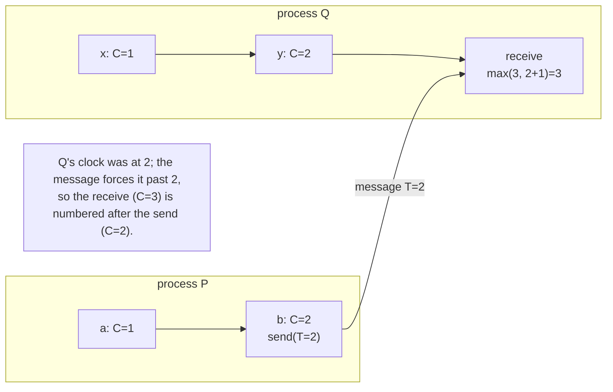

# 3. Logical clocks

## The problem: a partial order is true but hard to compute with

The happened-before relation is the honest description of what a distributed system knows about order. It is also awkward to use. To ask "did a happen before b?" you have to trace paths through process lines and message lines across the entire system, which no single process can do on its own, because no process has the global picture. A running program usually wants something cheaper: attach a number to each event, and compare numbers. The question is whether you can assign numbers that respect the partial order, using only local information, without smuggling in a physical clock that chapter 1 already ruled out.

## Why the obvious fix fails: physical timestamps violate causality

The tempting shortcut is to stamp each event with the local machine's wall clock. It fails on the relation itself. Suppose process P sends a message to process Q, so the send happened before the receive. If Q's clock happens to be running behind P's, the receive can carry a smaller timestamp than the send. Now the numbers say the receive came first, which is not just wrong but impossible: it claims an effect preceded its cause. Physical timestamps do not respect happened-before, because the clocks are not synchronized and nothing forces a message's arrival to be stamped later than its departure. Whatever numbering we use has to be driven by the messages themselves, not by independent clocks.

## Lamport's move: a counter that jumps forward on every message

Lamport's clock is deliberately humble. "We begin with an abstract point of view in which a clock is just a way of assigning a number to an event." Each process keeps a clock, and, in the line that should be tattooed on anyone who works with these, "we make no assumption about the relation of the numbers to physical time, so we can think of the clocks as logical rather than physical clocks. They may be implemented by counters with no actual timing mechanism." The logical clock is a counter. It measures nothing. It ticks because events happen, not because time passes.

What must the counter guarantee? Exactly that it respects the partial order. Lamport states it as the Clock Condition: "for any events a, b: if a happened before b then C(a) < C(b)." If one event could have influenced another, the influenced one gets a larger number. That is the entire correctness criterion, and it is enforced by two local rules:

- **IR1**: "Each process increments its clock between any two successive events." This handles order within a process.
- **IR2**: on sending, a process stamps the message with its current clock value; on receiving a message stamped T, a process "sets its clock greater than or equal to its present value and greater than T." This handles order across a message: the receive is forced to be numbered after the send.

The receiver's jump is the heart of it. When a message arrives carrying a bigger number than the receiver's own clock, the receiver leaps forward past it. The clock is dragged upward by incoming causality. Two processes chatting frequently will keep their counters roughly in step, not because time synchronized them, but because their messages keep forcing each other forward.

## The trap inside the clock: a timestamp is not a time

Here is the point the trap list is right to guard, because half the field gets it backwards. The Clock Condition runs in one direction only. If a happened before b, then C(a) is less than C(b). The converse does not hold, and Lamport says so explicitly: "we cannot expect the converse condition to hold as well, since that would imply that any two concurrent events must occur at the same time." Two concurrent events can carry any pair of numbers at all. C(a) < C(b) does not mean a happened before b, and it certainly does not mean a happened earlier in real time. It might mean that, or they might be concurrent and the ordering is an accident of how the counters happened to advance.

So a Lamport timestamp tells you one thing reliably and nothing else. If you see a causal chain from a to b, the numbers will agree with it. But you cannot look at two bare numbers and conclude anything about the events' real-time order or even whether they are causally related. The clock counts causal steps along the paths that exist; it does not measure how much time elapsed, and it cannot detect that two events were concurrent. That last limitation is not a bug Lamport missed. It is the specific gap that vector clocks were later invented to close, and chapter 6 returns to it. For now, hold the discipline: the number is a counter's value, not a reading of a clock, and treating a smaller value as "earlier" is the mistake the paper is trying to prevent.

## The modern echo, stated precisely

Lamport clocks are alive in production, and so is the misreading. Systems that need a cheap, monotonic, causally-consistent sequence number, replication logs, some CRDT implementations, event-sourced systems that want a stable tiebreaker, use exactly this counter-that-jumps-forward-on-receipt. They get the one guarantee it offers: if one event caused another, the caused one has a higher number, so replaying in timestamp order never puts an effect before its cause. Where teams get burned is when they read the timestamp as a time. "This record has a higher Lamport timestamp, so it is newer" is false whenever the two records are concurrent, and in a distributed system concurrent writes are the normal case, not the edge case. The scalar clock gives you a safe order to process things in. It does not give you a way to tell which of two independent things really happened first, because, as chapter 1 insisted, that fact often does not exist.

> **Principle:** A logical clock is a counter that respects causality, not a measurement of time. It guarantees cause gets a smaller number than effect, and guarantees nothing about the reverse. A smaller timestamp is not an earlier moment.
