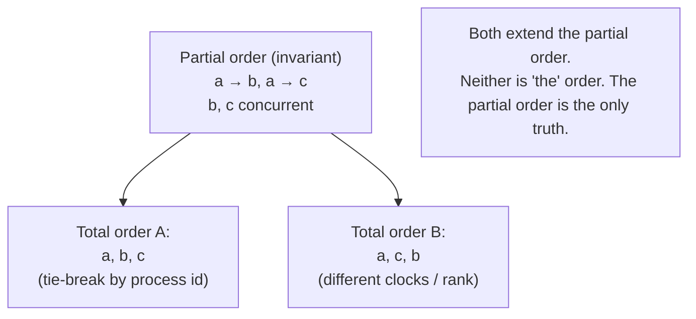

# 4. The total order and its price

## The problem: some decisions need everyone to agree on one order

The partial order is the truth, but some problems demand more than the truth. Consider granting a shared resource to one requester at a time. If two requests are concurrent, the partial order says nothing about which came first, yet the system still has to pick one, and, crucially, every process has to pick the *same* one, or two of them will think they hold the resource. Concurrency being truly unordered is no excuse; the system needs a single agreed sequence of events to act on. So the question becomes: can we extend the partial order to a total order that all processes compute identically, using only the logical clocks we already have?

## Why the obvious fix fails: the naive scheduler orders by arrival, which is not order

The reflex is a central scheduler that grants requests in the order they arrive. Lamport shows in three sentences why this is wrong, and the example is worth keeping. Let the scheduler be process P0. Process P1 sends a request to P0, then sends a message to P2. P2, having heard from P1, sends its own request to P0. Causally, P1's request happened before P2's: there is a chain P1-request, then P1-to-P2 message, then P2-request. But the two requests race to P0 over different paths, and "it is possible for P2's request to reach P0 before P1's request does." Order by arrival and you grant P2 first, violating the requirement that requests be granted in the order they were made. Arrival order is not happened-before order. The scheduler has thrown away the causality the system worked to preserve.

## Lamport's move: complete the partial order arbitrarily, and be honest that it is arbitrary

Lamport builds a total order on top of the logical clocks, and the construction is almost embarrassingly simple. Order events by their clock value; when two events have the same value, break the tie using "any arbitrary total ordering of the processes." Formally, a comes before b if a's timestamp is smaller, or the timestamps are equal and a's process is ranked ahead of b's. Because the clocks satisfy the Clock Condition, this total order extends happened-before: whenever a genuinely happened before b, it also comes first in the total order. The rest of the ties are settled by process rank.

Now the price, which Lamport states plainly and which the trap list is right to insist on. This total order "is not unique." Different valid clocks yield different total orders, and the tie-break by process id is a convention, not a discovery. He is blunt in the conclusion: it is "a somewhat arbitrary total ordering." The invariant, the thing that is actually a property of the system, is the partial order: "it is only the partial ordering which is uniquely determined by the system of events." The total order is a tool. It is a consistent, agreed-upon completion that every process can compute the same way, and that is exactly what the resource problem needs, but it is not real time and it is not the only possible answer. Two concurrent events get ordered by which machine has the lower id, which has nothing to do with when they happened. That arbitrariness is fine as long as every process applies the same rule, and dangerous the moment anyone mistakes the resulting sequence for the truth about time. Chapter 5 shows exactly the trouble it causes.

## The seed: a replicated state machine

With a total order in hand, Lamport gives a distributed mutual-exclusion algorithm: each process keeps its own request queue, requests are broadcast with timestamps and acknowledged, and a process takes the resource only when its request is first in the total order and it has heard from everyone else with a later timestamp. Every process, applying the same total order to the same set of requests, reaches the same decision about who goes next, with no central scheduler.

Then comes the sentence that seeded a research program. The mutual-exclusion algorithm, Lamport writes, is just one instance: "this approach can be generalized to implement any desired synchronization for such a distributed multiprocess system. The synchronization is specified in terms of a State Machine, consisting of a set of possible commands, a set of possible states, and a function" mapping a command and a state to the next state. Give every process the same total order of commands, have each independently feed those commands to an identical copy of the state machine, and every copy walks through the same states in the same sequence. Replicas stay consistent not by sharing memory but by agreeing on an order of inputs. That is state-machine replication, described here in 1978, term and all.

## The price of the seed: it dies if anyone does

This is where the trap matters most, because the 1978 algorithm is not the fault-tolerant replication that later systems ship, and Lamport is the first to say so. The algorithm "requires the active participation of all the processes. A process must know all the commands issued by other processes, so that the failure of a single process will make it impossible for any other process to execute State Machine commands, thereby halting the system." One process dies and everything stops, because the total order needs to hear from everyone before it can advance. This is a seed, not a harvest.

And Lamport puts his finger on why failure is so hard, in a sentence that connects this seminar back to the first one in the series. "The entire concept of failure is only meaningful in the context of physical time. Without physical time, there is no way to distinguish a failed process from one which is just pausing between events. A user can tell that a system has crashed only because he has been waiting too long for a response." That is the dead-versus-unreachable impossibility that ran through the Armstrong seminar and surfaced again in Hewitt: from inside the system, a stopped process and a slow one look identical. The algorithm here cannot tolerate failure precisely because it cannot tell failure apart from slowness. Lamport does not solve it. He notes that "a method which works despite the failure of individual processes or communication lines is described in" a companion paper, and moves on.

So credit the 1978 paper with exactly what it earned: the state-machine replication idea and the insight that consistent replication reduces to agreeing on an order of commands. Do not credit it with fault tolerance or consensus. Fred Schneider named and surveyed "state machine replication" as a fault-tolerant technique in a 1990 tutorial. The consensus algorithm that lets a replicated state machine keep running when processes fail, tolerating the dead-or-slow ambiguity by only needing a majority, is Lamport's own Paxos, from *The Part-Time Parliament*, written around 1990 and finally published in 1998. That paper gets its own seminar in this series, and it is the harvest of the seed planted in this sentence. Reading Paxos back into the 1978 paper would erase twelve years and the hardest part of the problem.

> **Principle:** A total order is a tool you build on top of causality, not a truth you discover in it. Agreeing on an order of commands is enough to replicate a state machine, but agreeing at all, once processes can fail, is the separate and harder problem consensus was invented to solve.
