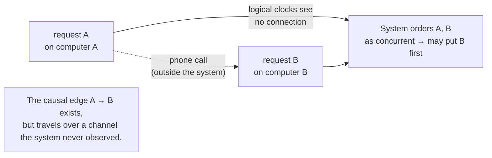

# 5. The forgotten half: physical clocks

## The problem: the system can be right and still look wrong

Most retellings of this paper stop at logical clocks and the total order. They quit at the halfway point, and they miss the part where Lamport turns on his own construction and shows where it fails. The second half of the paper is about a failure mode the first half cannot fix, and about the one thing logical clocks were built to avoid coming back through the door: physical time.

The failure has a name, "anomalous behavior," and a story. "Consider a nationwide system of interconnected computers. Suppose a person issues a request A on a computer, and then telephones a friend in another city to have him issue a request B on a different computer. It is quite possible for request B to receive a lower timestamp and be ordered before request A." To the two people, A obviously came first; one of them made a phone call about it before the other acted. To the system, A and B are concurrent, because no message inside the system connects them, so the arbitrary total order is free to put B first. The system is internally consistent and externally wrong.

## Why the obvious fix fails: logical clocks cannot see the phone call

The reason the logical clock cannot help is precise, and Lamport formalizes it. Let the set of system events be one thing, and consider a larger set that also includes the external events, like the phone call. There is a real happened-before relation over that larger set: A really did happen before B, through the phone. But the logical clocks only ever saw messages inside the system, and inside the system A and B are causally unrelated. "No algorithm based entirely upon events in the system, and which does not relate those events in any way with the other events, can guarantee that request A is ordered before request B." The information that A preceded B traveled over a channel the system never observed. You cannot order by a causality you never saw.

Lamport names the two ways out. The first puts the burden on the user: when you make request A, the system hands you its timestamp, and you pass that timestamp along so request B can be stamped later. In effect, you carry the missing causal edge across the gap by hand. The second is to stop relying on the arbitrary logical order and use clocks that track something the external world also tracks: physical time.

## Lamport's move: bring physical clocks back, but bound them

The fix demands a stronger property. Lamport states the Strong Clock Condition: for events in the extended world, including the external ones, if a really happened before b then C(a) is less than C(b). Logical clocks do not satisfy this, because they never saw the external edges. But physical clocks can, and Lamport puts the reason almost poetically: "one of the mysteries of the universe is that it is possible to construct a system of physical clocks which, running quite independently of one another, will satisfy the Strong Clock Condition." Physical time is the shared reference the phone call also lives in. If A's clock and B's clock both track real time closely enough, then A's earlier real-time occurrence shows up as a smaller timestamp, phone call or no phone call.

"Closely enough" is the engineering, and this is where the second half earns its keep. Lamport writes down two conditions. The clocks must run at nearly the right rate: there is a small constant such that each clock's drift rate stays within it, and "for typical crystal controlled clocks" that bound is about one part in a million. And the clocks must stay near each other: the difference between any two clocks at any instant is under some bound. Rate alone is not enough, because two clocks each running at almost exactly the right rate still drift apart over time if nothing pulls them together.

To prevent the anomaly, the synchronization bound has to be tight relative to message speed. If the closest two processes can exchange a message in time μ, then keeping the clocks within roughly μ of each other is enough that a message can never arrive stamped earlier than it was sent in real time. Lamport then gives an algorithm, a physical-clock version of the same send-a-timestamp, jump-forward-on-receipt rules from chapter 3, with one addition that turns out to matter: clocks are only ever set forward, never back, because setting a clock backward could make an effect look earlier than its cause.

The chapter's technical result is a theorem bounding how well this keeps clocks in sync. For a connected network of diameter d, where a message crosses each link at least every τ seconds with bounded unpredictable delay, the clocks stay synchronized to within a bound proportional to the diameter times the drift and delay terms. The exact expression matters less than its shape: synchronization degrades with the diameter of the network and improves with more frequent messaging and steadier delays. Lamport notes, with visible feeling, that "the proof of this theorem is surprisingly difficult," and that the never-set-backward requirement is what makes the result new. It is a full page of appendix for a bound most summaries never mention.

## The modern echo, stated precisely

The second half of this paper is the ancestor of the most expensive clocks in computing. Lamport's structure is exactly the one Google's Spanner confronts: to give globally consistent timestamps, you must bound clock uncertainty, so Spanner spends real money on GPS receivers and atomic clocks in every datacenter and exposes the remaining uncertainty as an interval, then deliberately waits out that interval before committing, so that timestamp order can never contradict real order. That is Lamport's ε made into a hardware budget and a commit-wait. A cheaper lineage, hybrid logical clocks, used by CockroachDB, splices a logical counter onto a physical timestamp so the clock tracks real time closely but still jumps forward on causality the way chapter 3's clock does, getting the Strong Clock Condition's benefit without atomic clocks. Chapter 6 lays these out. The point of this chapter is that Lamport already drew the whole map: logical clocks give you a cheap consistent order but cannot see outside the system, physical clocks can close that gap but only if you pay to bound their uncertainty, and the size of the bill is set by how tightly you need order to match reality.

> **Principle:** Logical order is free but blind to anything outside the system. Matching the order the world perceives requires physical clocks, and physical clocks are only as trustworthy as the bound you can enforce on how far they drift apart.
