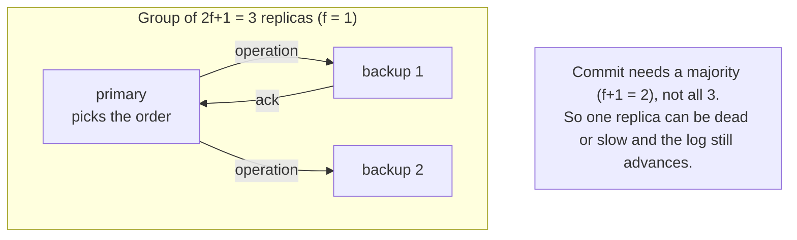

# 1. The unfinished business

## The problem Lamport handed forward

The previous seminar ended on a confession. Lamport had shown how to keep a set of replicas consistent: agree on one totally ordered log of commands, feed that same log to identical deterministic state machines, and they march through the same states forever. Then he told you the catch, in his own words: the algorithm "requires the active participation of all the processes," so "the failure of a single process will make it impossible for any other process to execute State Machine commands, thereby halting the system." And he explained why failure is the hard part: "without physical time, there is no way to distinguish a failed process from one which is just pausing between events." Fault tolerance, he said, was beyond the scope of the paper.

That is the unfinished business Viewstamped Replication picks up. State-machine replication is only useful if it keeps running while machines die, because in any real deployment machines are always dying. The question VR answers is the one Lamport set down: how do you keep the log advancing, in the same agreed order, when replicas crash and recover and the network loses and reorders your messages, without ever losing an operation you already told a client was done?

VR is precise about the world it lives in, and the precision matters. Nodes fail only by crashing. The 1988 paper says it directly: "we assume these failures are not byzantine. Nodes can crash, but we assume they are failstop processors." The 2012 report repeats it: "VR does not handle Byzantine failures, in which nodes can fail arbitrarily, perhaps due to an attack by a malicious party." A crashed replica stops; it does not lie, corrupt its state, or send malicious messages. The network is worse behaved than the nodes: messages "might be lost, delivered late or out of order, and delivered more than once." Hold onto that split. Crash faults, not lies, is the entire difficulty of this seminar, and lifting it to lying replicas is a separate and much harder problem that gets its own seminar later.

## Why the obvious fixes fail

Two reflexes present themselves, and watching both fail is the fastest way to see why VR is built the way it is.

The first reflex: keep Lamport's scheme but stop waiting for the dead replica. Just proceed once the live ones agree. This runs straight into the wall Lamport named. You cannot tell a crashed replica from a slow one. If you declare a replica dead and move on, but it was only slow and had already accepted an operation you did not see, you now have replicas that disagree about the log. Worse, if you require nothing more than "the replicas I happened to hear from," then two disjoint sets of replicas can each make progress independently and the histories fork. Proceeding without a rule for who counts is how you lose committed work.

The second reflex: appoint a leader. Let one replica, the primary, choose the order, and if it dies, elect a new one. This is the right instinct, and it is where VR starts, but stated naively it has two failure modes that are exactly the ones that destroy consistency. First, when the old primary dies, whatever it had committed must not vanish; a new leader that starts from a blank log silently erases acknowledged operations. Second, a primary that is merely slow or partitioned away, not dead, may keep accepting writes while a new primary is also accepting writes. Two primaries, two divergent logs, split brain. A leader makes ordering easy and makes these two dangers acute.

## Liskov's move: a majority is enough, and leaders can change safely

VR's answer is to relax "everyone" to "a majority," and to make leader changes safe by construction. Run the service on `2f+1` replicas to tolerate `f` failures. In normal operation one replica is the primary and picks the order, but it does not wait for all `2f+1` to acknowledge an operation; it waits for a majority, `f+1` including itself. That single change is what walks through Lamport's wall: up to `f` replicas can be crashed or slow and the system still makes progress, because a majority is still alive to acknowledge. The dead-versus-slow ambiguity stops being fatal, because you never needed the ambiguous replica; you needed a majority, and a majority is present.

Leader change is handled by a second protocol, the view change. The replicas move through a numbered sequence of views, and each view has one primary. When the backups stop hearing from the primary, they run a view change to install the next one. The delicate requirement, the one the rest of this seminar is really about, is that the new view must inherit every operation the old view had committed, in the same order, and it must do so even though nobody can be sure the old primary is actually dead. VR guarantees this with the same majority idea: a committed operation is known to a majority, a new view is formed from a majority, and any two majorities of `2f+1` replicas share at least one member, so the operation cannot slip through the gap. Chapter 3 makes that arithmetic exact and chapter 4 makes the view change do the work.

## The modern echo, stated precisely

If the shape feels familiar, it is because you have almost certainly operated a system built on it. A modern replicated log, the kind under etcd, CockroachDB, or a Kafka metadata quorum, runs an odd number of replicas, elects a leader that appends entries to a log, commits an entry once a majority has stored it, and runs a leader election when the leader falls silent. That is VR's skeleton, feature for feature, usually by way of Raft, which cites VR as its closest ancestor. The vocabulary drifted, "view" became "term" or "epoch," "primary" became "leader," but the bones are the same, and chapter 6 lays the family tree out in full. What matters here is the lineage of the idea: the pattern you reach for by reflex when you need a consistent replicated log was worked out, correctly including the hard leader-change case, in this 1988 paper.

> **Principle:** You cannot tell a crashed machine from a slow one, so do not try. Require a majority instead of everyone, and a minority of dead or slow replicas stops being fatal.
