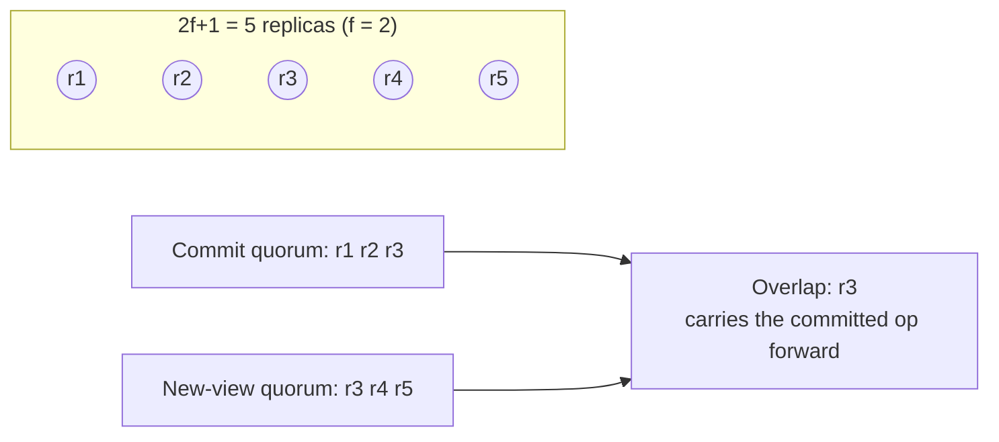

# 3. Why 2f+1

## The problem: how many replicas, and how many must agree?

The last chapter defined a committed operation as one that `f+1` replicas hold, and promised that a view change could always recover it. Both claims rest on a count. How many replicas do you need to tolerate `f` failures, and how many must acknowledge an operation before it is safe? Get these numbers wrong and the protocol either cannot make progress or, worse, silently loses committed data during a leader change. This chapter is the arithmetic, and it is short, because all of VR's safety compresses into one fact about overlapping sets.

## Why the obvious fixes fail: wait for all, or wait for any

Two simple rules bracket the answer, and both are wrong.

Wait for all replicas before committing, and you are back in Lamport's trap from chapter 1: a single crash halts you, because you can never collect acknowledgments from a machine that is down, and you cannot tell it is down rather than slow. Availability is zero the moment anything fails. That is the rule VR exists to escape.

Wait for any single acknowledgment, or any small fixed number, and you lose safety. Suppose you commit an operation once just one backup has it, then the primary and that backup both crash. The operation was acknowledged to the client, but it now survives only on machines that are gone. A new leader, formed from the replicas that are still up, has never heard of it. It has vanished despite being committed. Committing on too few replicas means a small burst of failures can erase acknowledged work.

The right threshold has to be large enough that the set which committed an operation and the set which forms the next view cannot miss each other.

## Liskov's move: 2f+1 replicas, a majority commits, majorities always overlap

VR runs `2f+1` replicas to tolerate `f` failures, and commits on a quorum of `f+1`, a bare majority. The 2012 report derives the count from first principles, and the reasoning is worth following exactly because every term in it is load-bearing:

> We have to be able to carry out a request without waiting for `f` replicas to participate, since these replicas may be crashed and unable to reply. However, the `f` replicas we didn't hear from might merely be slow to reply. `f` of the replicas we did hear from may thus subsequently fail. Therefore we need to run the protocol with enough replicas to ensure that even if these `f` fail, there is at least one replica that knows about the request. This implies that each step of the protocol must be processed by `f+1` replicas. These `f+1` together with the `f` that may not respond give us the smallest group size of `2f+1`.

Read that as three groups of replicas in the worst case. You commit using `f+1`. Of those, `f` might crash immediately afterward. That leaves one survivor from the committing set. Meanwhile the `f` replicas you never heard from might have been alive all along. So the next step of the protocol proceeds with a different `f+1`: the `f` you did not hear from, plus that one survivor. The survivor is the whole point. It is in both sets, and it carries the committed operation across.

That is the quorum intersection property, and the report names it as the foundation: "correctness of the protocol depends on the quorum intersection property: the quorum of replicas that processes a particular step of the protocol must have a non-empty intersection with the group of replicas available to handle the next step." The proof is grade-school arithmetic. Two subsets of a set of size `2f+1`, each of size `f+1`, must share at least one element, because if they were disjoint they would together contain `2(f+1) = 2f+2` distinct replicas, which is more than the `2f+1` that exist. There is nowhere for two majorities to hide from each other.

The picture generalizes across the protocol. An operation is committed only when a quorum holds it. A new view is formed only from a quorum. Those two quorums intersect, so at least one replica in the new view's quorum already holds the committed operation, and the view change can recover it from that replica. Nothing committed can fall through, because there is no gap between "the majority that committed it" and "the majority that forms the next view" for it to fall through.

The report is also careful about a tempting mistake: making the group bigger does not buy more. "For a particular threshold `f` there is no benefit in having a group of size larger than `2f+1`: a larger group requires larger quorums to ensure intersection, but does not tolerate more failures." Five replicas tolerate two failures whether you demand quorums of three or of four; the extra replica just raises the bar for progress. `2f+1` is not a rough sizing rule, it is the exact minimum, and exceeding it costs latency for no gain in fault tolerance.

## The modern echo, stated precisely

Every majority-quorum system you run is standing on this arithmetic. Raft commits an entry when a majority of servers has stored it and elects a leader with votes from a majority, and its safety argument is the same overlap: the election majority and the commit majority intersect, so a newly elected leader's supporters include someone holding every committed entry. It is why these systems are almost always deployed in odd numbers, three or five, and why an even number is a waste: six replicas need a quorum of four and still tolerate only two failures, exactly what five tolerate with a quorum of three. The rule of thumb every operator learns, "run three or five, never four or six," is not folklore. It is the direct reading of `2f+1`, and it traces straight back to the intersection argument in this protocol.

> **Principle:** Safety is arithmetic. If every decision requires a majority, any two decisions share a participant, and that shared participant is what carries committed state from the old regime into the new one.
