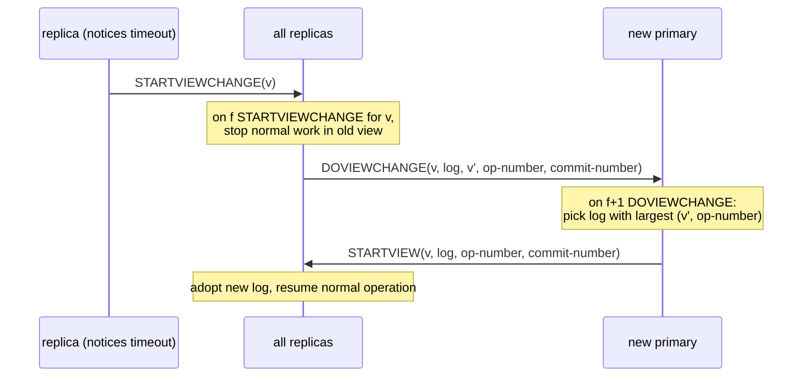

# 4. The view change

## The problem: replace the leader without losing anything

Everything easy about VR lives in the normal case. Everything hard lives here. The primary has fallen silent, and the backups have to install a new one. The new view must satisfy a condition the 2012 report states without flinching: "every committed operation survives into all subsequent views in the same position in the serial order." Every operation the old primary ever committed must be present in the new view, at the same slot, and this must hold even though nobody can be certain the old primary is actually dead rather than slow, and even though the operation might have been committed at the old primary an instant before it crashed, before the news reached anyone the new view will talk to. This is the part of the protocol people wave their hands at, and it is exactly the part that is hard to get right. So we will not wave.

## Why the obvious fix fails: naive election loses data or forks the log

The tempting version: notice the primary is gone, pick a new one, let it start assigning operations. Two things break.

First, lost commits. Suppose the new primary starts from its own log, which might be missing the last operation the old primary committed, because that operation was committed on a majority that happened not to include this replica. The new primary blithely reuses that slot for a different operation. An acknowledged operation is now gone, and a client that was told "done" is wrong. A leader change that does not actively hunt down committed operations will drop them.

Second, two primaries. If the old primary was only slow or partitioned, not dead, it may still think it is the primary and still be accepting operations and committing them on its side of the partition, while the new primary does the same on the other side. Two logs diverge. This is split brain, and it is the failure that turns a replicated database into two databases that disagree.

A correct view change has to guarantee the new primary learns every committed operation, and has to guarantee the old primary can no longer commit anything. VR does both, and the mechanism for the second is subtler than it looks.

## Liskov's move: gather a quorum, take the most-advanced log, and shut out the past

The 2012 view change is three messages, and each one is doing a specific job. Every replica keeps its `view-number`; the primary of a view is a deterministic function of that number, so agreeing on the view number is agreeing on who leads.

A replica that suspects the primary advances its view-number, sets its status to `view-change`, and broadcasts `STARTVIEWCHANGE`. When a replica has heard `STARTVIEWCHANGE` for the new view from `f` others, it sends `DOVIEWCHANGE` to the replica that will be the new primary, and, crucially, that message carries its entire log plus two numbers: `v'`, the latest view in which its status was normal, and its `op-number`. The new primary waits for `DOVIEWCHANGE` from `f+1` replicas including itself, and then makes the decision the whole protocol turns on: it adopts, out of those `f+1` logs, "the one contained in the message with the largest `v'`; if several messages have the same `v'` it selects the one among them with the largest op-number." Then it broadcasts `STARTVIEW` with the chosen log, and everyone adopts it and resumes.

Why is the chosen log guaranteed to contain every committed operation? This is the argument, and it is pure quorum intersection from chapter 3. An operation commits only after the old primary collected `f` `PREPAREOK`s, which means it sits in the logs of `f+1` replicas. The new view is formed from the logs of `f+1` replicas. Two sets of `f+1` out of `2f+1` must share a member. So at least one replica in the `DOVIEWCHANGE` quorum holds the committed operation, and since the new primary takes the most-advanced log among them, it takes a log that includes it. The report states the conclusion exactly: the view change "obtains information from the logs of at least `f+1` replicas. This is sufficient to ensure that all committed operations will be known, since each must be recorded in at least one of these logs; here we are relying on the quorum intersection property." Uncommitted operations may or may not survive, and that is fine; only the committed ones carry a promise.

Now the subtle half, shutting out the old primary. It is not enough for the new primary to gather the right log; the old primary must be prevented from committing anything new behind the new view's back. VR does this with the rule that a replica, once it starts a view change, stops accepting `PREPARE` messages from the old view. The report is emphatic that this is load-bearing: "it is crucial that replicas stop accepting PREPARE messages from earlier views once they start the view change protocol. Without this constraint the system could get into a state in which there are two active primaries." The reasoning is tight. To commit a new operation, the old primary would need a majority, `f+1` replicas including itself, to accept its `PREPARE`. But once a majority has moved to the new view, those replicas refuse messages from the old view, and two majorities of `2f+1` cannot be disjoint, so the old primary can never gather the majority it needs. It can still be running, still think itself in charge, still receive client requests, and it simply cannot commit anything. It is a primary with no quorum, which is to say, harmless. This is the same insight the 1988 paper stated in its own vocabulary: an old primary that missed the view change "will not be able to prepare and commit user transactions, however, since it cannot force their effects to the backups."

There is a matching subtlety in recovery, which the report handles with equal care: a crashed replica that comes back must not rejoin as if current, because "if it forgets that it prepared some operation, this operation might then be known to fewer than a quorum of replicas even though it committed, which could cause the operation to be forgotten in a view change." So a recovering replica stays out until it has relearned a state at least as fresh as when it crashed, reconstructing it from `f+1` peers including the current primary. VR treats "the volatile state at `f+1` replicas as stable state," which is the same bet as chapter 2's no-disk design: a majority's memory is your durable store.

## The modern echo, stated precisely

Raft's leader election is this view change with the serial numbers filed off, and its designers say so. A Raft candidate wins with votes from a majority, and Raft adds a rule that a server refuses its vote to any candidate whose log is less up to date than its own, which forces the winner to already hold every committed entry, the same guarantee VR gets by having the new primary pick the most-advanced log from its quorum. Raft's `term` number plays the role of the `view-number`, monotonically rising and stamping every message so that a stale leader is recognized and ignored, which is Raft's version of shutting out the old primary. The two protocols solve the identical problem with the identical arithmetic and differ mainly in which side does the log comparison: VR's new primary pulls the best log from the quorum, while Raft's voters push the requirement onto the candidate. Either way, the committed operation cannot be lost, for the reason chapter 3 gave: two majorities always meet.

> **Principle:** A leader change is safe only if the new leader is guaranteed to hold every committed operation and the old leader is guaranteed to be unable to commit another. Quorum intersection gives you the first; refusing messages from the old view gives you the second.
