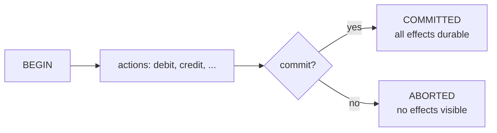

# 1. A transaction is a contract

## The problem: half-done is worse than not-done

Move a hundred dollars between two accounts and the work is two steps: debit one, credit the other. Now let the machine crash between them. The money is gone from the first account and never arrived at the second. This is not a slow system, and it is not an unavailable one. It is a system that gives a wrong answer and keeps running as if nothing happened. A multi-step change to shared, durable state has a state in the middle that must never be allowed to persist or be seen, and the central difficulty of Gray's paper is how to forbid that middle state in a world where machines crash and many changes run at once.

The obvious framing, the one every application programmer starts with, is to handle each failure where it happens: check for the crash, notice the half-done transfer, write code to repair it. Gray's paper is an argument that this is the wrong place to put the logic, and that there is a single abstraction that removes it from the application entirely.

## Why the obvious fix fails: you cannot build your way out with hardware

The first instinct of a hardware company, and Gray was at Tandem, is to make the machine never fail. Gray takes that seriously and then shows its ceiling. Computers, he notes, can be built from fail-fast modules, each of which "either operates correctly or detects its failure and does nothing," with mean times to failure "measured in months." Duplex the parts, mirror the discs, and the numbers get spectacular: a mirrored disc pair fails "about once every three thousand years," and by his more realistic estimate has a mean time to failure of 800 years. Tandem's NonStop systems paired every module and ran a backup process for every primary. On paper, such a system almost never fails.

And yet it does. Gray is blunt about the ceiling: real systems "fail every few months or years" not because the hardware breaks but "because the people who adapted your system make some mistakes (application programming errors) and the people who operated the system make some mistakes." Operator error runs about once a year, application bugs several times a year, and "at least one transaction in 100 will fail due to data-entry error or authorization error." No amount of redundancy touches those. Worse, even the reliable hardware does not make applications easy to write: programming a primary that "checkpoints its state to the backup process prior to each operation" is, in his words, "very subtle," and resynchronizing after a takeover is "delicate." A perfect machine still leaves the programmer hand-coding recovery, and still aborts real transactions for reasons no machine can prevent.

So reliability is necessary and not sufficient. You will always need a way to abandon a change cleanly, and you want that way to be a reusable mechanism, not application code written fresh each time.

## Gray's move: borrow the transaction from contract law

Gray's move is to name the abstraction and to source it, surprisingly, from law rather than engineering. "The transaction concept," he writes, "derives from contract law." Two parties negotiate, then make a binding deal, and once the deal is struck it cannot simply be undone; a bad deal is corrected only "via further compensating transactions." When the parties are wary they appoint an intermediary, "usually called an escrow officer, to coordinate the commitment." His running example is a wedding: the couple negotiate for years, then a minister asks each in turn whether they agree, and only on a double yes pronounces them bound. Hold onto the minister; chapter 4 shows he is the two-phase commit coordinator.

From the contract, Gray reads off the properties a computer transaction needs, and here precision matters because the folklore gets it wrong. He names exactly three:

- **Consistency**: the transaction must obey the rules, transforming one legal state into another legal state.
- **Atomicity**: "it either happens or it does not; either all are bound by the contract or none are."
- **Durability**: "once a transaction is committed, it cannot be abrogated."

That is the whole named list: atomicity, consistency, durability. Not four. Gray does not name "isolation," and he never writes "ACID." He handles the concurrency problem, two transactions colliding, at length in later sections, but he treats it as part of getting a consistent result through locking, not as a separately named property. The famous four-letter acronym came two years later, from Theo Haerder and Andreas Reuter's 1983 survey, which added isolation and coined ACID. This is the single most common misattribution about the paper, so it is worth stating plainly: the transaction concept and three of its four now-canonical properties are Gray's; the acronym is not, and the "I" is not.

The diagram is the guarantee in one picture. A transaction has exactly two possible outcomes, and the half-done middle is not one of them. Either every effect survives, even through a crash, or none of them was ever visible to anyone else. The programmer writes three verbs, BEGIN, COMMIT, and ABORT, and the mechanism underneath makes the outcome binary.

## The modern echo, stated precisely

The verbs are still there. Every relational database gives you `BEGIN`, `COMMIT`, and `ROLLBACK`, and the guarantee behind them is exactly Gray's: the statements between `BEGIN` and `COMMIT` either all take effect or none do, and once `COMMIT` returns the change survives a crash. What moved is where the failure logic lives. Before the transaction concept, the application noticed the half-done transfer and repaired it; after it, the application says `ABORT` (or just crashes) and the database's recovery mechanism guarantees the debit is undone with no repair code at all. Gray's own summary of the payoff holds up: transaction management "frees the application programmer from concerns about failures or process pairs."

The precise modern caution is the ACID one. When a system advertises "ACID transactions," it is promising Haerder and Reuter's four properties, and the "I," isolation, is the one that leaks in practice: most databases default to an isolation level weaker than full serializability, so the guarantee you actually get is often not the one the acronym implies. Knowing that Gray named three properties and that isolation was bolted on later is not trivia. It is a reminder that isolation was always the awkward one, the property that costs the most and gets relaxed the most, which is the subject of chapter 3.

> **Principle:** Reliability makes failure rare; it cannot make it impossible. The transaction is the abstraction that makes failure survivable, by allowing exactly two outcomes, all or nothing, and moving the recovery out of the application.
