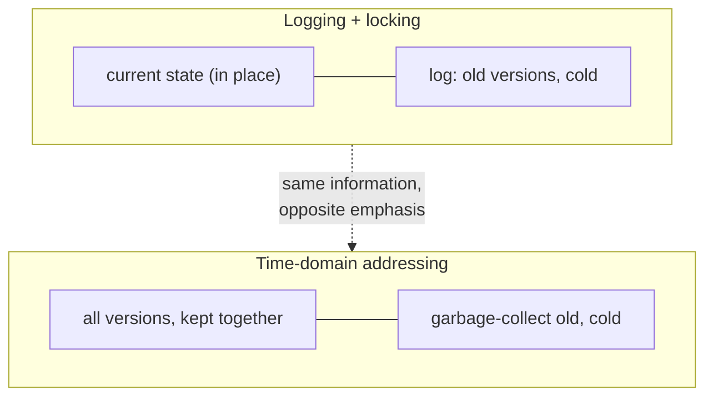

# 2. All or nothing

## The problem: how do you undo something that already happened?

Atomicity sounds like a wish more than a mechanism. "Either all actions happen or none do" is easy to say and hard to deliver, because by the time a transaction decides to abort, it has usually already done things: written records, changed pages, sent messages. Some of those you can take back. Some you cannot. The question this chapter answers is the concrete one hiding under the word atomicity: when a transaction must be undone, how does the system reverse what it already did, and what about the parts that cannot be reversed?

## Why the obvious fix fails: not all actions are equal

The naive picture is that a transaction is a list of writes, and undo means writing the old values back. Gray's first move is to show the picture is too simple, because actions differ in whether they can be taken back at all. He sorts every action into three kinds:

- **Unprotected**: it need not be undone or redone. Writing a scratch file, sending an intermediate message. Nobody cares if it is lost.
- **Protected**: it "can and must be undone or redone." Ordinary database writes. This is the category the machinery is built for.
- **Real**: "once done, the action cannot be undone." A cash dispenser that has already spat out twenties. An airplane wing that has moved. The commit itself.

That third category is the one the naive picture ignores, and it forces a design constraint that runs through the paper. You cannot undo a real action, so you must never do it until you are certain the transaction will commit. Real actions have to be deferred to the very end. Atomicity is not just "be able to undo"; it is "arrange the work so that everything reversible is done early and everything irreversible is done last, after the outcome is settled." Get that ordering wrong and no logging scheme can save you, because the money is already out of the machine.

## Gray's move: two ways to make the past negotiable

Given protected actions that must be undoable and real actions that must be deferred, how do you actually build atomicity and durability? Gray lays out two families, and his real contribution is to hold them side by side and show they are the same idea wearing different clothes.

The first is **time-domain addressing**, or versioning. Never update anything in place. An object's address becomes a pair of name and time, and writing does not overwrite; it "evolves" the object by appending a new value valid from now on. The old values stay. To read as of a moment, you read the version current at that moment. Abort becomes trivial: you simply never make the new version valid. Gray credits the fullest proposal to Dave Reed at MIT, who used not real time but "pseudo-time" precisely "to avoid the difficulties of implementing a global clock," which should sound familiar after the Lamport seminar. Versioning has costs Gray lists honestly: reads become writes because they advance an object's clock, waits become aborts, and a million-record read touches a million timestamps.

The second is **logging plus locking**. Update in place, but before you change anything, write down how to take it back. Gray reaches for two fairy tales. Theseus unrolls Ariadne's string through the labyrinth so he can retrace his steps; that string is an undo log. Hansel and Gretel drop crumbs to find their way back, "the first undo and redo log," until a bird eats the crumbs, "the first log failure," which is exactly why real logs must live on stable storage that no bird can eat. Every protected action writes an undo record (how to reverse it) and a redo record (how to replay it), and this DO-UNDO-REDO discipline gives you both abort (follow the undo records back) and durability (after a crash, replay the redo records onto an old copy). Chapter 3 covers the locking half.

Then Gray does the thing that makes the paper more than a catalog. He argues the two families are, underneath, the same. Logging keeps the current state in place and "relegates old versions to a history file called a log." Versioning keeps all versions together and garbage-collects old ones "into something that looks very much like a log." Make log records restartable and you tag objects with version numbers, so "most logging schemes contain a form of time-domain addressing." His conclusion: "despite the external differences between time-domain addressing and logging schemes, they are more similar than different in their internal structure." One keeps the current value hot and the history cold; the other keeps the history hot and garbage-collects it cold. Same information, opposite emphasis.

## The modern echo, stated precisely

Gray predicted a fork, and both branches won, in different parts of the same database. Logging became the write-ahead log: every serious storage engine writes the change to a durable log before touching the data pages, and recovery replays it, the DO-UNDO-REDO discipline formalized a decade later as ARIES. Versioning became multiversion concurrency control: Postgres, Oracle, and most modern engines keep multiple versions of a row so that a reader sees a consistent snapshot as of its start time without blocking writers, which is Reed's time-domain addressing made practical. The striking part is that a single modern database usually runs both at once. Postgres has a write-ahead log for durability and MVCC for isolation, in the same engine, on the same data. Gray's "more similar than different" was not a hedge; it was a prediction that the two techniques would stop competing and start cooperating, each doing the job it is best at. And the deepest version of his point, that the log and the state are two views of the same information, is the idea behind event sourcing and the "log as source of truth" architectures that chapter 6 returns to.

> **Principle:** Atomicity is not the power to undo anything; it is the discipline of making every reversible action reversible and deferring every irreversible one until the outcome is certain. Whether you keep the state and log the history, or keep the history and cache the state, is a choice of emphasis, not of substance.
