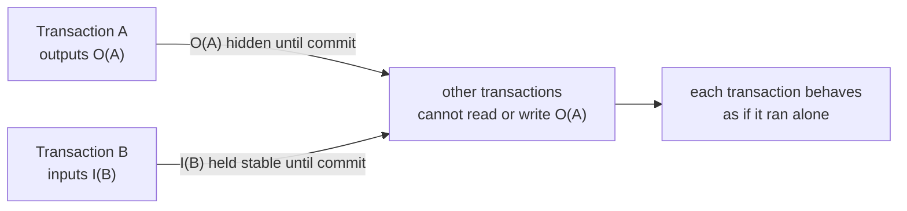

# 3. Isolation without the word

## The problem: other transactions are running at the same time

Atomicity and durability, chapters 1 and 2, are about one transaction surviving failure. This chapter is about many transactions running at once without poisoning each other. The danger is concrete. Transaction A debits an account and, before it commits, transaction B reads the new balance and acts on it. Then A aborts. B has now made a decision based on a number that never really existed, and undoing A means chasing down and undoing B, which may already have committed and cannot be undone. Concurrency turns a single abort into an unbounded cascade. The problem is to let transactions run concurrently for speed while making each one behave as if it had the database to itself.

## Why the obvious fix fails: guessing what a transaction will touch

One tempting approach is to figure out in advance which records each transaction will read and write, and schedule two transactions together only if their sets do not overlap. Gray notes this was tried early, in IMS, under the name intent scheduling, and that it "has not been very successful"; IMS "abandoned predeclaration in 1973." The reason is that programs do not know their own footprint ahead of time. A transaction's reads and writes depend on the data it finds as it runs, so any pre-declared set is either wrong or so conservative that it serializes everything and destroys the concurrency you wanted. You cannot plan the conflicts; you have to detect them as they happen.

## Gray's move: hide outputs, stabilize inputs, and lock to enforce it

Gray reduces the concurrency problem to a rule about what one transaction may see of another. Every transaction has a set of inputs it reads and a set of outputs it writes, and the rule is simple to state: "other transactions may read I but must not read or write O." Uncommitted outputs are hidden until commit, so nobody can act on a value that might be rolled back. And inputs must be stabilized: once a transaction reads a record, that record must not change under it, or "a transaction could reread a record and get two different answers," a phrase Gray takes from the 1976 Eswaran paper that put concurrency control on a formal footing.

The mechanism that enforces the rule is locking, and Gray's treatment is the one that became standard practice. Lock an object when you touch it; if it is already locked, wait. Distinguish two modes, a shared read lock and an exclusive update lock, so many readers can proceed together but a writer excludes everyone. Because a transaction's footprint is unknown in advance, locks are taken dynamically as the transaction discovers what it needs, which is exactly the thing pre-declaration could not do. Locking at a single granularity is too crude, so Gray describes a hierarchy: organize lockable things from coarse (a whole file) to fine (a record) as a graph, and lock from the root down, so a transaction that wants one record and one that wants the whole file can coexist without either over-locking.

The price of locking is the possibility that two transactions each wait for a lock the other holds, forever. Gray names it and dispatches it in a sentence of method: a deadlock "must be detected (by timeout or by looking for cycles in the who-waits-for-whom graph), a set of victims must be selected and they must be aborted and their locks freed." He adds a warning that reads as prophecy for anyone who has run a busy database: deadlock is rare in small transactions but "deadlocks per second rise as the square of the degree of multiprogramming and the fourth power of transaction size." Big transactions and high concurrency make deadlock explode, which is why the limitations chapter later worries about transactions that last for days.

## The trap: this is isolation, and Gray never calls it that

Here is the thing to see clearly, because it is the paper's most-cited-wrong point. Everything in this chapter, hiding uncommitted outputs, stabilizing reads, locking for consistent results, is what the industry now calls isolation, the "I" in ACID. Gray builds it, carefully and in detail. But he does not name it as one of the transaction's defining properties. His named list, from chapter 1, is atomicity, consistency, and durability. He treats concurrency correctness as part of achieving a consistent transformation, enforced by locking, rather than as a fourth, first-class guarantee. The promotion of isolation to a named property, and the coining of ACID, came in 1983, from Haerder and Reuter, building on exactly this material. So when a modern engineer says "the I in ACID goes back to Gray," the honest correction is: the mechanism does, the name does not. Gray gave isolation its machinery and left it unnamed inside consistency.

That is not pedantry, because isolation turned out to be the property that behaves differently from the other three. Atomicity and durability are effectively all-or-nothing: a system either has them or it does not. Isolation comes in degrees, and Gray already knew it, citing his own earlier work on accepting "a lower degree of consistency" when full locking is too expensive. That single admission is the seed of the entire modern isolation-levels menu.

## The modern echo, stated precisely

Open any database manual and you find isolation sold by the level: read committed, repeatable read, snapshot isolation, serializable. That menu exists because full isolation, making every transaction behave exactly as if transactions ran one at a time, is expensive, so systems offer weaker guarantees that run faster and let certain anomalies through. Most databases default below serializable; PostgreSQL and Oracle default to a level that permits anomalies a strict serial order would forbid. The dominant modern technique is not Gray's pure locking but the versioning of chapter 2: snapshot isolation gives each transaction a consistent view as of its start, using multiversion storage, so readers never block writers. That is Reed's time-domain addressing enforcing Gray's rule, "readers may see committed inputs, never uncommitted outputs," without most of the locks. The lesson to carry is the one Gray half-stated and Haerder and Reuter made explicit: isolation is the negotiable property. You will trade it away for performance more often than you trade away atomicity or durability, and the bugs that result, the phantom read, the write skew, live in exactly the gap between the isolation level you chose and the serializable one you imagined.

> **Principle:** Concurrency correctness reduces to one rule: a transaction may see another's committed inputs but never its uncommitted outputs. Everything else, locks, versions, isolation levels, is machinery for enforcing that rule, and how much of it you can afford is the first thing a real system negotiates away.
