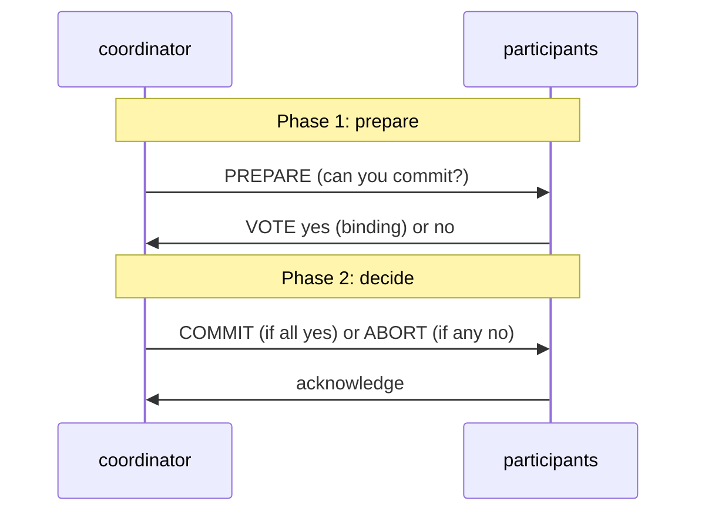

# 4. The commit is a handshake

## The problem: committing in more than one place at once

Everything so far assumed a single system deciding a single outcome. Real transactions often span several nodes: a transfer touches two banks, an order touches inventory and billing, and each node has its own log and its own recovery. Now atomicity has teeth. The transaction must commit at every node or abort at every node, with no outcome where one bank has committed the debit and the other has aborted the credit. Gray states the requirement exactly: if a transaction "has contributed to multiple logs then one must be careful to assure that the commit appears either in all logs or in none of the logs." The problem is getting independent machines, any of which can crash at any instant, to agree on one binary outcome.

## Why the obvious fix fails: one node cannot just decide

The simplest scheme, which Gray mentions, is to let a single active node make the decision and have the others follow. That works only if the followers have given up the right to change their minds. But a participant may have good reason to abort: it hit a constraint violation, a deadlock, a local failure. If the coordinator can unilaterally declare commit while a participant has already decided it must abort, atomicity breaks. So you cannot simply announce the outcome. You first have to collect, from every participant, a binding promise that it is able and willing to commit, and only then decide. The decision has to come after the promises, not before.

## Gray's move: prepare, then commit, like a wedding

Gray's answer is the two-phase commit protocol, and he explains it with the metaphor he set up in chapter 1: the wedding. "It is very similar to the wedding ceremony in which the minister asks 'Do you?' and the participants say 'I do' (or 'No way!') and then the minister says 'I now pronounce you,' or 'The deal is off.'" The two phases are the two questions. In the first phase, the coordinator asks every participant to prepare, and each votes yes or no. A yes is binding: "the participant abdicates the right to unilaterally abort once it says 'I do' to the prepare request." In the second phase, the coordinator counts the votes. If all said yes, it broadcasts commit; if any said no, it broadcasts abort. Unanimity commits; a single objection, like the minister's "does anyone object," aborts.

Two points of attribution, because this is where the folklore overreaches. First, Gray did not single-handedly invent two-phase commit, and this paper does not claim he did; he gives it one paragraph and notes "many variations on this protocol are known." The protocol has several roots in the 1970s, credited across Gray's own earlier "Notes on Database Operating Systems" (1978) and Lampson and Sturgis's "Crash Recovery in Distributed Systems" (1976), among others. Gray is a primary source and popularizer of 2PC, not its lone author. Second, the flaw that defines 2PC's reputation is not analyzed in this paper at all.

## The flaw: 2PC blocks, and that points somewhere

The flaw is blocking, and it is worth being precise because it is the hinge to the rest of the series. Consider the worst moment: a participant has voted yes, so it has given up the right to abort and is holding its locks, waiting to be told the outcome. Now the coordinator crashes before sending the decision. The participant cannot abort, because it promised not to. It cannot commit, because it does not know whether everyone else voted yes. It can only wait, holding its locks, until the coordinator comes back. Other transactions that need those locks wait too. One badly timed crash freezes part of the system indefinitely. This is the blocking property of two-phase commit, and it was set out crisply not by Gray but by Dale Skeen in 1981, who also showed the fix: add a third phase, a "prepare to commit" round that propagates the decision to enough participants that a new coordinator can always recover it, yielding the non-blocking three-phase commit.

Even three-phase commit has limits under network partitions, and that is the thread to pull. The real problem behind atomic commit is getting a group of unreliable machines to agree irrevocably on one value, the commit-or-abort decision, and to keep agreeing even when the machine that was coordinating disappears. That is not a database problem; it is the consensus problem, and it is exactly what a later seminar in this series takes up with Paxos. The connection also runs backward. The previous seminar's Viewstamped Replication was, in its original 1988 form, replicating a transaction system that ran this very commit protocol; VR's view change is the mechanism for surviving the coordinator failure that leaves 2PC stuck. Gray names the handshake and its weakness; consensus is the tool built to remove the weakness.

## The modern echo, stated precisely

Two-phase commit is alive and it is feared in equal measure. The XA standard is 2PC for distributed transactions across databases and message queues, and it works, and operators avoid it wherever they can, for the reason Gray's structure predicts: a coordinator failure holds locks across multiple systems and stalls them together. This is a large part of why microservice architectures generally refuse distributed transactions and reach instead for the sagas of chapter 5, trading atomicity for availability. Where strong consistency across nodes is truly required, the modern move is not to abandon 2PC but to make its coordinator fault-tolerant: Google's Spanner runs two-phase commit across shards, but each participant is itself a Paxos group, so the "coordinator" is a replicated state machine that does not simply vanish when one machine dies. That is the arc of this series in one sentence. Gray's handshake supplies atomicity across nodes; consensus supplies the fault tolerance that keeps the handshake from freezing; and the modern distributed database is the two of them stacked.

> **Principle:** Committing in more than one place is a promise before a decision: collect binding votes, then declare the outcome. But a promise held while the coordinator is gone is a lock held forever, so atomic commit is only as reliable as the agreement underneath it, which is why it becomes a consensus problem.
