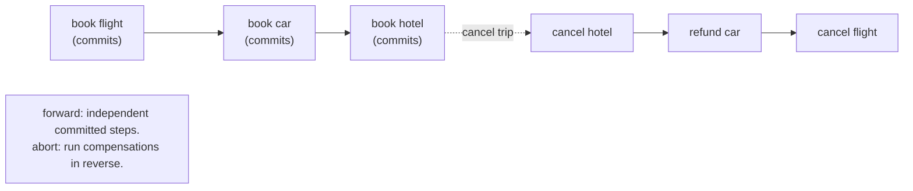

# 5. Virtues and limitations

## The problem: the transaction that lasts a week

The title of the paper is "Virtues and Limitations," and almost every retelling stops at the virtues. The back half is where Gray turns on his own idea, and it is the more prophetic half. He names three difficulties with the transaction model as built: "Transactions cannot be nested inside transactions. Transactions are assumed to last minutes rather than weeks. Transactions are not unified with programming language." The first two are the ones that matter for how we build systems now, and they share a single breaking example.

The example is a travel agent booking a trip: negotiate flights, then cars, then hotels, collect the tickets, bill the card, and much later the customer takes the trip, or cancels it. Gray's verdict is stark: "The transaction concept as described thus far crumbles under this example." It crumbles for two reasons at once, and they are worth separating.

## Why the obvious fix fails: one big transaction cannot hold the world still

The reflex is to wrap the whole trip in one transaction: BEGIN, book everything, COMMIT, and if anything fails, ABORT and it all rolls back cleanly. This fails on contact with reality in two ways.

First, duration. A trip is arranged over days or weeks. A single transaction holding locks that whole time is impossible: chapter 3's arithmetic, deadlock rising with the square of concurrency and the fourth power of transaction size, guarantees that thousands of week-long transactions holding locks will collapse into deadlock. You cannot lock an airline's seat inventory for a week while a customer decides.

Second, and deeper, the sub-steps are not yours to roll back. Booking a flight is a committed transaction at the airline. The airline has its own atomicity, and once its transaction commits, "the agent cannot unilaterally abort an interaction after it completes." There is no undo log that reaches into another company's database. The whole premise of atomicity, that the system controls all the effects and can reverse them, breaks the moment the effects belong to someone else who has already committed them.

## Gray's move: compensate instead of undo, and lower the bar

Gray's answer abandons the idea that a long process is one atomic transaction and rebuilds it as a sequence of small committed transactions, each paired with a way to reverse it after the fact. "Adjustment of a bad transaction," he wrote back in chapter 1, "is done via further compensating transactions." Here he cashes that in. Each step commits on its own and, if the larger process must be abandoned, you do not roll it back, you run a compensating transaction that semantically reverses it: cancel the reservation, refund the charge. He proposes the system keep a user-visible log of what has been done and what its compensation would be, so the process can be wound backward step by step. He is candid that this is not true atomicity: nested transactions "differ from protected actions because their effects are visible to the outside world prior to the commit of the parent," and so "they do not have the property of atomicity. Others can see the uncommitted updates." You give up the clean all-or-nothing and replace it with do-and-compensate.

For the duration problem, Gray's fix is to relax consistency deliberately. Only "active" transactions, the ones currently making changes, hold locks; "sleeping" transactions, a trip half-arranged and waiting, hold none. That means other transactions can see uncommitted work, so undo and redo must commute with the operations in between: if two transactions both adjust a balance and one aborts, the other's change must survive. He notes IMS Fast Path already exploited that addition and subtraction commute, and admits "no one knows how far this trick can be generalized." He adds save points so a long transaction can be reset to a recent checkpoint at system restart rather than thrown away, because "when 10,000 transactions are lost at system restart, then the old approach of discarding them all is inconceivable."

## The seed, and what it grew into

What Gray sketched here has a name now, and the name is not his. A long-lived process built from independent committed steps, each with a compensating transaction, run forward normally and unwound by compensation on failure, is a **saga**, and the term and the formal treatment come from Hector Garcia-Molina and Kenneth Salem's 1987 paper "Sagas." Their paper studies exactly Gray's problem, the long-lived transaction that holds locks too long, and reaches for exactly his tool, compensation, even reusing the travel and reservation examples. So the honest lineage is that Gray identified the problem and the shape of the answer in 1981, and the saga was named and worked out six years later. Do not call Gray's paper "the saga paper"; call it the paper that saw the saga coming.

## The modern echo, stated precisely

The saga is now the default way distributed systems handle multi-step business processes, precisely because the two failures Gray identified are worse than ever across a microservice architecture. You cannot run a distributed two-phase commit across a dozen services for an order that takes minutes and touches external payment providers, for the exact reasons chapter 4 gave, so the industry does what Gray described: each service commits its own step, and a saga orchestrator runs compensating actions when a later step fails. Cancel the payment, release the inventory, void the shipment. Workflow engines like Temporal, which the Armstrong seminar met as a durable-execution system, are in large part machinery for running Gray's compensating-transaction log reliably over days or weeks, keeping the record of what has been done and what must be undone exactly as he proposed. And the broader retreat from strict ACID toward "eventually consistent" and BASE-style designs is the industry accepting Gray's own advice to "accept a lower degree of consistency" when the work is too long or too distributed to hold still. The limitations half of the paper turned out to describe the world we actually build in.

> **Principle:** When a process is too long or too distributed to hold atomic, stop trying to undo it and start compensating for it. You trade all-or-nothing for a sequence of committed steps and their reversals, and you accept that the middle is visible. That trade is the saga, and Gray saw it coming.
