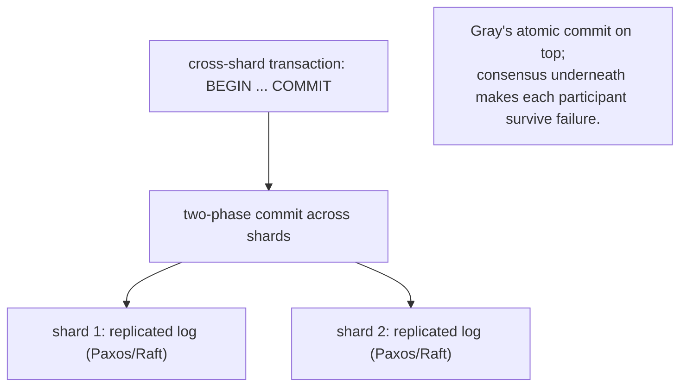

# 6. The transaction in the modern world

## The problem: can you keep the guarantee when you scale out?

Gray's transaction assumed a setting that stopped being universal: one database, on one machine or a small cluster, that you could ask to hold locks and write a log. The last twenty years pushed data onto many machines across many datacenters, for volume and for availability, and that raised a question Gray did not have to answer. Can you still offer BEGIN, COMMIT, and the all-or-nothing guarantee when the data is spread across a hundred nodes and any of them can fail? For a long stretch the industry's answer was no, and this chapter is about how that answer changed and where transactions sit now among the other tools this series has covered.

## Why the obvious fix failed: choosing sides

The influential answer of the 2000s was to give up. The reasoning ran through the CAP theorem: a distributed system cannot have both strong consistency and availability when the network partitions, so, faced with the choice, the large web companies chose availability and dropped transactions. This hardened into a slogan, ACID versus BASE, where BASE (basically available, soft state, eventually consistent) was sold as the grown-up choice for scale and ACID as a legacy comfort that would not survive contact with a real distributed system. The first generation of NoSQL stores shipped with no multi-key transactions at all, on the argument that they were incompatible with scale.

That framing was too clean, and it conflated two different things. Dropping transactions was presented as a consequence of distribution, but it was really a consequence of not wanting to pay for the coordination that distributed transactions require. The coordination was expensive and, done with plain two-phase commit, fragile, for the blocking reason of chapter 4. The mistake was concluding that because the old mechanism was fragile, the guarantee itself had to go.

## The resolution: transactions on top of consensus

The move that reunited the two was to stop implementing distributed transactions on bare two-phase commit and start implementing them on top of a consensus-replicated log. This is the synthesis of the middle of this series, so it is worth stating as a stack. At the bottom, a set of replicas agree on an ordered log of operations and survive failures of a minority, which is Viewstamped Replication and Paxos, seminars five and thirteen. On top of that, each shard of the data is not a single fragile node but a replicated state machine, so it does not simply vanish mid-commit. And across shards, Gray's two-phase commit runs as before, except that every participant is now fault-tolerant, so the coordinator failure that used to block the protocol becomes just another failover.

Google's Spanner is the clearest instance: it runs two-phase commit across shards, and each shard is a Paxos group, so the atomic commit Gray described sits on the fault-tolerant agreement that Lamport and Liskov described. CockroachDB and TiKV do the same over Raft. The result is a system that offers Gray's transactions, real BEGIN and COMMIT with serializable isolation, at a scale and availability Gray's single-log design could not reach. The "NewSQL" label is just the recognition that the ACID-versus-BASE choice was false: you can have the transaction guarantee at scale, you just have to build it on consensus rather than on a single durable log.

## The idea underneath: the log was the database all along

There is a second modern echo, quieter and arguably deeper, and it comes straight from chapter 2's observation that the log and the state hold the same information. Gray kept the current state hot and the log as history. A line of modern systems inverts the emphasis and treats the log itself as the source of truth, deriving the queryable state as a materialized view of it. Event sourcing stores the sequence of changes and replays them to reconstruct state. Kafka made the durable, ordered, replicated log a piece of infrastructure in its own right, and a generation of "turn the database inside out" designs build read models as projections of that log. This is Gray's "more similar than different" carried to its conclusion: if the log and the state are two views of the same information, you are free to choose which one is primary, and sometimes the log is the better choice, because it is also the ordering, the audit trail, and the replication stream all at once.

## Where transactions sit now

Set the tools side by side. Ordering (Lamport) tells you how events relate without a shared clock. Replication and consensus (Liskov, and Paxos ahead) keep a service alive and agreeing through failure. Transactions (Gray) keep state correct: all-or-nothing, durable, isolated. They are not competitors; they compose. The modern distributed database is a transaction layer speaking Gray's language of commit and abort, sitting on a replication layer speaking Lamport and Liskov's language of ordered, agreed logs, with the atomic-commit handshake between them made non-blocking by the consensus underneath. And where even that is too expensive, the saga of chapter 5 gives up strict atomicity for compensation. Gray's paper is one leg of a tripod, and reading it after the ordering and replication seminars shows how the legs were always meant to stand together.

> **Principle:** The transaction guarantee did not lose to scale; the naive way of distributing it did. Put Gray's atomic commit on top of a consensus-replicated log and you get transactions that survive failure, which is why the ACID-versus-BASE choice turned out to be one you rarely have to make.
