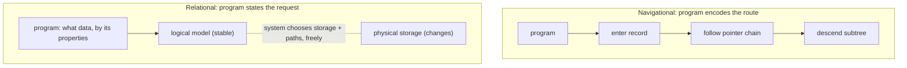

# 1. Programs chained to storage

## The problem: the query and the route were the same thing

In 1970 a database was a structure you walked. In a hierarchical system like IBM's IMS, records hung off other records in a tree; in a network system like IDS, they formed a graph wired together by pointers. To answer a question, a program started at some entry record and followed the pointers, hop by hop, along paths the storage designer had built. The program did not describe the data it wanted. It described the route to reach it.

That fused two things that should have been separate: what the data means and how it is stored. A program that printed the parts committed to a project did not just say "parts, joined to that project." It said "enter here, follow this chain, descend that subtree," and those instructions were only correct for one particular physical arrangement. Codd's opening is a catalog of how badly this fuses. He identifies three kinds of dependence that lock a program to the storage: ordering dependence (programs assume records arrive in the order they are stored), indexing dependence (programs name specific indexes and break when an index is added or dropped), and access path dependence (programs navigate a specific tree or network and fail when it is restructured). His verdict on the last is the whole problem in one line: application programs "tend to be logically impaired if the trees or networks are changed in structure."

He proves it with a small, devastating example. Take parts and projects, with a quantity committed of each part to each project. That information can be laid out as at least five different trees: parts above projects, projects above parts, the two as peers, and so on. Now write a program to print the parts used by a given project. Codd's observation: a program written for one of those five structures "will fail on at least three of the remaining structures," because it references a file or a path that only exists in the arrangement it assumed. The data is identical in all five. Only the storage differs, and the storage is what the program encoded.

## Why the obvious fix fails: schemas alone do not free you

The database designers of the day were not blind to this. Their answer was the data description table, a schema that named the fields and structures so that some storage changes could be made in one place. Codd gives them credit: such tables are "a major advance toward the goal of data independence." Then he closes the door on them as a full solution. The trouble, he writes, is that "the variety of data representation characteristics which can be changed without logically impairing some application programs is still quite limited," and the model the user works with "is still cluttered with representational properties." A schema tells you the shape of the maze. It does not stop your program from having memorized a path through it. As long as the logical model still exposes ordering, indexes, and access paths, programs will reach for them, and reaching for them is what breaks.

## Codd's move: make the logical model independent of storage

Codd's move is to insist on a clean separation and to give it a name: data independence, "the independence of application programs and terminal activities from growth in data types and changes in data representation." The user's model of the data should contain only the data's "natural structure," what relates to what, with "no additional structure for machine representation purposes." Where the bytes live, how they are ordered, which columns are indexed, what pointers connect them: all of that drops below a line the program cannot see and does not depend on. Above the line is a logical model stated in mathematics. Below it, the system is free to store, order, index, and reorganize however it likes, and to change its mind later, without a single program noticing.

This was not a small technical preference; it was a fight about what a database is, and the field had it out in the open. Charles Bachman had won the 1973 Turing Award for the navigational design and gave a lecture, "The Programmer as Navigator," that treated the maze as a feature: the programmer's skill was in threading the connections. In June 1974, at the SIGFIDET conference in Ann Arbor, Bachman and Codd debated their models face to face, network versus relational. The room understood the stakes. Afterward the network model lost its standing as the default, the research world tilted toward relational, and the special interest group renamed itself SIGMOD. Codd's paper is one side of that argument, written four years early.

## The modern echo, stated precisely

The clearest proof that Codd won is a thing you do without thinking. You have a slow query, so you add an index, and the query gets faster without a single change to its text. That is indexing dependence abolished. In IDS, as Codd noted, programs "must refer to those chains by name" and "do not operate correctly if these chains are later removed"; adding or dropping an index was a code change. In a relational database the index is invisible to the query, a pure performance object the system may create or destroy at will, because the query names the data it wants, not the path to it. The same independence is why you can move a table to a different disk, partition it, change its row format, or cluster it differently, and the application keeps running. The line Codd drew between the logical model and the physical store is the line every database administrator still works on the far side of, tuning storage under queries that never learn what happened. The navigational world had no such line, which is why it could not survive its own success: the more programs that navigated a structure, the more expensive it became to ever change it.

> **Principle:** If a program encodes the route to the data, the storage can never change without breaking the program. Draw a hard line between the logical model and the physical store, and everything below the line becomes free to change.
