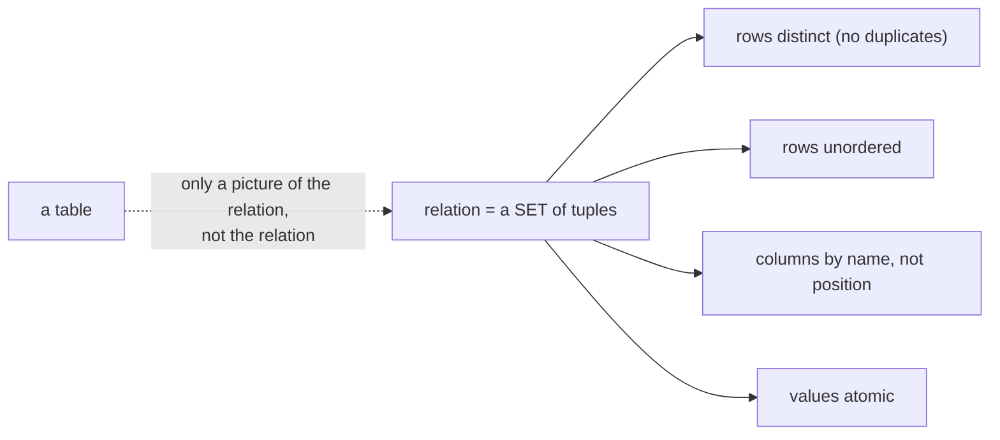

# 2. A relation is not a table

## The problem: what exactly is the logical model?

Chapter 1 argued for a line between the logical model and physical storage. That argument is only as good as the logical model you put above the line. If the logical model still smuggles in storage ideas, ordering, position, duplication, then the line leaks and programs start depending on those ideas again. So Codd needs a logical object with no representational baggage at all: something defined purely by what it means, with nothing in it that refers to how it is laid out. The candidate everyone reaches for is "a table," and Codd's paper is careful to say that a table is exactly the wrong way to think about it.

## Why the obvious fix fails: a table carries storage assumptions

Picture a table, a spreadsheet grid. It has a first row and a last row, so it has an order. It can contain the same row twice. Its columns sit in positions, first, second, third, and you can refer to "the third column." Each of those three properties is a storage assumption in disguise, and each is exactly the kind of thing chapter 1 wanted below the line. If the logical model is "a table," then a program can depend on row order, on duplicate rows meaning something, on a column's position, and you are back to storage dependence wearing a friendlier face. The grid is comfortable precisely because it looks like memory. That is the problem.

## Codd's move: the mathematical relation

Codd takes the word relation "in its accepted mathematical sense." Given domains, sets of possible values, a relation is a set of tuples, each drawing its values from those domains. That is the entire definition, and being a set does the work. Read off what a set forbids, straight from Codd's own list of the array's properties: the rows are all distinct (a set has no duplicate members, so no duplicate rows), the ordering of rows is immaterial (a set is unordered), and each column is identified by the name of its domain, not by a position. He even proposes users work with what he calls relationships, relations with the column ordering abstracted away, so that columns are referred to only by name and role, never by "first" or "third." A relation, in short, is defined by which tuples are members and nothing else. It has no order, no duplicates, no positional columns, because a set has none of those.

Then the sentence that should be printed on the wall of every database course. The array, the grid, the table, is just a convenient picture: "it must be remembered that this particular representation is not an essential part of the relational view being expounded." The table is to the relation what a printout is to a set. Useful for humans, incidental to the mathematics. The relation is the logical object; the table is one way to draw it. Codd added the constraint that makes the picture always drawable: every value in a relation must be atomic, a single indivisible value, not a nested list or a sub-table. He called flattening the data to meet this the normal form, and chapter 4 takes up how far he went with it. Atomic values are what let a relation be a flat set of simple tuples rather than a structure with more structure hiding inside.

## The trap: SQL is not the relational model

Here is the confusion the paper's own care should prevent, and the one every practitioner falls into: equating the relational model with SQL. They are not the same, and the gaps are exactly the properties above. SQL tables are not sets. `SELECT` returns a bag, a multiset that can contain the same row many times, which is why SQL needs a special `SELECT DISTINCT` to recover set behavior that the model had for free. SQL has `ORDER BY` and a general notion of row order the model denies. And SQL added NULL, a marker for missing information that the 1970 model of atomic domain values did not contain, and that drags in a three-valued logic where a comparison can be true, false, or unknown, so `WHERE x = NULL` quietly matches nothing. Every one of these is a place where the commercial language permits what the mathematical model forbids.

This is not a modern complaint invented to make SQL look bad. It is Codd's own, made loudly. SQL began as SEQUEL, designed by Chamberlin and Boyce in 1974, and its stated aim was ergonomic, "how people use tables to obtain information," a language for programmers working with grids, not a faithful rendering of the algebra. Codd watched vendors ship approximations and market them as "relational," and in 1985 he published a list of twelve rules (thirteen, counting from zero) in Computerworld under the title "Is your DBMS really relational?", explicitly to give buyers a test for the products overselling the word. The relational model is the mathematics. SQL is a popular, powerful, and permanently imperfect approximation of it, and the man who wrote the model said so.

## The modern echo, stated precisely

The gap has practical teeth, and you meet it in ordinary bugs. A join that should return one row per match returns duplicates because an upstream subquery was a bag, not a set, and you reach for `DISTINCT` to paper over it. An aggregate silently ignores the rows where a column is NULL, and a `NOT IN` against a set containing a NULL returns nothing at all, because three-valued logic turned your condition to unknown. A query that "worked" starts returning rows in a different order after an index change, and code that assumed the old order breaks, which is chapter 1's ordering dependence sneaking back in through SQL's willingness to have an order at all. None of these are failures of the relational model; they are failures of the approximation. Knowing that a relation is a set, and that SQL only pretends to be one when you ask it to, is what lets you predict where the pretense will leak.

> **Principle:** The logical model must carry no storage assumptions, so the relation is a set: no duplicates, no order, no positional columns. A table is a picture of a relation, and SQL is an approximation of the model, not the model itself.
