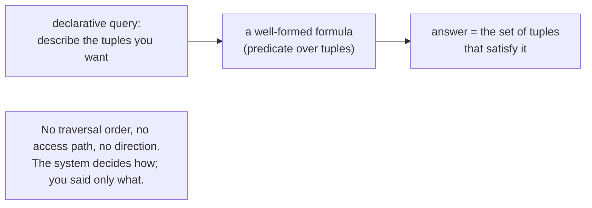

# 3. Say what, not how

## The problem: how do you ask for data without naming the route?

A clean logical model is necessary but not sufficient. You could define perfect relations and then still access them with a language that makes you write loops: open this relation, read the next tuple, if it matches follow it to that relation, iterate. That language would drag the access path back into the program through the back door, because the sequence of steps is the path. Data independence at the level of the model is undone by procedurality at the level of the language. So Codd needs a way to ask for data that names what you want and says nothing about how to get it.

## Why the obvious fix fails: a procedure is a path

The natural way to retrieve data, and the way the navigational systems worked, is to write the retrieval as a procedure: a series of steps the machine follows. But a procedure over data is an access path spelled out in code. "Loop over parts, for each part look up its project, if the project is alpha then emit it" encodes an order of traversal, a choice of which relation to enter first, an assumption about how to get from one to another. Change the storage and the efficient traversal changes, but the procedure is frozen. Any language where you say how to fetch the data commits the program to a particular how, which is the thing chapter 1 spent its energy removing. Procedural retrieval and data independence are in direct conflict.

## Codd's move: describe the set with logic

Codd's answer is a language in which you describe the data you want by its properties and let the system work out the retrieval. He proposes "a universal data sublanguage based on an applied predicate calculus," and pins down what kind of power it needs in a phrase that is the heart of the declarative idea: "the universality of the data sublanguage lies in its descriptive ability (not its computing ability)." You are not writing a computation. You are writing a description of a set, a well-formed formula that some tuples satisfy and others do not, and the answer is exactly the tuples that satisfy it. How the system finds them is its problem, not yours.

The consequence Codd draws is the one that captures the whole spirit, and he reaches for a mountain to say it. Once a relation exists, a user should be able to query it "using any combination of its arguments as knowns and the remaining arguments as unknowns, because the information (like Everest) is there." He calls this symmetric exploitation. In a navigational database, the paths ran in particular directions: you could go from supplier to parts cheaply because a chain was built that way, but the reverse question meant a different chain or no chain at all. Codd's point is that logically there is no privileged direction. Supplier-to-project and project-to-supplier are the same relation interrogated two ways, and a declarative language lets you ask either without caring which paths happen to exist. He notes the navigational cost precisely: to support symmetric access to an n-column relation you would need up to n factorial directed paths, all named and maintained. The relational model needs one relation, named by its content, and asks the questions with logic.

There is a hazard Codd is careful to name, because getting the logic wrong produces confident nonsense. He calls it the connection trap. Suppose suppliers link to the parts they supply, and parts link to the projects that use them. It is tempting to conclude that following every path from a supplier through its parts to those parts' projects gives the projects that supplier supplies. It does not, in general. That chained path yields a valid supplier-to-project relation only in the special case where the target relation is exactly the natural composition of the other two, and usually it is not, because a part a supplier ships may be used by a project that supplier has nothing to do with. The connection trap is what happens when you mistake "there is a path between these" for "these are related." Declarative logic is precisely the discipline that forbids the mistake: you state the relationship you actually mean, rather than trusting that a chain of pointers computes it.

## The modern echo, stated precisely

This is SQL's one great inheritance from the model, the part SQL got right. A `SELECT` names the data by its properties, the columns, the join conditions, the `WHERE` predicate, and says nothing about how to retrieve it. You do not tell the database to use the index on `project_name`, to scan parts first, or to join in a particular order. You describe the result, and the same query text runs correctly whether the data is on one disk or a hundred, indexed or not, stored this way today and that way tomorrow. That is why the declarative query and data independence are the same idea seen from two sides: because you said only what, the system is free to change the how. The connection trap survives too, as the everyday join bug: chain three tables together on convenient-looking keys and you can get a result that has a plausible shape and the wrong meaning, rows double-counted or spuriously related, because the join you wrote is not the relationship you meant. Codd's warning is forty years old and still catches people, because the temptation to read a path as a relationship never went away.

> **Principle:** A procedure is an access path in disguise. To keep data independence, describe the set you want with logic and let the system find it, and state the relationship you actually mean rather than trusting that a chain of connections computes it.
