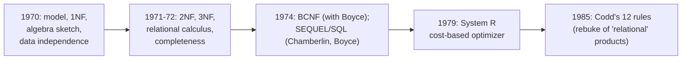

# 4. What 1970 settled

## The problem: one paper, or a whole canon?

The relational model, as taught today, is a large body of doctrine: relations and keys, first through fifth normal form, Boyce-Codd normal form, the relational algebra with its named operators, the relational calculus, and a completeness theorem tying the two together. Almost all of it gets attributed, loosely, to "Codd's 1970 paper." That is a compression error, and it matters, because it hides which ideas were there at the start and which took years and other people to work out. This chapter draws the line around what the 1970 paper actually contains, so the rest can be credited honestly.

## Why the obvious move fails: back-projection flattens history

The tempting move is to treat 1970 as the container for everything relational, and read the later doctrine back into it. This fails for the ordinary reason that back-projection always fails: it erases the work in between and makes a first step look like a finished theory. Worse, it misattributes. Say "Codd's 1970 paper gave us third normal form" and you have quietly erased the 1971 and 1972 papers where he actually developed it, and reading "Boyce-Codd normal form" into 1970 erases Raymond Boyce entirely. The paper is a seed, and calling a seed a tree is not a compliment to the seed.

## What the paper actually contains

Four things, and it is worth being exact.

First, the model: relations over domains, degree and keys. Both primary keys and foreign keys are defined here, which is worth stating because foreign keys are often assumed to be later; they are not.

Second, one normal form. The paper's "normalization" is a single procedure: eliminate nonsimple domains, the columns whose values are themselves relations, by flattening nested structure into separate flat relations with the parent key copied down. This is what later got named first normal form. And Codd marks the boundary himself, in a sentence that settles the scope question: "Further operations of a normalizing kind are possible. These are not discussed in this paper." He knew there was more normalization to do. He did not do it here.

Third, a sketch of an algebra. Section 2 introduces operations on relations, permutation, projection, natural join, composition, restriction, and the "tie" for cyclic joins, and uses them to define derivability, strong and weak redundancy, and consistency. It is a working sketch, enough to discuss when one relation is derivable from others, not the tidy, closed, named set of operators with a completeness result that the textbooks present.

Fourth, the argument that ties it together, data independence, which chapters 1 through 3 covered and which is the paper's actual thesis.

What is not here is most of the canon. Second and third normal form came in Codd's "Further Normalization of the Data Base Relational Model," in 1971 and 1972. The relational calculus and the relational completeness result, the theorem that a query language is "relationally complete" if it can express everything the calculus can, are Codd's 1972 "Relational Completeness of Data Base Sublanguages," not 1970; the 1970 paper only gestures at "an applied predicate calculus" as a yardstick. Boyce-Codd normal form is 1974, and the Boyce in its name is Raymond Boyce. SQL, then SEQUEL, is Chamberlin and Boyce in 1974. The cost-based query optimizer that made any of this fast is 1979, and it is the next chapter.

## Why the distinction earns its keep

This is not pedantry for its own sake; the timeline is itself a lesson about how foundational ideas mature. The 1970 paper is a manifesto with a model attached. It states the goal, data independence, defines the object, the relation, gives one normalization and a sketch of operations, and openly leaves the rest as future work. The theory that made it rigorous and the systems that made it fast arrived over the following decade, from Codd and from others, and each piece is a real contribution that deserves its own name and date. Flattening them into "the 1970 paper" does to the relational model exactly what chapter 2 warned against doing to relations: it loses the structure. And it obscures the most interesting fact about the relational model, which is that it was not born finished. It was argued into existence, formalized in stages, doubted, debated in 1974, and only proven practical when the optimizer showed up. A reader who keeps the stages distinct understands not just the model but how models win.

> **Principle:** Credit the seed as a seed. The 1970 paper gives the model, first normal form, an algebra sketch, and the data-independence argument; the later normal forms, the calculus, the completeness theorem, and SQL are separate work by Codd and others, and collapsing them into one citation erases both the people and the process.
