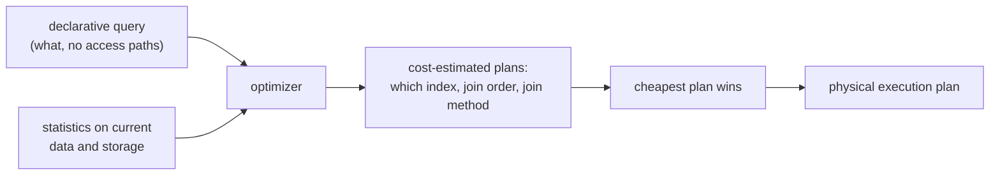

# 5. The optimizer makes it real

## The problem: who makes the declarative query fast?

Codd's model made a promise: say what data you want, not how to get it, and stay independent of storage. Practitioners in 1970 heard that promise and doubted it, with reason. A navigational programmer chose the access path by hand precisely because they knew which path was fast. If you take that choice away and let users write pure descriptions, something has to make the choice instead, and make it well. A declarative query that the system executes stupidly, scanning a million rows where an index would have found three, is slower than the navigational code it replaced. The relational model is only usable if there is a component that turns a description into an efficient plan, automatically, every time. Without it, "say what, not how" is a nice slogan that loses benchmarks, and users go back to navigating.

## Why the obvious fix fails: hints and rules leak the how back in

Two easy answers fail. The first is to let the user supply hints: tell the system which index to use, which table to read first. This works and it destroys the point, because a hint is an access path written by hand, so the query is welded to the storage again and breaks when the storage changes. Data independence dies the moment the query names an index. The second easy answer is a fixed set of rules: always use an index when one exists, always join in the order written. Rules are brittle because the right plan depends on the data. Using an index is a win when a query selects a few rows and a disaster when it selects most of them, since you pay for random lookups to visit nearly everything anyway. A rule cannot know which case it is in. What is needed is not a rule but a judgment, made freshly against the actual data, about which of the many possible plans is cheapest.

## The move: cost-based optimization, System R, 1979

The component that kept Codd's promise arrived in 1979, from the System R group at IBM San Jose, in a paper by Patricia Selinger and colleagues, "Access Path Selection in a Relational Database Management System." Its first sentences are the relational model's promise restated as an engineering problem: "requests are stated non-procedurally, without reference to access paths. This paper describes how System R chooses access paths." That choosing is the query optimizer, and its design is still the design in every serious database.

It works in three moves. First, enumerate: for a given query, there are many equivalent physical plans, different indexes to use or ignore, different orders to join the tables, different methods for each join. They all compute the same relation, because the query only specified the what. Second, estimate: using statistics about the data, how many rows a table has, how selective a condition is likely to be, the optimizer assigns each plan an estimated cost in disk accesses and computation. Third, choose: it searches the space of plans and keeps the cheapest, pruning with dynamic programming so it does not have to price every combination separately. The output is a physical plan, a concrete program of index scans and joins, derived on the fly from a description the user wrote without any of that in mind.

Selinger's specific contributions are the ones the field still uses. The optimizer prices the access methods for a single table, an index scan versus a full scan, against the estimated selectivity of the predicates, so it uses an index exactly when the index pays. It considers the order in which to join multiple tables, which matters enormously because a good order keeps intermediate results small, and it prices different join methods against each other. And it does all this with a cost model fed by table statistics, so the same query gets a different plan on a small table than on a huge one. This is judgment made against the data, not a rule applied blindly, which is why it beats the hand-tuned navigational code it replaced often enough to win.

## Why this is what makes data independence real

The optimizer is not a side feature of the relational model; it is the thing that makes the model's central promise pay off, and the connection is exact. Data independence says the physical storage may change without the query changing. That is only useful if, when the storage changes, something re-derives an efficient way to run the old query against the new storage. The optimizer is that something. Add an index and the next run of an unchanged query silently starts using it, because the optimizer re-costs the plans against the current statistics and the index now wins. Grow the table tenfold and the plan shifts from index lookups to a scan-and-sort, again with no change to the query, because the cost model now says so. The query stayed a pure description, exactly as chapter 3 wanted; the optimizer absorbed every consequence of the storage change. Codd drew the line between logical and physical and promised the system would bridge it. The cost-based optimizer is the bridge, and until it existed the promise was theoretical. This is the precise sense in which a 1979 paper completed a 1970 one: Codd said the system must translate a non-procedural request into "efficient actions on the current stored representation" and called it "a challenging design problem"; Selinger's team solved that exact problem, and their solution is why you have never once told your database which index to use and still gotten fast answers.

> **Principle:** Declarative queries are only free if something chooses the how well. The cost-based optimizer, judging plans against live statistics, is that something, and it is what turns data independence from a promise into a system that stays fast while its storage changes underneath.
