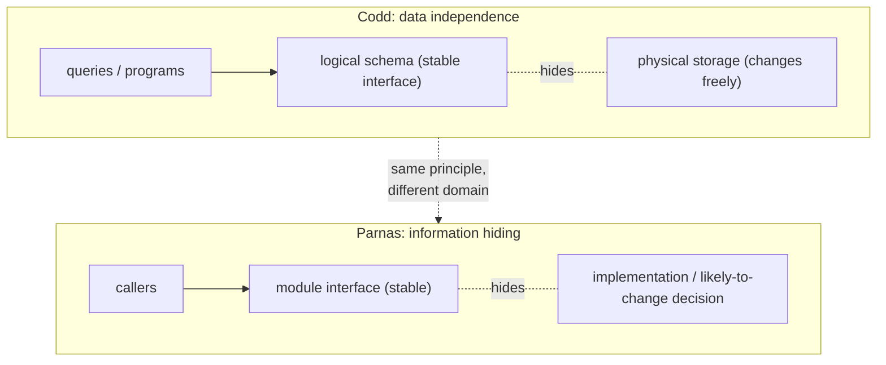

# 6. What survived, and information hiding

## The problem: why does a database paper belong in this series?

The seminars before this one were about keeping systems alive and correct under failure. Codd's paper is about organizing what a system knows. That looks like a change of subject, and this chapter argues it is not, by naming the idea that connects Codd to the software-engineering seminars still ahead and by being honest about what of his model survived and what got compromised.

## What survived, precisely

The model won, comprehensively, and it is worth being specific about what "won" means. Relations, keys, and normalization are the default way the world stores operational data, fifty years on. But the deepest survivor is the one this seminar has centered: data independence. Every relational database maintains the line between a logical schema and a physical store, and the entire industry of database administration lives on the far side of that line, adding indexes, repartitioning, changing storage engines, all under queries that never learn what happened. The declarative query survived with it, because, as chapter 3 argued, they are the same idea: you say what, so the system is free to choose and re-choose the how.

What got compromised is the language, and Codd said so at the time. SQL carried the model to the world and, in doing so, permitted the duplicates, nulls, and ordering the model forbids, which is why chapter 2 insisted the two are not the same. Codd's 1985 rules were his protest that products were claiming a purity they did not have. So the honest scorecard is split: the model is a triumph, and its most-used implementation is an approximation its author considered flawed. Both are true, and a working engineer needs both, because the gaps between SQL and the model are where the surprising bugs live.

The model has also been tested by rebellion. In the 2000s, systems built for web scale threw out the relational model and, in a real sense, went back to navigating: denormalized data, application-managed relationships, access shaped to specific query paths, the very coupling Codd broke. Sometimes that was the right trade for scale and availability, and sometimes it was a rediscovery of why Codd left. The correction came from the NewSQL systems, which put the relational model and its declarative queries back on top of the fault-tolerant, distributed foundations the earlier seminars in this series described. That arc is not a morality tale about relational always winning; it is evidence that data independence is a cost worth paying often enough that the field keeps returning to it.

## The idea underneath: data independence is information hiding

Here is the connection that puts Codd in the same conversation as the software-engineering classics. Data independence is information hiding applied to data. The principle is identical: find the thing most likely to change, and put it behind a stable interface so that change cannot propagate. In Codd's case the thing likely to change is the physical storage, ordering, indexes, layout, access paths, and the stable interface is the logical schema. Programs are written against the schema and are therefore protected from the churn below it. Swap the italics and you have the general software rule: find the design decision most likely to change, hide it inside a module, and expose an interface that stays stable while the decision changes.

That is not a loose analogy; it is the same move, and it points directly at the Parnas seminar later in this series, which turns "hide what is likely to change behind an interface" into a general criterion for decomposing any system into modules. Codd made the argument first, in 1970, for the specific and enormously valuable case of data, and he made it concrete enough to build. Reading the two together, the relational schema is just Parnas's module interface with a very long and very profitable life.

The declarative half of Codd's idea has an equally broad lineage. "Say what, not how" is the shape of every system where you describe a desired result and a planner works out the steps: the query optimizer of the last chapter, but also build systems that compute a dependency graph from declared targets, configuration and infrastructure tools that reconcile a declared desired state, and constraint solvers that search for a satisfying assignment. Each hides an execution strategy behind a description, and each buys the same thing Codd bought, the freedom to change the strategy without changing the description. Codd's paper is the early, load-bearing instance of a pattern that now runs through the whole stack.

## The modern echo, stated precisely

Put the two survivors together and you have the shape of modern data work. A schema migration changes columns and constraints, the logical interface, deliberately and visibly, and applications must be updated to match, because that is the interface changing. A storage change, adding an index, switching to a column store, moving to SSD, changes only what is hidden, and applications are untouched, because that is the implementation changing behind a stable interface. The daily discipline of keeping those two kinds of change separate, migrations versus tuning, is Codd's line between logical and physical, lived out. And every time you write a query and trust the planner to run it well, you are relying on the declarative bargain: you describe, it decides, and neither of you has to renegotiate when the storage moves. That bargain is the thing that survived, and it survived because it was, underneath, the same good idea the rest of software eventually learned to call information hiding.

> **Principle:** Data independence is information hiding for data: the logical schema is a stable interface over storage that is free to change. The relational model endured because that principle is worth paying for, and it is the same principle that decomposes any system, data or code, into parts that can change without breaking each other.
