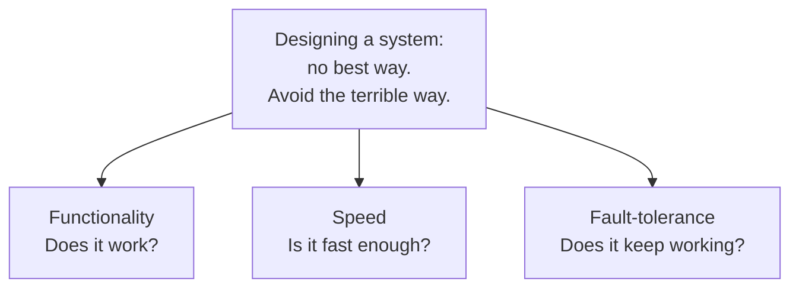
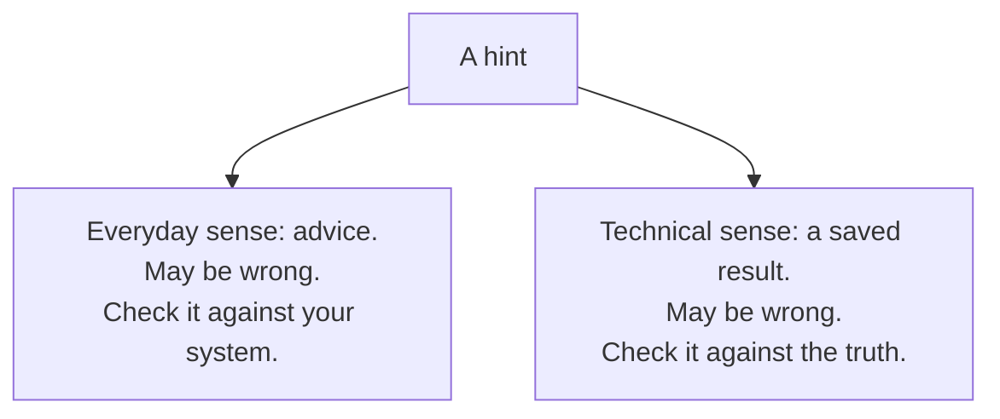

# 1. The catalog and the pun

## The problem: a system is not an algorithm

Lampson opens by drawing a line most engineers feel but rarely name. Designing an algorithm and designing a system are different jobs. The algorithm has a spec you can write down and a result you can prove. The system does not. He lists three reasons. The external interface, which is the requirement, is less precisely defined, more complex, and more subject to change. The system has far more internal structure, and so far more internal interfaces. And the measure of success is much less clear.

The consequence is disorientation. The designer, he writes, "usually finds himself floundering in a sea of possibilities," unsure how one choice will constrain the others or move the size and speed of the whole. Then the sentence that sets up everything after it: "There probably isn't a 'best' way to build the system, or even any major part of it; much more important is to avoid choosing a terrible way, and to have clear division of responsibilities among the parts."

That reframes the goal. You are not searching for the optimum. You are steering away from disaster and keeping the parts from tangling. The rest of the paper is about how to steer.

## Why the obvious fix fails: methodology was on offer, and he declined it

The obvious answer in 1983 was a methodology. The field was full of them: top-down design, bottom-up design, iterative design, structured this, data-abstract that. Lampson had watched them, and he says so. He deliberately avoids "exhortations to modularity, methodologies for top-down, bottom-up, or iterative design, techniques for data abstraction, and other schemes that have already been widely disseminated." Sometimes, he adds, he points out "pitfalls in the reckless application of popular methods."

A methodology promises that if you follow the steps, the design follows. Lampson does not believe that, because a system's requirement keeps changing and its success is unclear, so no fixed procedure can carry you to a good design. What he offers instead is judgment, compressed into slogans and paid for with examples. He is careful that this is a weaker and more honest thing than a method.

## The move: a catalog on two axes

Each hint is one slogan that, "when properly interpreted, reveals the essence of the hint." There are more than two dozen of them. A summary figure at the front of the paper, Figure 1, lays them out on two axes.

The first axis is **why** a hint helps, and it has three values that are just three blunt questions:

- Functionality: does it work?
- Speed: is it fast enough?
- Fault-tolerance: does it keep working?

The second axis is **where** in the design a hint helps: in reaching completeness, in choosing an interface, or in devising an implementation. The body of the paper follows the why axis, one section each for functionality, speed, and fault-tolerance. This seminar follows the same spine.

The figure does one more thing that is easy to skip. Lampson draws thick lines between repeated slogans and thin lines between related ones. Three slogans appear in more than one cell, and those are the ones doing the most cross-cutting work: "end-to-end" shows up three times, "make actions atomic" and "use hints" twice each. A slogan that answers more than one of the three questions is a slogan worth trusting.

## The disclaimer, read closely

Right after the introduction, Lampson tells you what the hints are not. They are not, in his words, "novel (with a few exceptions), foolproof recipes, laws of system design or operation, precisely formulated, consistent, always appropriate, approved by all the leading experts, or guaranteed to work." Then: "They are just hints."

Read that list slowly, because two entries are load-bearing. **Not consistent**: the hints are allowed to contradict each other, and they do, on purpose. **Not always appropriate**: each one has a range where it holds and a range where it fails, and telling them apart is on you. A reader who wants a rulebook will find this frustrating. It is not sloppiness. It is the most honest thing in the paper, and the later chapters will keep coming back to it.

## The pun

The title is "Hints for Computer System Design," and the word "hints" is doing double duty.

In everyday English a hint is a piece of advice. That is what the paper looks like from across the room: a wise senior engineer offering tips. But partway through, in the speed section, Lampson defines "hint" as a technical term. A hint is the saved result of a computation that makes the common case fast, that may be wrong, and that therefore must be checked against the truth before you rely on it, with a correct fallback for when it turns out to be stale. A cache entry that is allowed to lie, as long as you catch it lying. One of the paper's own hints is, literally, "use hints." The title also echoes an earlier paper Lampson treats as a companion, Hoare's "Hints on Programming Language Design," which makes the wordplay hard to read as an accident.

So the two meanings fold together. The paper gives hints in the everyday sense and teaches hints in the technical sense. And here is the move that most first readings miss: by his own disclaimer, the advice is offered in the technical sense too. Not laws, not guaranteed, correct often enough to be worth having, and always to be checked against the system in front of you. The truth is your system; the hint is his slogan; when it is wrong for your case, you fall back and do the work yourself.

If you read the paper as a list of tips, you get a good list of tips. If you read it knowing that "hint" is also a mechanism, and that the mechanism describes the advice itself, you get the paper Lampson actually wrote.

## Why it still gets assigned

More than forty years on, "Hints" is still handed to new systems engineers, and it won the ACM SIGOPS Hall of Fame award in 2005. The reason is the framing in the first page. Most working design happens exactly where Lampson put it: not choosing the best option, because there usually is not one, but avoiding the terrible option and keeping responsibilities clear. The modern rituals of the trade, the design document, the architecture decision record, the review that asks "what happens when this interface changes," are all machinery for the same goal he named. They are ways of steering out of the sea of possibilities without pretending a method will do the steering for you.

> **Principle:** There is rarely a best design, so stop hunting for it. Aim to avoid the terrible design, keep responsibilities clear, and treat every rule you are handed, including these, as a hint to be checked against the system in front of you.
