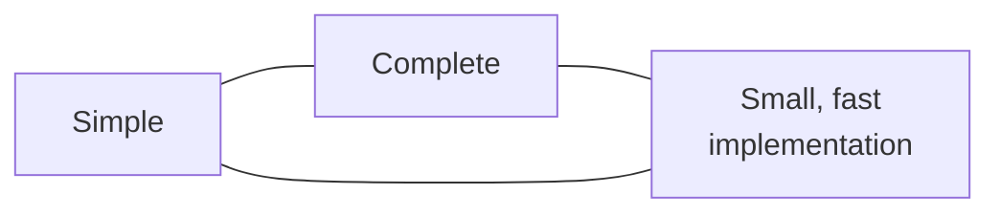

# 2. Keep it simple, get it right

## The problem: functionality lives in the interface

Lampson calls the functionality hints the most important and the vaguest, because getting a system to do the right thing is the part with the least structure to lean on. Almost all of these hints route through one idea: the interface that separates an implementation of some abstraction from the clients who use it.

His definition of an interface is worth slowing down on, because it is not the usual one. An interface, paraphrasing a paper by Britton and colleagues on device interfaces, is "the set of assumptions that each programmer needs to make about the other program in order to demonstrate the correctness of his program." Not the function signatures. The assumptions. The interface is the contract that lets two people prove their halves correct without reading each other's code. That is why Lampson says defining interfaces is the most important part of system design, and usually the most difficult.

Difficult because the interface must satisfy three requirements that fight each other. It should be simple. It should be complete. And it should admit a sufficiently small and fast implementation. Push on any one and the other two push back.



There is one more framing that unlocks the rest. "Each interface is a small programming language: it defines a set of objects and the operations that can be used to manipulate the objects." Once you see an interface as a language, every hard thing about language design lands on you: what the primitives are, how they compose, what they cost. Lampson points at Parnas's classic paper and at Hoare's hints on language design, and treats his own paper as a companion to both.

## Why the obvious fix fails: generality is the trap

The obvious way to satisfy "complete" is to make the interface general. Handle every case a client might ever want. Lampson's first and bluntest hint is that this is backwards. "Do one thing at a time, and do it well." An interface should "capture the minimum essentials of an abstraction. Don't generalize; generalizations are generally wrong."

The reason is cost, and cost that the specification never mentions. An interface is a contract to deliver service, and clients depend not only on the service but on getting it at a reasonable price in time and resources. That price is almost never written down. When an interface tries to do too much, its implementation gets large, slow, and complicated, and the price creeps up at every layer. Lampson does the arithmetic: "If there are six levels of abstraction, and each costs 50% more than is 'reasonable', the service delivered at the top will miss by more than a factor of 10." Generality compounds.

His language example is PL/1, which "got into serious trouble by attempting to provide consistent meanings for a large number of generic operations across a wide variety of data types." Even a decade of optimizing compilers later, a programmer could not tell what would be fast and what would be slow. Pascal and C are easier to use, he argues, precisely because "every construct has a roughly constant cost that is independent of context or arguments." Predictable cost is part of simplicity, not separate from it.

The systems example is closer to home, because it is his own group's code. The Alto operating system gave files a plain read and write interface, about 900 lines for files and 500 for paging, and it was fast: a page fault cost one disk access, and a client could drive the disk at full speed. Its successor, Pilot, followed Multics in mapping virtual pages onto file pages, folding all file input and output into the virtual memory system. More general, more elegant, and much more expensive: about 11,000 lines, often two disk accesses per fault, unable to run the disk at full speed. "The extra functionality is bought at a high price." Lampson is careful not to say it was impossible to do well, only that it was hard, and that the added generality dragged in a circularity, the file system wanting to use virtual memory while virtual memory depended on files, that competent, experienced people paid for in complexity.

## Get it right, because simplicity is not correctness

Then he turns and warns against reading "keep it simple" as the whole story. "Neither abstraction nor simplicity is a substitute for getting it right." And, sharper: abstraction can actively cause the disaster.

The cautionary tale is a word processor. Documents embed named fields, encoded inline as something like `{name: contents}`. Someone needed a routine to find the field with a given name, and someone had already written a routine to find the *i*th field. Finding the *i*th field must scan from the start, so it costs order *n* in the document length. The natural implementation of find-by-name loops over that:

```
for i in 0 .. numberOfFields:
    f := FindIthField(i)
    if f.name = name: return f
```

Each call to `FindIthField` is order *n*, the loop runs order *n* times, and one major commercial product shipped a find-by-name that was order *n* squared in the size of the document. The abstraction that hid the cost, `FindIthField`, is what made the mistake easy. "Once the (unwisely chosen) abstraction FindIthField is available, only a lively awareness of its cost will avoid this disaster." Lampson is explicit that this is not an argument against abstraction, only a reminder that an abstraction which hides its cost has hidden something the client needed. That thread runs straight into the next chapter.

## When generality becomes a security hole

The most vivid example of generality turning into complexity is the Tenex password bug, and it doubles as a security lesson forty years early. Tenex had a set of features that each looked harmless. A reference to an unassigned virtual page was reported back to the user program as a trap. A system call was treated as an instruction of an extended machine, so a bad reference it made was reported the same way. Large arguments, including strings, were passed by reference. And a `CONNECT` call took a directory password as a string argument, failing after a three second delay on a wrong password to stop high-speed guessing.

Put those together and the delay does not protect anything. `CONNECT` checks the password one character at a time:

```
for i in 0 .. len(password):
    if password[i] != argument[i]:
        wait 3 seconds; return BadPassword
connect to directory; return Success
```

Lay the password argument across a page boundary so that its first character is the last byte of an assigned page and the next page is unassigned. Now try each possible first character. If the guess is wrong, the check fails on the first character and you get `BadPassword`. If the guess is right, the check moves on to the second character, touches the unassigned page, and the system reports a page reference instead. The reply tells you whether the first character was correct, with no three second wait. Slide the boundary one byte and repeat. Because you now learn the password one character at a time, you try about 64 values per position, so the work is linear in the length, roughly 64 times *n*, instead of the exponential blind search of 128 to the power *n* that the designers were counting on.

The bug hid because the interface was complex. Reporting an unassigned-page reference through a system call is a lot of behavior to reason about, and none of the four features looked dangerous alone. Generality did not just cost performance here. It opened a hole.

## The tension, planted early

Lampson will not let "keep it simple" off easy. Sometimes, he says, it is worth a great deal of work to build a fast implementation of a clean and powerful interface, if the interface is used widely enough and you already know how to make it fast. BitBlt, the raster operation that Dan Ingalls designed after years with the Alto display, cost about as much microcode as the Alto's entire instruction emulator, and it was worth it, because everything that draws on a bitmap screen now uses it. The Dorado memory system took several man-years and 850 chips to give the microprogrammer a cache with no special cases, and that was justified only by thirty years of prior experience showing memory access was the bottleneck. Even there, he adds in retrospect that one part, the high I/O bandwidth, was probably not worth the cost.

So the first hint already contradicts itself at the edges. Keep it simple, except when a proven, heavily used interface earns a hard, fast implementation. Which case you are in is a judgment, not a rule, and that is the shape of the whole paper.

## The modern echo

The idea that an interface is a small programming language is now the default stance of good API design. When you argue about whether a method should take five boolean flags or a small set of composable operations, you are doing language design on Lampson's terms, and the flags usually lose for the reason he gives: they amount to a cramped, unpredictable language bolted onto a call.

The unpredictable-cost complaint about PL/1 is alive in every abstraction that makes an expensive operation look cheap. An ORM where `user.orders` quietly issues a database query per row, a property getter that hides a network call, a `+` on a data frame that copies a gigabyte: these are the `FindNamedField` disaster in modern dress, an abstraction hiding a cost the client had to know.

And the Tenex bug is a founding example of a timing side channel. Comparing a secret one character at a time, and returning as soon as it differs, still leaks the secret through how long the comparison takes, which is why security libraries ship constant-time comparison functions for passwords, tokens, and signatures. Lampson's point is broader than the specific trick: every feature you add to an interface is also something an attacker can combine with the others.

> **Principle:** Make an interface do one thing well, because generality you cannot afford becomes cost you cannot predict and holes you cannot see. Then get it right, because a simple interface that hides its true cost has not simplified anything.
