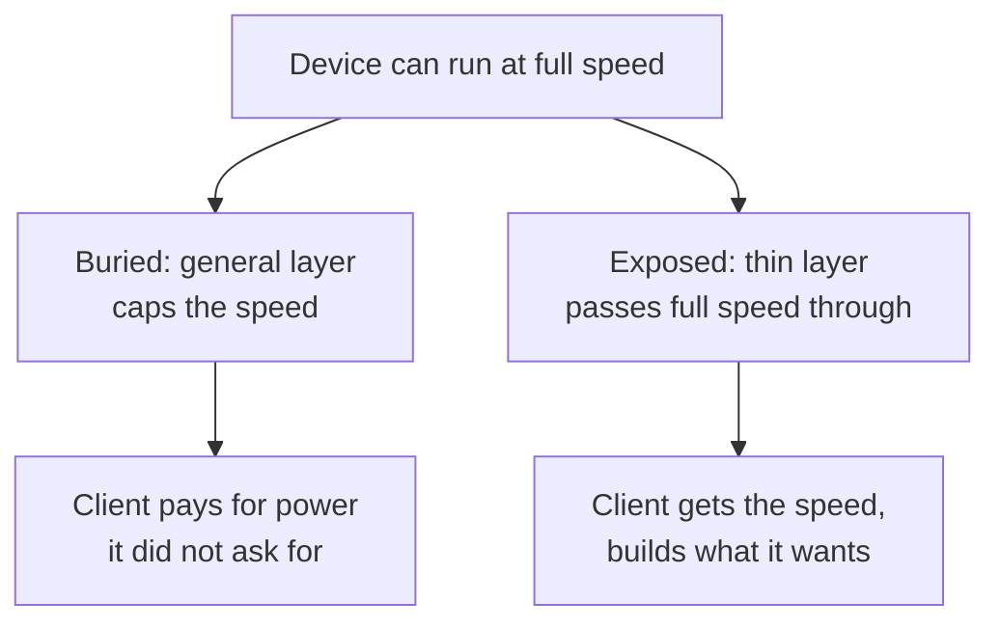

# 3. Don't hide power

## The problem: an abstraction hides things, and it can hide the wrong ones

The previous chapter ended on a trap: an abstraction that hides its cost has hidden something the client needed. This chapter is Lampson's answer, and it is a set of corollaries to "keep it simple" that all point the same way. An abstraction exists to hide. The question is what. Hide the ugly, changeable, accidental properties of the implementation, and you have helped the client. Hide the fast path the hardware could give them, and you have taxed the client for a power they never asked for.

He states the rule as a single sentence that is easy to underline and hard to live by: "The purpose of abstractions is to conceal undesirable properties; desirable ones should not be hidden."

## Make it fast, not powerful

The first corollary attacks the instinct to build big operations. "Make it fast, rather than general or powerful." The argument is economic. "If it's fast, the client can program the function it wants, and another client can program some other function." A fast primitive is raw material; everyone can build what they need on top. A slow, powerful operation forces one answer on everyone, and "the client who doesn't want the power pays more for the basic function." Then the line that should be printed on a card: "Usually it turns out that the powerful operation is not the right one."

His evidence is the instruction set. Study after study showed that programs spend most of their time on very simple things: loads, stores, tests for equality, adding one. Machines built to do those simple things quickly, the 801 and the Berkeley RISC, ran programs faster for the same hardware than the VAX and its rich, general instructions, and the machines with still grander ideas about what the programmer needed, like the iAPX-432, did worse still. Getting this wrong costs a factor of two in speed for the same silicon.

He pairs the hint with a discipline, because you cannot make it fast if you cannot find the slow part. You need measurement tools that point at the time-consuming code, since "it is normal for 80% of the time to be spent in 20% of the code, but a priori analysis or intuition usually can't find the 20% with any certainty." Tuning Interlisp-D with good tools sped it up tenfold.

## Don't bury the power that is there

The second corollary is the one that names the chapter. When a low level can do something fast, a higher level should not bury that speed inside something more general.

The example is the Alto disk. The hardware could transfer a whole cylinder at full disk speed. The file system was built so that a client could still get that: it could read successive file pages into memory at full disk speed, with enough buffering to compute on each sector as it flew by, and so scan the entire disk at hardware speed. People used that raw power to write a file-system scavenger that rebuilds a broken disk, and pattern searchers that scan files for matches. The higher, friendlier stream interface still let you read *n* bytes at full disk speed for the parts that filled whole sectors. The only thing the client gave up at the higher level was the ability to watch individual pages arrive. Everything else, including the speed, came through.

## Two ways to keep an interface small: procedures and the client

The next two corollaries are techniques for keeping an interface simple without giving up flexibility.

"Use procedure arguments to provide flexibility in an interface." Instead of inventing a jumble of parameters and mode flags that "amount to a small programming language," take a procedure. His clean example is enumeration: to return every element of a set with some property, let the client pass a filter procedure that tests the property, rather than defining a pattern language inside the interface. The technique scales to surprising places. The Berkeley 940's Spy let an untrusted user plant measurement patches into the supervisor itself, because the installer checked the patch first: no wild branches, no loops, bounded length, writes confined to a statistics region. The Cal system's `FRETURN` let any supervisor call be wrapped so it ran at full speed in the normal case but jumped to a failure handler on error. Lampson adds one honest caveat, and it points at the previous seminar: a specialized language can beat a procedure argument if the language is more amenable to static analysis for optimization, which is exactly why database query languages are languages and not callbacks.

"Leave it to the client." An interface can be simple, flexible, and fast all at once if it solves exactly one problem and hands the rest back. Parsers that do only context-free recognition and call client semantic routines beat parsers that always build a tree the client must then walk. Monitors work as a synchronization tool because the locking and signaling do very little and leave the real work to the client's monitor procedures, and even the fact that monitors give no control over scheduling is an advantage, because it leaves the client free to schedule the way it needs instead of fighting a built-in policy. And the cleanest example is Unix, which "encourages the building of small programs that take one or more character streams as input, produce one or more streams as output, and do one operation," so the client can combine them to get precisely the effect it wants. Lampson notes in passing that the end-to-end argument, the heart of the fault-tolerance section, is itself another corollary of keeping it simple. The next chapters cash that in.

## The modern echo

The "make it fast, not powerful" instinct won the processor argument, though the win needs stating carefully. Simple, fast, composable instructions are the design center of ARM and RISC-V, and even modern x86 chips, whose instruction set is anything but reduced, decode those complex instructions into simple internal operations to run them quickly. The industry did not so much retire complex instruction sets as bury them behind a fast, simple engine, which is Lampson's point turned inside out.

"Don't hide power" anticipates a complaint every senior engineer has voiced, later named by Joel Spolsky in 2002 as the Law of Leaky Abstractions: all non-trivial abstractions, to some degree, leak. Note the difference, because it is the interesting part. Lampson is prescriptive: expose the power clients need, so they are not forced to defeat your abstraction to get their work done. Spolsky is descriptive: abstractions leak whether you want them to or not, so you still have to understand the layer below. Read together, they explain the escape hatches that good systems ship on purpose. The raw-SQL trapdoor under an ORM, the `unsafe` block, the kernel-bypass paths like io_uring, DPDK, and RDMA that hand a client the network card or disk at full hardware speed: those are the Alto disk lesson, keeping the fast path reachable through the friendly layer.

"Use procedure arguments" is now so ordinary it is invisible: the comparator you pass to sort, the callback, the higher-order function, the dependency you inject. The caveat aged just as well. When you want the system to analyze and optimize your request, you hand it a declarative language, not a closure, which is why you send SQL to a database and a predicate to an in-memory filter. And "leave it to the client" is the Unix philosophy, still the cleanest statement of which is Doug McIlroy's "do one thing and do it well." Its modern stress test is the microservice. Splitting a system into small single-purpose services is "do one thing well" and "leave it to the client" taken to the deployment level, and it delivers their benefits, independent evolution and clear responsibility. It also relocates the cost where Lampson would predict: the simplicity of each service is paid for by complexity in the space between them, latency, partial failure, and the distributed transactions that the fault-tolerance chapters warn are hard. Lampson's monitors, meanwhile, are the ancestor of the condition variables in your language's standard library; the Mesa monitors he and Redell built are why `wait` and `signal` behave the way they do in Java and Go.

> **Principle:** Hide the accidental, never the essential. An abstraction should conceal what the client should not depend on and expose the power the client came for, because a client denied the fast path will either pay too much or tunnel through your abstraction to get it.
