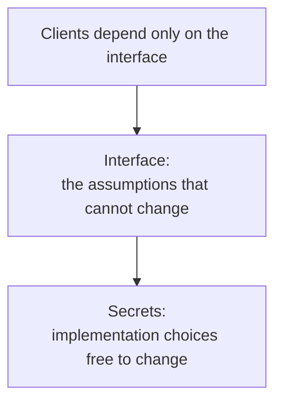

# 4. Designing for change

## The problem: the system will change, and change breaks interfaces

The last two chapters were about what an interface should expose and hide at one moment. This one is about time. An interface, Lampson reminds us, embodies assumptions shared by more than one part of a system, sometimes by a great many parts. The moment you change it, every one of those assumptions is in play. And yet you must improve the design, because the requirement keeps moving. He names the bind directly: "There is a constant tension between the desire to improve a design and the need for stability or continuity."

This is the half of the interface story about hiding, the complement to "don't hide power." You expose the power clients need, and you hide what you intend to change, so that the changing part can change without dragging the clients with it.

## Keep basic interfaces stable

The first hint is defensive. "Keep basic interfaces stable." Because an interface is shared assumptions, changing it is expensive in proportion to how many parts share it. In a language with no type checking it is "nearly out of the question to change any public interface," because you cannot even find the clients to see what you broke, let alone tell a pointer from an integer. A language like Mesa, with full type checking and real support for interfaces, makes change easier: the compiler can at least tell you which assumptions no longer hold. But it only finds them. A programmer still has to go fix each one.

Then a number worth remembering. "When a system grows to more than 250K lines of code the amount of change becomes intolerable; even when there is no doubt about what has to be done, it takes too long to do it." Past that size there is no choice but to break the system into pieces joined only by interfaces that stay stable for years. In 1983 the only interfaces that stable were the ones a programming language or an operating system kernel defined. The lesson is that stability is not a nicety you add later; above a certain scale it is the only thing holding the system together.

## Keep a place to stand

Sometimes you have to change an interface anyway. The second hint is how to survive it: "Keep a place to stand." Lampson gives two shapes.

The first is the compatibility package: implement the old interface on top of the new system, so old programs keep running. Tenex and Cal kept old software alive by simulating the supervisor calls of the systems they replaced. The IBM 360 and 370 emulated the instruction sets of the 1401 and 7090. Pushed further, this becomes the virtual machine, simulating whole copies of a machine on the machine itself. A compatibility layer is cheap next to rewriting the software that depends on the old world, and it buys you the freedom to change underneath.

The second is the world-swap debugger, and it is a lovely instance of the same idea aimed at a different problem. To debug the lowest levels of a system, write the target's entire memory out to secondary storage, read the debugger in where it was, and map each target address to its saved place. The debugger then depends on almost nothing in the target, "except the very simple world-swap mechanism." That is the place to stand: one small, trustworthy thing you can rely on while everything else is suspect. A variant runs the debugger on another machine entirely, talking to a tiny nub in the target that only knows how to read a word, write a word, stop, and go.

## Plan to throw one away

The third hint is the most quoted, and it is not Lampson's. "Plan to throw one away; you will anyhow." He cites Fred Brooks and *The Mythical Man-Month*, and earlier in the paper he riffs on Brooks again, joking that "after the second system comes the fourth one," a nod to Brooks's second-system effect. Attribute it correctly: Lampson is passing on Brooks, and he says so.

The claim is that if anything about a system's function is genuinely new, the first implementation will have to be redone completely to get something acceptably small, fast, and maintainable, so it costs less if you plan for a prototype from the start. Sometimes you need two. You can cut the cost by copying from a previous system, even a flawed one: Tenex was built on the SDS 940, and Unix took many ideas from Multics even though Multics was, in his words, too grandiose. And the work is never finished, because decisions rot. Optimizations tuned for a particular memory size or load "often come to be far from optimal" as the system evolves, so it pays to revisit old choices.

## Keep secrets

The fourth hint is the deepest, and it is also borrowed. "Keep secrets of the implementation." A secret is "an assumption about an implementation that client programs are not allowed to make." Turn that around and it defines the interface too: the interface is what cannot change without changing clients, and the secrets are everything else, the things you kept free to change. The fewer assumptions the parts make about each other, the easier the system is to modify.

This is David Parnas's information hiding, and Lampson names Parnas's classic paper directly. The next seminar reads Parnas as the origin of the criterion: decompose a system around the decisions that are likely to change, and hide each one inside a module. Lampson is the practitioner using the tool, and he is honest that the tool has an edge that cuts both ways. He flags the tension with the previous chapter out loud: keeping secrets fights "the desire not to hide power." And he notes a second problem, which is that performance often comes from letting one part assume more about another, not less. If you know a set is sorted, you can test membership in log *n* instead of *n*. Every such assumption you allow is a secret you gave up. "Striking the right balance remains an art."

## Two more moves for building it

Lampson files two more hints under making implementations work, and both are about managing complexity rather than change, so they get a shorter word here. "Divide and conquer" is the familiar reduction of a hard problem to easier ones, with a twist for when resources run out: bite off as much as will fit and leave the rest for another pass. The Alto's Scavenger, rebuilding a file system, discards half the files when its in-memory table will not fit and comes back for them; the Dover printer slices a fourteen-million-bit page into bands because the whole image fits neither in memory nor on disk. "Use a good idea again instead of generalizing it" is the counsel to reuse the idea, not the code: replication shows up three different ways in his systems, local two-disk copies, weighted voting over transactional storage, and a replicated commit record, and "there is no circularity here, since only the idea is used twice, not the code." That last hint is a quiet rebuke to the reflex from chapter 2, the one that wants to generalize. Reuse the insight; resist the urge to build the one general mechanism that serves every case.

## The modern echo

"Keep basic interfaces stable" is the discipline the industry eventually formalized as semantic versioning, backward compatibility policies, and deprecation windows. The web platform's near-religious refusal to break old pages, and the decades-long stability of the Linux system-call interface, are Lampson's stable-interface hint enforced at civilizational scale, and for his reason: too many clients share the assumptions to change them.

Then comes the dark corollary he did not have a name for. Hyrum Wright's law, popularized through Google's engineering culture, states that with enough users of an interface, every observable behavior of it will come to be depended on by somebody, regardless of what you promised. That is what happens when secrets leak. The clients quietly take a dependency on a behavior you meant to keep free, and now it is part of the interface whether you documented it or not. Keeping secrets (Parnas) and keeping interfaces stable are two sides of the same fight, and Hyrum's law is the report from the front on why it is so hard to win.

"Keep a place to stand" is alive every time a platform ships a compatibility layer. Apple's Rosetta 2 translating x86 binaries for ARM Macs, the original Windows Subsystem for Linux emulating the Linux system-call interface on the Windows kernel, the JVM and the browser as interfaces stable enough to build a world on: these are Lampson's Tenex-simulates-the-old-supervisor and the 360-emulates-the-1401, unchanged in spirit. And "plan to throw one away" is the honest core of prototypes and spikes, and the reason the strangler-fig pattern, growing the replacement around the old system rather than rewriting in one leap, tends to beat the confident big-bang rewrite. The teams that get burned are the ones who believed the first system was the last.

> **Principle:** Draw the interface around what must not change and hide everything else behind it, because above a certain size stable interfaces are the only thing holding the system together, and the parts you failed to hide will be depended on before you can change them.
