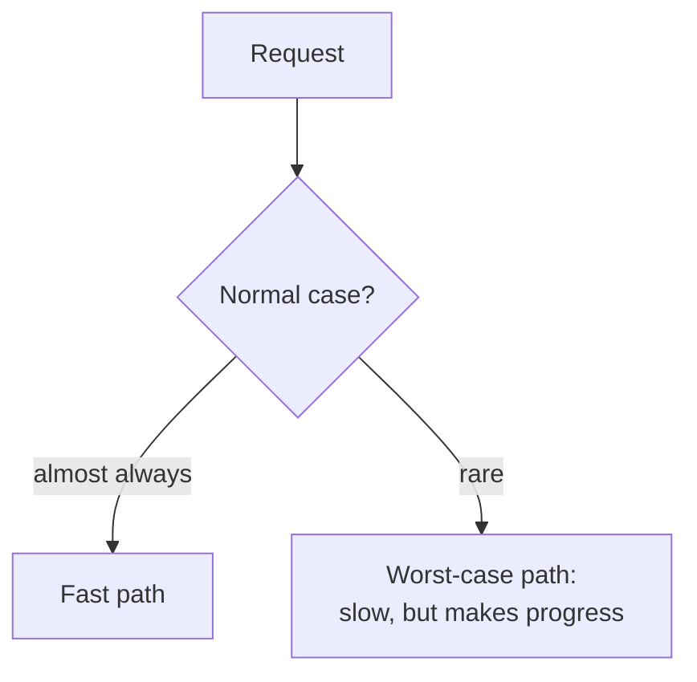

# 5. Speed, and the normal case

## The problem: speed has no single lever

The speed section is the longest in the paper, and it could read as a grab bag: split resources, analyze statically, translate dynamically, cache, use hints, brute force, compute in background, batch, and two rules about load. It is not a grab bag. Under the ten slogans sit three ideas, and every hint is one of the three wearing different clothes. Make the common case cheap. Handle the worst case separately, so it only has to make progress. And accept that you cannot optimize a general system, so aim to avoid disaster instead of chasing the optimum.

Start with the idea that organizes the other two, even though Lampson files it back in the functionality section.

## The spine: the normal case must be fast, the worst case must make progress

"Handle normal and worst cases separately as a rule, because the requirements for the two are quite different." Then the two lines that the rest of the section elaborates:

- The normal case must be fast.
- The worst case must make some progress.

These are different jobs, and trying to serve both with one code path serves neither. The normal path can assume the common situation and fly. The worst-case path can be slow, ugly, and rare, as long as it does not wedge.

Lampson pushes this further than most readers expect, into a claim about crashing that sounds reckless and is not. "In most systems it is all right to schedule unfairly and give no service to some of the processes, or even to deadlock the entire system, as long as this event is detected automatically and doesn't happen too often. The usual recovery is by crashing some processes, or even the entire system." And then the sentence that the reliability chapter will pick up: "one crash a week is usually a cheap price to pay for 20% better performance," provided the system has decent error recovery, which he notes is required anyway.

The examples show how far the split reaches. The Interlisp-D and Cedar reference-counting garbage collector does not count pointers stored in the local frames of procedures, because most assignments are to locals; instead it scans the frames when it collects. Cedar goes further and does not even track which locals hold pointers, assuming they all might, which means an integer that happens to look like an address can keep a dead object alive. Measured cost of that sloppiness: less than one percent of storage wrongly retained, in exchange for a nearly real-time collector. The normal case, ordinary local variables, is fast; the worst case, a leaked object, is rare and cheap. For freeing memory under pressure, the trick is to "keep a little something in reserve under a mattress," a bounded reserve brought out only in a crisis, and in a crisis to free just one item at a time so the whole reserve goes to making that one bit of progress. And the Bravo editor represents a document as a piece table, splitting pieces on every edit and never modifying the underlying strings, until after hours of editing hundreds of pieces bog things down and a separate cleanup pass rewrites the file. Normal editing is fast; the expensive reorganization is a rare, separate path.

## Make the common case cheap

The first cluster of speed hints all spend something now, memory or precomputation, to make the frequent path cheap later.

"Split resources in a fixed way if in doubt, rather than sharing them." Dedicated resources are usually faster to allocate, faster to access, and more predictable, and predictability is itself speed when it lets you skip a check. Registers beat memory; dedicated I/O channels and floating-point units beat multiplexing one engine, once hardware is cheap enough to dedicate. The cost is that you need more total resource, but often that cost is small next to the overhead and unpredictability of sharing.

"Use static analysis if you can." Discover properties of the program ahead of time and use them to go faster, the way a compiler places locals in registers, or a program that reads sequentially lets the system read ahead. The honest part is the qualifier. "The hooker is 'if you can'; when a good static analysis is not possible, don't delude yourself with a bad one, but fall back on a dynamic scheme." He notes that demand paging, a purely dynamic scheme, beat every attempt to optimize disk transfers by analyzing programs after the fact. And he warns that static analysis which assumes an invariant makes the system fragile when a bug or a hardware fault breaks the invariant.

"Dynamic translation from a convenient representation to one that can be quickly interpreted." Keep the program in a compact, easy-to-change form, and translate to a fast form on demand, caching the result. His example is an experimental Smalltalk that translated a procedure from bytecodes to machine code the first time it ran and kept the translation in a cache. That is the just-in-time compiler, described in 1983, and the paper he cites is the one modern JIT designers trace their lineage to.

Two more hints in this cluster are about doing less on the path the user waits on. "Compute in background when possible," because a fast response matters and load varies, so there is usually idle time later to finish the work: garbage collection, writing dirty pages, delivering mail, the bank's nightly reconciliation. And "use batch processing if possible," because incremental work almost always costs more, sequential access to disk and tape is far faster, and batch runs make error recovery simple. The Bank of America ran interactive tellers all day on a best-effort copy of the balances, then threw it away each night and reloaded from the authoritative batch run, which made the long-term data trustworthy at no real loss of function.

The most general member of this cluster, caching, and its unreliable cousin, the hint, are important enough that the next chapter is about them.

## The honest limit: you cannot optimize a general system

The third idea is the one that separates this paper from a performance tutorial. Lampson does not believe a general-purpose system can be optimized, and he has the scars to say so.

"Safety first. In allocating resources, strive to avoid disaster rather than to attain an optimum." The evidence is a generation of failures. On paging: people dreamed of squeezing every byte by cleverly placing related code together and predicting future references. "No one ever learned how to do this." Memory got cheaper, systems spent it on enough cushion for plain demand paging, and the field learned that "the only important thing is to avoid thrashing." On scheduling: many tried to tune the processor allocation by priority, working-set size, memory load, I/O likelihood. "These efforts failed." Only the crudest distinctions, interactive versus batch, produced intelligible effects, and the natural end of that road was the personal computer, one processor per person, so no scheduling contest at all. From this he draws a blunt capacity rule: "A system cannot be expected to function well if the demand for any resource exceeds two-thirds of the capacity, unless the load can be characterized extremely well."

"Shed load to control demand, rather than allowing the system to become overloaded" is the corollary. When demand approaches the limit, do not degrade for everyone; cut demand. Refuse new users, limit the jobs so their working sets fit, discard packets, and if it comes to the worst, crash and start over more prudently. The cautionary tale is the ARPANET's original promise to deliver every accepted packet unless a machine failed. That promise "turned out to be a bad idea": it made deadlock hard to avoid, it complicated the normal case, and it did not even help the client, who still had to handle packets lost to a host or network failure. The rule was abandoned, and the Pup internet instead "ruthlessly discarded packets at the first sign of congestion."

"When in doubt, use brute force" belongs here too, as a bet on predictability over cleverness. "A straightforward, easily analyzed solution that requires a lot of special-purpose computing cycles is better than a complex, poorly characterized one that may work well if certain assumptions are satisfied." Ken Thompson's chess machine Belle won championships on special-purpose hardware rather than subtle strategy; personal computers beat time-sharing despite wasting cycles; an asymptotically faster matrix multiply can lose to a simple one whose constant factor is not prohibitive. As hardware keeps getting cheaper, the simple, analyzable solution keeps winning.

## The modern echo

The normal-versus-worst split is the fast-path-slow-path structure of nearly everything performance-sensitive: the uncontended lock taken without entering the kernel, the JIT that runs optimized code until an assumption breaks and then falls back, the network stack's fast retransmit. The collector Lampson describes is deferred reference counting, Deutsch and Bobrow's technique of not counting the pointers in local frames and scanning them instead, and the same normal-case instinct drives generational garbage collection, which bets that most objects die young, handles them cheaply, and treats the survivors separately. And "one crash a week for twenty percent" is the seed of a philosophy this series already met in the Armstrong seminar. Crash-only software, named by Candea and Fox two decades later, and the routine killing and rescheduling of a process or a Kubernetes pod, are the same trade: make the normal path fast and recover the rare failure by restarting, backed by error recovery you needed regardless.

The make-it-cheap cluster is the modern runtime. Just-in-time compilation in V8 and the JVM is Lampson's dynamic translation. Profile-guided optimization is his "static analysis if you can, dynamic if you cannot," using runtime behavior to feed the static compiler. Read-ahead, write-back caching, and background queues are his "compute in background." Per-CPU data structures, thread-local storage, and sharding are "split resources," trading total memory for predictable, contention-free speed.

The honest-limit cluster is capacity planning and reliability engineering. Queueing theory gives Lampson's two-thirds rule its math: as utilization climbs toward one, queue length and latency blow up, which is why operators keep steady-state utilization well under the line and hold headroom. Load shedding, admission control, backpressure, and circuit breakers are "shed load" by its modern names, and the internet's choice of best-effort IP over guaranteed delivery is the ARPANET lesson he reports, pushing reliability to the endpoints, which is the subject of chapter 7.

> **Principle:** Spend memory and precomputation to make the common case fast, give the worst case a separate path that only has to make progress, and stop trying to optimize a general system. Keep headroom and shed load, because past two-thirds of capacity the goal is to avoid disaster, not to reach the optimum.
