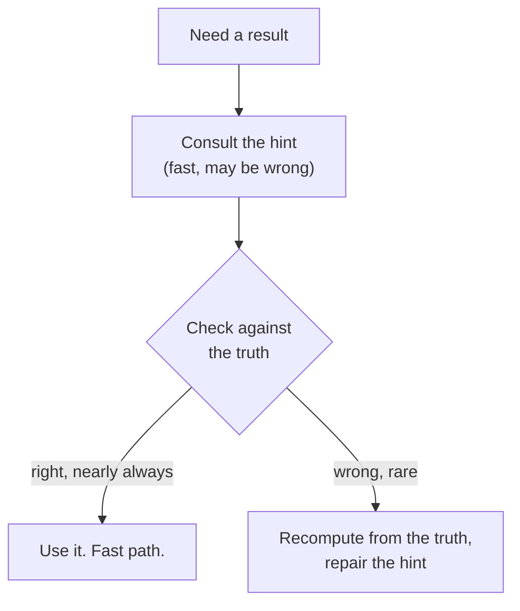

# 6. The hint

## The problem: a cache has to be kept honest

Caching is the most general way to make the common case cheap, and the previous chapter left it for this one because it comes with a bill. Lampson defines a cache precisely: store the triple of a function, its argument, and its result, keyed by the function and argument, so you can look up the answer instead of recomputing it. The classic case is the hardware memory cache, whose entries are just fetch, address, contents. Virtual memory is the same shape, with main storage caching the disk.

The bill is consistency. As Lampson notes, the interesting functions are not functional: fetch gives a different answer after a store. So a cache entry can go stale, and the moment it can, you owe an invalidation strategy. Every write has to find and kill or update the entries it invalidated. For interactive systems he gives a whole discipline for this, recompute the state after each change but cache the expensive results, organized so that a small change invalidates only a few entries, and the Bravo editor's per-line display cache is his worked example. The discipline works, but it is exacting. Getting invalidation right is famously one of the hard problems in the field.

So the question that opens the door: what if you did not have to keep the saved value honest at all?

## The move: let the saved value be wrong, and check it

That is the hint. Here is Lampson's definition, and it is worth quoting in full because the whole idea is in it:

> A hint, like a cache entry, is the saved result of some computation. It is different in two ways: it may be wrong, and it is not necessarily reached by an associative lookup. Because a hint may be wrong, there must be a way to check its correctness before taking any unrecoverable action. It is checked against the 'truth', information that must be correct but can be optimized for this purpose rather than for efficient execution. Like a cache entry, the purpose of a hint is to make the system run faster. Usually this means that it must be correct nearly all the time.

Look at what dropping the honesty requirement buys. A cache must be kept consistent with the truth, which is the expensive part. A hint is allowed to lie, so you never pay for invalidation. In exchange you take on two cheaper obligations: a fast way to check whether the hint is right before you rely on it, and a correct fallback for when it is wrong. The check has to be cheap and the hint has to be right nearly always, or you lose the speed. But when both hold, you get the speed of a cache without the cost of keeping it consistent.

The other half of the idea is the truth. A hint always sits next to an authoritative source, and the two are optimized for opposite things. The truth must be correct and is shaped for correctness and robustness, even if that makes it slow to consult. The hint is shaped for speed and is allowed to be wrong. Same information, two representations: one you trust, one you use.

## The pun, paid off

This is where the title comes home. "Use hints" is one of the paper's own hints, so the paper both gives hints and teaches the hint. And now the definition can be turned on the advice itself. Lampson's disclaimer said the hints are not laws, not consistent, not guaranteed, correct often enough to be worth having. That is the definition of a hint in the technical sense. His slogans are the fast, possibly-wrong representation; the truth is your actual system; and when a slogan is wrong for your case, you are meant to notice on the cheap and fall back to your own judgment. The paper is written the way it tells you to write systems.

## The pun, paid off in his machines

Lampson stacks up examples, and their range is the argument that the hint is a general technique, not a trick.

The Alto and Pilot file systems keep the truth on the disk itself. Every disk page carries a label with the identifier of its file and its page number, and page zero of each file, the leader page, carries the file's directory and name. The systems take great pains to keep that correct, because it is the truth. Everything else is a hint: the directory that maps a name to a file, the structure that maps a page number to a disk address, even the bit table of free pages. Each hint is checked when it is used, by reading the label or the leader page, and if a hint is wrong, all of it can be rebuilt by scanning the whole disk. Slow, but correct: the fallback is the truth.

The rest span the stack. ARPANET routing tables are hints, updated by broadcasts that are neither synchronized nor guaranteed, so nodes may briefly disagree; the truth is only that each node knows its own identity and can tell when a packet has arrived home. Ethernet treats the absence of a carrier signal as a hint that the cable is free; the check is collision detection, and the fallback is to back off and retry, with the backoff itself reading repeated collisions as a hint about how many senders are competing. An experimental Smalltalk caches, right in the compiled call site, the type it saw last time and the procedure that matched; measured hit rate ninety-six percent, and when the hint is right the call runs as fast as an ordinary subroutine call, with the check arranged so it usually does not even branch. The S-1 processor keeps one bit per instruction in its cache, sets it when the instruction last caused a branch, and uses it to guess which way to go next; wrong guess, flip the bit. That last one has a name today.

## The modern echo

The hint is one of the ideas from this paper that did not just survive but multiplied, and the trick to seeing it is to hold the line Lampson drew. A cache is kept consistent; a hint is allowed to be stale and is checked. By that test, much of what we loosely call caching is really hinting.

The S-1's bit is CPU branch prediction, which Lampson described before it was standard. A modern predictor is a hint about the direction of a branch; the check is the instruction actually resolving; the fallback is a pipeline flush. Same shape, billions of times a second. DNS resolution is a hint with a clock on it: a resolver serves a cached record that may already be stale, the authoritative server is the truth, and the record's time-to-live bounds how long you trust the hint before checking again. Optimistic concurrency control, the default under the covers of many databases and of software transactional memory, reads a value and its version as a hint, does its work assuming nothing changed, and validates at commit; if the version moved, the hint was stale, so it aborts and retries against the truth in the committed store. Even the just-in-time inline cache from the last chapter is a hint: the Smalltalk call-site cache is the direct ancestor of the polymorphic inline caches in V8 and the JVM, which guess the method from the type seen last and recheck on every call.

One echo even keeps the word, and it is worth getting right. Dynamo-style stores use hinted handoff: when the node that should hold a replica is down, the write goes to another node tagged with a hint naming the intended home, and when that home recovers the replica is handed off and the hint dropped. It shares the family resemblance, a possibly-temporary fact reconciled later against the truth, and it even shares the name. But be precise about the break: Dynamo's hint is there for availability and durability during a transient failure, not to make a normal-case computation faster, and the "hint" is routing metadata rather than a cached result. It is a cousin of Lampson's hint, not the same thing, and reading it as identical would flatten what each is for.

> **Principle:** When keeping a cache honest is too expensive, keep a hint instead: a fast, possibly-wrong value backed by a cheap check and a correct fallback to the truth. You trade guaranteed consistency for a guaranteed way to catch a lie, and much of a modern stack runs on that trade.
