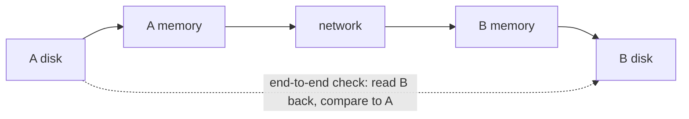

# 7. End-to-end, logs, and atomic actions

## The problem: reliability you can afford

The fault-tolerance section opens with a borrowed line, and the borrowing matters. The epigraph is Hoare, in Lampson's compressed wording: "The unavoidable price of reliability is simplicity." Hoare's own version, from his 1980 Turing lecture, is that the price of reliability is the pursuit of the utmost simplicity. Lampson then makes a claim that sounds too confident until you see the machinery behind it. "Making a system reliable is not really hard, if you know how to go about it. But retrofitting reliability to an existing design is very difficult."

The three hints in this section are the how. They are small in number and large in consequence, and each one is another engineer's idea that Lampson is putting to work. Read them as the practitioner's digest of arguments the rest of this series covers in full.

## End-to-end: put the check where correctness lives

The first hint is the sharpest thing in the paper, and Lampson attributes it plainly: "This observation was first made by Saltzer." The end-to-end argument. In his words: "Error recovery at the application level is absolutely necessary for a reliable system, and any other error detection or recovery is not logically necessary but is strictly for performance."

His example is a file transfer from a disk on machine A to a disk on machine B. To be sure the right bits are on B's disk, you have to read them back from B's disk, checksum them, and compare against a checksum of the bits on A's disk. Nothing less does it. Checking the transfer from A's disk to A's memory, or across the network, or from B's memory to B's disk, does not guarantee the result, because the bits could be corrupted at some point you did not check, sitting in a memory that no link-level check covered. And those intermediate checks are not necessary either, because if the end-to-end check fails you can just repeat the whole transfer.

The consequence is counterintuitive and freeing. The only check that establishes correctness is the one across the whole path, at the level that cares about the result. Every check below it is a performance optimization, worth adding when errors are frequent enough that repeating the whole transfer is too expensive, and worth omitting when they are not. Lampson's evidence for omitting is the Cambridge ring, where operators copied a 58-megabyte disk pack with only an end-to-end check, because errors were so rare that the twenty minutes of work almost never had to be repeated. He is also honest about the two catches. End-to-end needs a cheap test for success, and it can hide performance disasters that only surface under heavy load, when all that repeated work piles up.

This argument is a seminar of its own later in the series. It was made by Saltzer, Reed, and Clark; Lampson cites their 1981 conference paper, and the version most people read is the 1984 journal one. David Clark's own seminar takes up the design philosophy it belongs to, so this chapter sets it up rather than settling it. The point to carry forward is the one Lampson already flagged back in the functionality section: end-to-end is a corollary of keeping it simple, because it tells you which checks you are allowed to leave out.

## Log updates: keep the truth in a form that survives a crash

The second hint is about durability. "Log updates to record the truth about the state of an object." A log is a humble structure with excellent properties: append-only, so writing is minimal and it is easy to keep valid no matter when a crash hits, and cheap to force onto stable storage that outlives the crash. Databases had used logs for years, and here Lampson cites Gray's System R recovery manager, the subject of the transaction seminar. But he wants the idea used far more widely than databases.

The technique has two requirements, and they are exact. You record each update as a log entry naming the update procedure and its arguments, and for replay to reconstruct the state, the update procedure must be a true function: its result depends only on its arguments, with no side effects except on the object it updates. The arguments must be values, either immediate values copied whole into the log, or references to immutable objects. Get those right and a sequence of log entries, replayed from the same starting objects, reproduces exactly the objects the original run produced. Bravo needed only two such functions to log all editing, Replace and ChangeProperties, and every command reduced to those.

Lampson notes a duality that ties this chapter to the last. When the log holds the truth, the object's current in-memory state is very much like a hint: a fast representation you can rebuild from the authoritative log if you ever doubt it. The difference, he says, is that there is no cheap way to check the current state against the log, so it is not quite a hint. The family resemblance is the point. Truth in one place, a fast working copy in another.

## Make actions atomic: all or nothing, and restartable

The third hint is the transaction. "Make actions atomic or restartable. An atomic action (often called a transaction) is one that either completes or has no effect." The payoff for fault tolerance is direct: if a failure interrupts an atomic action, it left no trace, so recovery never has to make sense of a half-finished state.

The mechanism is the log plus a commit record that says whether an action is in progress, committed, or aborted. An action cannot commit until the log holds all its updates; after a crash, recovery applies the log entries of every committed action and undoes every aborted one. Lampson adds the property that makes replay safe: a log entry should be restartable, meaning it can be partly executed and then run again from the start without changing the result. Storing a set of values into a set of variables is restartable; incrementing a variable is not. The modern word is idempotent.

He is careful to show the full range of cost. The Alto file system gets a distorted, cheap version almost for free, using its disk labels and leader pages as a log to rebuild its structures, though it only makes file-system actions atomic, not the client's. The Juniper file system goes all the way, letting a client commit an arbitrary set of updates atomically using shadow pages, moving data into files by swapping pointers in a tree. And when even that is too much, a weaker method will do. Grapevine, the replicated mail and naming service, does not use atomic actions at all: updates are made at one site and spread to the others through the mail system, each stamped with a time, and the latest timestamp wins. During propagation the sites disagree, for instance about who is on a distribution list, and Lampson judges that "such occasional disagreements and delays are not very important to the usefulness of this particular system." Reliability is not one bar. You buy as much as the job needs.

## The contradiction worth noticing

Hold the epigraph against the section. The price of reliability is simplicity, and yet this section adds logs, commit records, replay rules, and idempotence. The resolution is the end-to-end argument. What keeps the machinery from bloating is the discipline of putting the real check at the application level and treating everything below as optional performance, so you add lower-level reliability only where measurement says you need it. Reliability is simple not because you do little, but because you know exactly which one check is load-bearing and refuse to duplicate it out of anxiety. That is also why Lampson says retrofitting reliability is hard: the end-to-end check has to be designed into the layer that owns the result, and you cannot bolt it on underneath later.

## The modern echo

The end-to-end argument decided the shape of the internet, best-effort packets with reliability at the endpoints, and it decides data-integrity design still. TCP's checksum is too weak to guarantee correctness, so systems that care put the real check at the top: ZFS checksums data end to end and heals from redundancy, git names every object by the hash of its contents, object stores verify an end-to-end digest on read, and careful pipelines carry a checksum from origin to final destination rather than trusting any single hop. Link-layer retransmission, like Wi-Fi resending a lost frame, is what Lampson said it was, a performance optimization that does not remove the need for the end-to-end check.

Log updates became the backbone of modern data systems, and the two requirements Lampson stated are why. Write-ahead logging, event sourcing, and a replicated log like Kafka all depend on replay producing the same state, which demands that the update be a deterministic function of its value arguments. That determinism requirement is the same one that state-machine replication rests on, the subject of the Liskov and Lamport seminars: feed identical logs of deterministic commands to identical replicas and they stay identical. A Redux reducer, a pure function of state and action, is Lampson's true-function-of-values rule enforced by a framework.

Atomic actions are transactions, and their reach now runs from the database through distributed systems. Restartable-means-idempotent is the principle behind idempotency keys in payment APIs and the idempotent methods of HTTP, which let an at-least-once delivery behave as if it happened once. Shadow paging is the ancestor of copy-on-write file systems like ZFS and Btrfs. And Grapevine's latest-timestamp-wins is last-writer-wins eventual consistency, still the default conflict resolution in systems like Cassandra, carrying the same known hazard Lampson accepted, that a concurrent update can be silently lost, which is why conflict-free replicated data types arrived later as the more principled answer. One caution the crib insists on: Grapevine used wall-clock timestamps, not logical clocks, so read it as the ancestor of last-writer-wins, not as Lamport ordering wearing a disguise.

> **Principle:** Put the one check that establishes correctness at the level that owns the result, and treat every check below it as performance you add only where it pays. Keep the truth in a log of deterministic updates, make the actions that change it atomic, and buy only as much consistency as the job actually needs.
