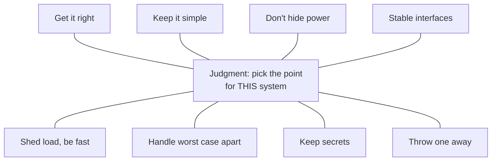

# 8. Contradictions, and how to read it today

## The argument in one breath

Lampson had built enough systems to know that designing one is not like designing an algorithm: the requirement is vague and moving, the structure is large and full of interfaces, and there is no clear measure of success, so there is rarely a best design and the real skill is dodging a terrible one. He wrote down the judgment that does the dodging as more than two dozen slogans, organized by whether they help a system work, run fast enough, or keep working. The functionality hints turn on the interface, a small programming language that should do one thing well, expose the power clients need, hide what you mean to change, and stay stable because too many parts depend on it. The speed hints reduce to making the common case cheap, giving the worst case a separate path that only has to make progress, and admitting you cannot optimize a general system. The fault-tolerance hints put the one real check at the application level and keep the truth in a log of deterministic, atomic updates. And running through all of it is the hint itself: a fast, possibly-wrong value backed by a cheap check and a correct fallback, which is both a technique in the paper and the way the paper offers its own advice.

## The contradictions are the content

The most common way to misread this paper is to tidy it. Pull the slogans into a clean checklist and you have thrown away the thing that makes it worth reading, because the slogans disagree with each other, and Lampson wrote them to. His disclaimer says so in one word: the hints are not "consistent." Here are the sharpest tensions, none of them accidental.

- **Get it right, against shed load and be fast.** Chapter 2 insists that neither abstraction nor simplicity substitutes for getting it right. Chapter 5 says one crash a week is a cheap price for twenty percent more speed. Both are true. Correctness is non-negotiable for the result the application owns, and negotiable for everything the end-to-end check will catch and repeat.
- **Keep it simple, against handle the worst case separately.** The simplest code has one path. The worst-case rule deliberately adds a second. Simplicity is not minimal code; it is minimal code on the path that runs almost always, with the rare path quarantined where its complexity cannot slow the common case.
- **Don't hide power, against keep secrets.** Lampson flags this one himself. Expose the fast path the client needs, but hide the implementation choices you want to keep changing. The art is knowing which is which, and the same property can be power to one client and a secret you regret exposing to the next.
- **Keep basic interfaces stable, against plan to throw one away.** Freeze the interface, expect to rebuild the implementation. The two are compatible only because the stable thing and the disposable thing are different layers, which is why the boundary between them is the most important line you draw.

A rule tells you what to do. A tension tells you what to trade, and leaves the trade to you. That is why Lampson calls them hints and not laws, and why the honest way to read the paper is as a map of the trades, not a list of commandments. The map is the same for everyone; where you stand on it depends on your system, your load, and your failure budget. Read this way, the contradictions stop being a flaw and become the reason the paper still teaches. It hands you the tensions a designer actually faces and refuses to pretend one side always wins.

## The recursion in the title

Once you know that a hint is a fast, possibly-wrong value you check against the truth, the disclaimer reads differently. Lampson is telling you how to use his own paper. The slogans are the fast representation, correct nearly always, cheap to apply. Your system is the truth. When a slogan is wrong for your case, and some will be, you are supposed to notice on the cheap and fall back to your own judgment, then repair your model of when the hint applies. The paper is written the way it tells you to build systems, and that is the deepest thing in it. It does not ask to be obeyed. It asks to be checked.

## Questions worth arguing about

These are seminar questions. Several have no settled answer.

1. **Which contradiction bites you most?** In your own work, where do "get it right" and "shed load to be fast" actually collide, and how do you decide which wins? Is the line the same for a payments system and a video feed?
2. **Is "do one thing well" still right?** Microservices take it to the deployment level. Did that deliver the benefit Lampson promised, or did it mostly relocate the complexity into the network, where his own tensions predicted it would go?
3. **Where are you paying for a cache when a hint would do?** Find a place in your stack that keeps something consistent at real cost. Could it be a checked, possibly-wrong hint instead, with the truth kept somewhere slower and safer?
4. **Are stable interfaces even possible at scale?** Hyrum's law says every observable behavior becomes an interface once enough clients depend on it. Does that make "keep secrets" a losing battle, or just a reason to expose less and observe more?
5. **Can you optimize a general system now?** Lampson says no, and points to a graveyard of tuning attempts. Autoscaling, learned indexes, and profile-guided compilers are new attempts. Have they beaten his two-thirds rule, or just moved the cushion around?
6. **Where did a lower-level check turn out to be necessary?** The end-to-end argument calls intermediate checks pure performance. Name a case where you added one and, on reflection, it was not optional. What made the endpoint check insufficient in practice?

## Further reading

Start with the paper, then follow the hints back to the people Lampson borrowed them from.

- **Lampson, "Hints for Computer System Design" (OSR 17(5), 1983; reprinted IEEE Software 1(1), 1984).** The source. Read the introduction and Figure 1 for the two axes, then the three sections in order.
- **Hoare, "Hints on Programming Language Design" (1973).** The paper whose title and spirit Lampson's echoes. Read it to see the genre, and because Lampson calls it a supplement to his own.
- **Brooks, *The Mythical Man-Month* (1975).** The source of "plan to throw one away" and the second-system effect. Lampson is quoting Brooks; read the original argument.
- **Parnas, "On the Criteria To Be Used in Decomposing Systems into Modules" (1972).** The origin of "keep secrets," and the subject of the next seminar. Lampson applies information hiding; Parnas argues for it.
- **Saltzer, Reed, and Clark, "End-to-end arguments in system design" (1981 conference; 1984 journal).** The source of the end-to-end hint, taken up later in the David Clark seminar.
- **Spolsky, "The Law of Leaky Abstractions" (2002).** The descendant of "don't hide power," restated as an observation about how abstractions fail. Short and sharp.
- **Lampson, "Hints and Principles for Computer System Design" (2020).** Lampson returned to this material almost forty years later, reorganizing the advice around goals and approaches and adding a set of explicit principles. Read it as the author checking his own hints against another four decades of systems.

## Where the series goes next

Lampson is the hinge, and the next seminars are where two of his borrowed hints get their full hearing.

- "Keep secrets" is **David Parnas's** information hiding, and Parnas comes next. Lampson used it as one hint among many; Parnas makes it the single criterion for how to cut a system into modules. Read them in order and the relationship is clear: Lampson is the practitioner, Parnas is the argument.
- The end-to-end hint opens onto **David Clark's** seminar later in the series, where the design philosophy of the internet is read on its own terms. Lampson gives you the one-paragraph version and tells you who to credit; Clark gives you the worldview it came from.
- And the fault-tolerance hints close a loop the series already opened. The crash-and-restart recovery, the logs, and the atomic actions are the shapes **Jim Gray** formalized for transactions and **Joe Armstrong** built a language around, twenty years after Lampson wrote "one crash a week is a cheap price." The interlude ends where the series began, with the observation that failure is normal and the only question is how cheaply you recover.

The final question this series asks of every chapter: if Lampson were in the room, would he recognize his own idea and learn something from the modern reading? He would recognize all of it, because most of it is still how we build. What he might enjoy is watching his hint, the possibly-wrong value checked against the truth, turn up in the branch predictor, the DNS resolver, and the optimistic transaction, running the systems he could only sketch. He told us to use hints. We took the hint.
