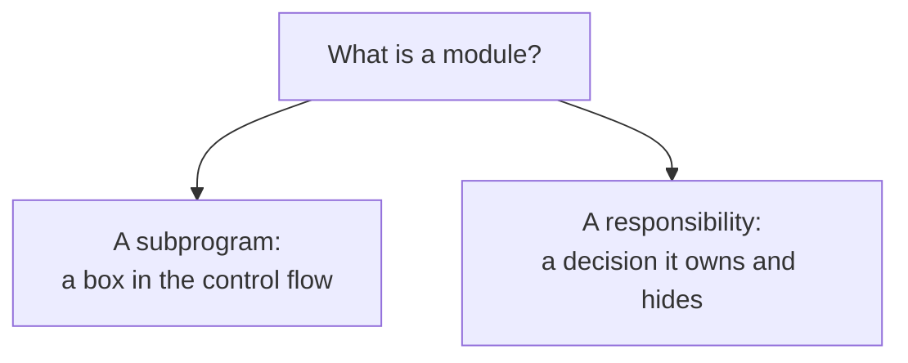

# 1. The criterion nobody stated

## The problem: everyone agreed to modularize

By 1972 modular programming was settled doctrine. Parnas opens by quoting a 1970 textbook that states the orthodoxy plainly: a well-defined segmentation of the project ensures modularity, each task becomes a separate module with a well-defined interface, each module is checked out on its own, and later "system errors and deficiencies can be traced to specific system modules." That is the managerial dream, and Parnas does not argue with it. He grants that the real advance in modular programming had already happened, in the assemblers and coding techniques that let one module be written with little knowledge of another's code, and let a module be replaced without reassembling the whole system.

Then comes the sentence that the entire paper exists to answer: "Usually nothing is said about the criteria to be used in dividing the system into modules." Everyone knew to cut the system into modules. Nobody had written down where to cut. And Parnas's wager is that where you cut is the thing that decides whether any of the promised benefits actually show up.

## Why the obvious answer fails: a benefit is not a method

He lists the benefits people expected from modularity, and it is worth keeping them exact, because the rest of the paper grades against them:

- Managerial: development time drops, because separate groups work on separate modules with little need to communicate.
- Product flexibility: you can make a drastic change to one module without changing the others.
- Comprehensibility: you can study the system one module at a time.

These are goals, not a method. Nothing about them tells you how to draw the boundaries, and that is the trap. You can slice a system into modules with tidy-looking interfaces and still get none of the three, if you sliced in the wrong place. Two groups will end up in constant contact, a small change will touch every module, and no module will make sense on its own. The benefits are downstream of a decision the doctrine left unspoken, because the answer felt too obvious to state: cut the system along the steps of the computation.

## The move: a module is a responsibility, not a subprogram

Parnas's first move is quiet, and it decides everything after it. He redefines the unit. "In this context 'module' is considered to be a responsibility assignment rather than a subprogram." A module is not a box of code in the control flow. It is a responsibility, and the modularization is the set of design decisions you must fix before independent work can begin.

That redefinition is the whole paper compressed. If a module is a subprogram, you find modules by carving the program into procedures, and the natural carving traces the steps of the computation: read the input, transform it, write it out. If a module is a responsibility, you find modules by deciding who owns which design decision, and the natural carving traces the decisions instead. Same system, different question, and, as the next chapters show, boundaries in completely different places.

Parnas will not settle this by assertion. He does something better and rarer: he builds one small system, decomposes it both ways, and then runs a set of likely changes through each design and counts the damage. It is one of the cleanest experiments in the software literature, and it fits on a few pages. The next three chapters follow it: the example and the obvious cut, the same system cut by secrets, and the result when the changes arrive.

> **Principle:** Deciding to modularize is the easy half. The criterion for where to draw the boundaries is the half that determines whether modularity pays, and it is the half worth arguing about.
