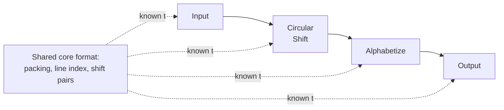

# 2. KWIC, and the obvious cut

## The problem: a small, honest example

Parnas needed an example small enough to hold in one hand and real enough to argue about, so he chose a KWIC index. The idea predates him. Keyword-in-context indexing was Hans Peter Luhn's, at IBM in the late 1950s, a way to list every line of a text once for each significant word it contains, so you can find a phrase by any word in it. Parnas states the system in three lines: it accepts an ordered set of lines, each line an ordered set of words, each word an ordered set of characters; any line may be "circularly shifted" by repeatedly taking the first word off the front and putting it on the end; and the system outputs every circular shift of every line, in alphabetical order.

He is honest that this is a toy. A good programmer could write the whole thing in a week or two, so none of the real pressures of a large system apply. He treats it as if it were large precisely so the two ways of cutting it become visible on something you can read in an afternoon.

## The obvious cut: one module per step

Ask a room of programmers to modularize this and you will get one answer. Follow the data through its stages and make each stage a module. Parnas calls this Modularization 1, and he is careful to say it is not a strawman: it is "approximately the decomposition which would be proposed by most programmers."

- **Input** reads the lines and stores them in core. It packs four characters to a word, marks the end of a word with an otherwise unused character, and keeps an index giving the starting address of each line.
- **Circular Shift** runs after input and builds an index of every shift, storing each as a pair: the original line number and the starting address of that shift.
- **Alphabetizing** takes the arrays from Input and Circular Shift and produces the same kind of array, reordered alphabetically.
- **Output** takes the alphabetized array and the original lines and prints the formatted listing.
- **Master Control** sequences the other four and handles housekeeping like error messages and space allocation.

Each module is a step in the processing. Draw it and you have drawn a flowchart, which is the point: this is the decomposition you reach by making a flowchart and turning each box into a module. It is what a generation of training taught, and for the small systems of the day it worked.

## The coupling you do not see at first

Look at what the modules actually share. Input decides that characters are packed four to a word, that an index holds the starting address of each line, that everything lives in core. Circular Shift reads that packed representation directly and writes its own array of pairs. Alphabetizing reads both of those arrays in their exact formats. Output reads them too. The interfaces between these modules are not simple function calls. They are the shared layouts of the tables in core, and every module is written to know them.

That shared knowledge is the load-bearing fact, and it is easy to miss because the design looks clean. The boxes are small, the flow is linear, each module is understandable. But the decision about how lines are stored is not owned by anyone. It is spread across all of them, baked into the format that every module reads and writes. Parnas has set the trap the next two chapters spring: the flowchart cut produces modules that are independent in the control flow and deeply entangled in the data. When the storage decision changes, and Parnas will argue it is one of the likeliest to change, that entanglement is where the cost lands.

> **Principle:** Cutting by processing step gives you modules that look independent because the control flows through them in order, while they quietly share the one thing most likely to change: the format of the data they pass.
