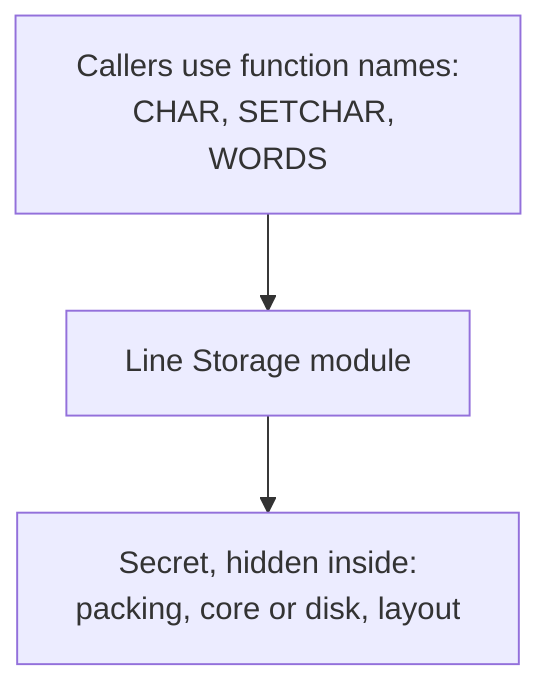

# 3. The same system, cut by secrets

## The move: cut along the decisions, not the steps

Parnas builds the same KWIC index a second time, and this time he does not follow the data through its stages. He starts from a different question: what are the decisions in this design that might change, and how do I keep each one from leaking? He calls this Modularization 2, and he notes it "has been used successfully in a class project." Each module is built around one such decision and is written to reveal as little about it as possible.

- **Line Storage** holds the lines, but nobody outside it can see how. It offers functions instead: `CHAR(r,w,c)` returns the c-th character of the w-th word of the r-th line, `SETCHAR(r,w,c,d)` sets it, `WORDS(r)` reports how many words are in line r, and a few more for counts and deletion. Illegal calls trap to an error handler the caller supplies. The secret it keeps is the entire storage decision: the packing, the indexing, whether the lines are even in core.
- **Input** reads the original lines and calls Line Storage to store them. It does not know, and cannot depend on, how they are stored.
- **Circular Shifter** offers the same style of interface, `CSCHAR` and the rest, and, in Parnas's exact words, "creates the impression that we have created a line holder containing not all of the lines but all of the circular shifts of the lines." A caller asks for the c-th character of a word of a shift. Whether that shift was precomputed and stored, indexed, or generated on the spot is the secret.
- **Alphabetizer** offers `ALPH`, which must run first, and `ITH(i)`, which returns the index of the shift that comes i-th in alphabetical order. How and when the ordering is produced is hidden.
- **Output** prints. **Master Control** sequences, as before.

## The interface changed shape

Notice what the interfaces are made of now. In the flowchart cut, a module handed the next module a table in a known format, so the interface was a data layout. Here a module hands the next one a set of functions, and the interface is "primarily the function names and the numbers and types of the parameters." Nobody passes a packed array of pairs. They call `CSCHAR` and `ITH`. The format that every module in Modularization 1 had to agree on has become a secret that exactly one module knows.

## The point that is easy to miss: the program can be identical

Here is the sentence that separates a real understanding of this paper from a slogan. Parnas writes that the two decompositions "may share all data representations and access methods," that his discussion "is about two different ways of cutting up what may be the same object," and, most pointedly, that "a system built according to decomposition 1 could conceivably be identical after assembly to one built according to decomposition 2."

Read that twice. The two designs can compile to the same running program, the same bytes, the same algorithms, the same tables in the same formats. Information hiding, in 1972, is not a claim about what the machine does at run time. It is a claim about how the work is divided and who is allowed to know what. `Line Storage` might store its lines in the identical packed array that Modularization 1 spread across every module. The difference is that here, only `Line Storage` knows it, and everyone else reaches the data through functions. The knowledge is contained even when the representation is not different at all.

That is why Parnas insisted the module is a responsibility, not a subprogram. The responsibility, the secret, is the real object of the design. The code that ends up running is downstream of it, and can even be shared between the two decompositions. What differs is the map of who depends on what, and that map is what decides the cost of the next change.

> **Principle:** Decompose by secret and the interface stops being a shared data format and becomes a set of functions. The running code may be identical to the flowchart version; what changes is who is allowed to know the decision, and that is the thing that will matter when it changes.
