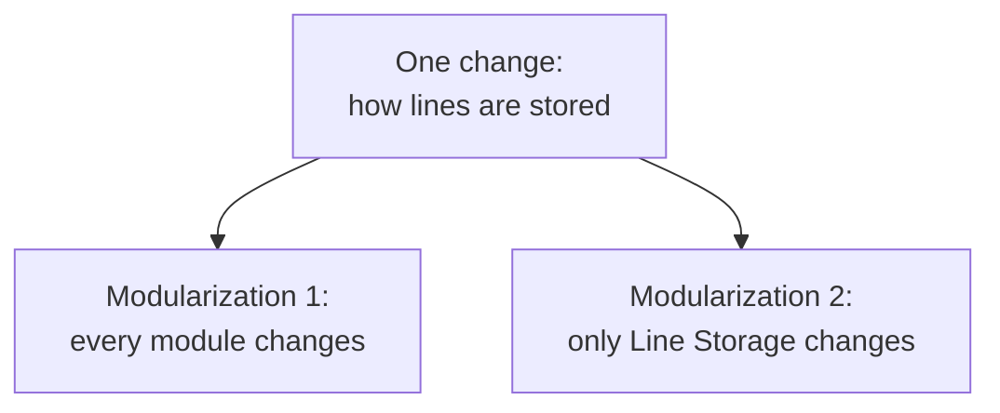

# 4. Which change ripples

## The experiment: introduce a change and count the damage

Two designs, same system. Parnas now does the thing that turns an opinion into an argument. He writes down the design decisions that are "questionable and likely to change," and he traces each one through both decompositions to see how far it spreads. His list:

1. The input format.
2. Whether all the lines are kept in core, which for a large job may be impractical.
3. Whether characters are packed four to a word.
4. Whether the circular shifts are actually stored, or only indexed, or computed on demand.
5. Whether the list is alphabetized once, or searched item by item, or partially sorted the way Hoare's FIND does it.

These are not exotic. They are the ordinary decisions any implementer makes on the first afternoon, the ones most likely to be revisited when the data gets bigger or the machine changes. So the right question about a decomposition is not "is it tidy" but "when one of these flips, how many modules do I have to open?"

## The result

The first change, the input format, is confined to one module in both designs, because both have an Input module that owns it. A tie. Then the designs separate, and they separate hard.

Consider the second and third changes, about how lines are stored in core. In Modularization 1, Parnas writes, this "would result in changes in every module," because "the format of the line storage in core must be used by all of the programs." Every module reads that shared format, so every module has to change. In Modularization 2 the same change stops at one wall: "Knowledge of the exact way that the lines are stored is entirely hidden from all but module 1. Any change in the manner of storage can be confined to that module."

| Likely change | Modularization 1 | Modularization 2 |
|---|---|---|
| Input format | one module | one module |
| Lines kept in core | every module | Line Storage |
| Character packing | every module | Line Storage |
| Store vs index shifts | three modules | Circular Shifter |
| When to alphabetize | Output couples | hidden |

The fourth change tells the same story. Whether shifts are stored or indexed touches the shifter, the alphabetizer, and output in the flowchart design, because all three read the shift array; in the second design it is sealed inside Circular Shifter. The fifth change is the subtlest and the most damning. In Modularization 1, Output expects the alphabetized index to exist before it runs, so the decision about when sorting happens is wired into the control flow, and you cannot move it without disturbing Output. In Modularization 2 the Alphabetizer "was designed so that a user could not detect when the alphabetization was actually done. No other module need be changed." You could sort eagerly, lazily, or in pieces, and nothing outside would know.

## The other two benefits fall out of the same fact

Parnas promised three benefits back in chapter 1, and the same experiment cashes the other two.

Independent development, the managerial benefit, depends on how much two groups must agree before they can start. In Modularization 1 the interfaces are "the fairly complex formats and table organizations" that the modules share, and those "must be a joint effort among the several development groups." You cannot write Alphabetize until the shift-array format is nailed down with the people who produce and consume it. In Modularization 2 the interfaces are "primarily the function names and the numbers and types of the parameters," simple enough that "the independent development of modules should begin much earlier." The cut that hides the format is also the cut that lets the teams stop waiting on each other.

Comprehensibility follows too. To understand Output in the flowchart design, Parnas says, you must understand the alphabetizer, the shifter, and the input module, because Output's tables only make sense in light of how the others built them; "the system will only be comprehensible as a whole." In the second design a module can be read on its own.

## The criterion, stated

Now Parnas names what he has been demonstrating. The first decomposition used a criterion so familiar it is invisible: "make each major step in the processing a module. One might say that to get the first decomposition one makes a flowchart." He grants the flowchart earned its place, that it "was a useful abstraction for systems with on the order of 5,000-10,000 instructions," but says that past that size "it does not appear to be sufficient." The second decomposition used a different criterion: "'information hiding.' The modules no longer correspond to steps in the processing. Every module in the second decomposition is characterized by its knowledge of a design decision which it hides from all others. Its interface or definition was chosen to reveal as little as possible about its inner workings."

The conclusion states it as advice, and it is the line worth carrying out of the paper: "it is almost always incorrect to begin the decomposition of a system into modules on the basis of a flowchart. We propose instead that one begins with a list of difficult design decisions or design decisions which are likely to change. Each module is then designed to hide such a decision from the others."

The experiment is the argument. The flowchart cut and the information-hiding cut can run as the same program, but when a likely change arrives, one spreads it across every module and the other stops it at a wall. That asymmetry, measured on a system you could write in a week, is the reason the paper is still read.

> **Principle:** Draw the module boundary around the decision most likely to change, so that when it changes the damage stops at one wall. A decomposition is only as good as the changes it confines.
